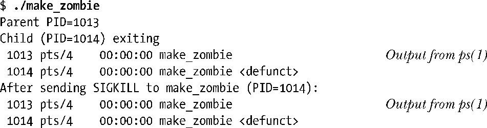
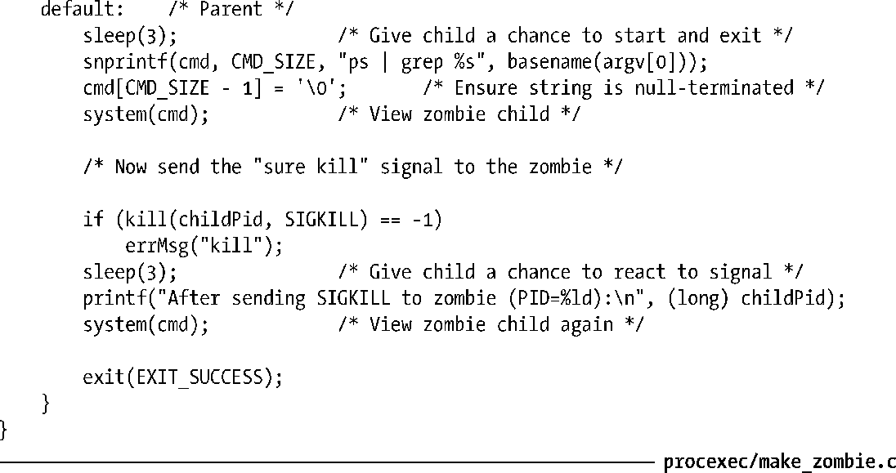

### 26.2　孤儿进程与僵尸进程

父进程与子进程的生命周期一般都不相同，父、子进程间互有长短。这就引出了下面两个问题。

+ 谁会是孤儿（orphan）子进程的父进程？进程ID为1的众进程之祖——init会接管孤儿进程。换言之，某一子进程的父进程终止后，对 getppid()的调用将返回 1。这是判定某一子进程之“生父”是否“在世”的方法之一（前提是假设该子进程由init之外的进程创建）。

> 使用参数PR_SET_PDEATHSIG调用Linux特有的系统调用prctl()，将有可能导致某一进程在成为孤儿时收到特定信号。

+ 在父进程执行 wait()之前，其子进程就已经终止，这将会发生什么？此处的要点在于，即使子进程已经结束，系统仍然允许其父进程在之后的某一时刻去执行 wait()，以确定该子进程是如何终止的。内核通过将子进程转为僵尸进程（zombie）来处理这种情况。这也意味着将释放子进程所把持的大部分资源，以便供其他进程重新使用。该进程所唯一保留的是内核进程表中的一条记录，其中包含了子进程ID、终止状态、资源使用数据（36.1节）等信息。

至于僵尸进程名称的由来，则源于 UNIX 系统对电影情节的效仿——无法通过信号来杀死僵尸进程，即便是（银弹）SIGKILL。这就确保了父进程总是可以执行wait()方法。

当父进程执行 wait()后，由于不再需要子进程所剩余的最后信息，故而内核将删除僵尸进程。另一方面，如果父进程未执行wait()随即退出，那么init进程将接管子进程并自动调用wait()，从而从系统中移除僵尸进程。

如果父进程创建了某一子进程，但并未执行 wait()，那么在内核的进程表中将为该子进程永久保留一条记录。如果存在大量此类僵尸进程，它们势必将填满内核进程表，从而阻碍新进程的创建。既然无法用信号杀死僵尸进程，那么从系统中将其移除的唯一方法就是杀掉它们的父进程（或等待其父进程终止），此时init进程将接管和等待这些僵尸进程，从而从系统中将它们清理掉。

在设计长生命周期的父进程（例如：会创建众多子进程的网络服务器和Shell）时，这些语义具有重要意义。换句话说，在此类应用中，父进程应执行 wait()方法，以确保系统总是能够清理那些死去的子进程，避免使其成为长寿僵尸。如26.3.1节所述，父进程在处理SIGCHLD信号时，对wait()的调用既可同步，也可异步。

程序清单 26-4 展示了一个僵尸进程的创建，以及发送 SIGKILL 信号无法杀死僵尸进程的例子。运行这一程序的输出如下:

以上输出中，ps(1)所输出的字符串<defunct>表示进程处于僵尸状态。

> 程序清单26-4使用system()函数来执行通过字符串参数传入的shell命令。27.6节将会详细描述system()函数。

程序清单26-4：创建一个僵尸子进程

