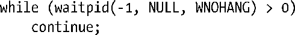
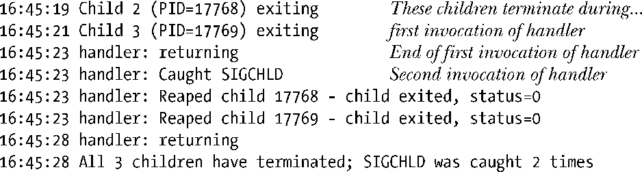
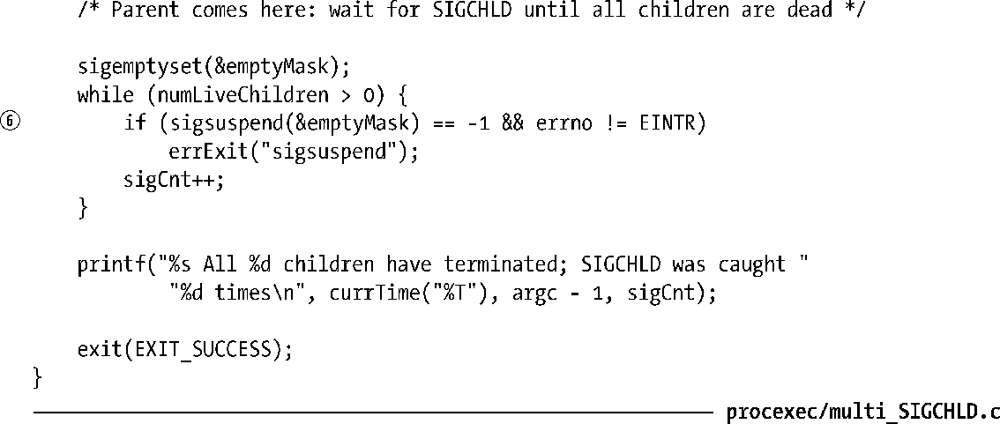

### 26.3.1　为SIGCHLD建立信号处理程序

无论一个子进程于何时终止，系统都会向其父进程发送SIGCHLD信号。对该信号的默认处理是将其忽略，不过也可以安装信号处理程序来捕获它。在处理程序中，可以使用 wait()（或类似方法）来收拾僵尸进程。不过，使用这一方法时需要掌握一些窍门。

由20.10节和20.12节可知，当调用信号处理程序时，会暂时将引发调用的信号阻塞起来（除非为 sigaction()指定了 SA_NODEFER标志），且不会对 SIGCHLD 之流的标准信号进行排队处理。这样一来，当SIGCHILD信号处理程序正在为一个终止的子进程运行时，如果相继有两个子进程终止，即使产生了两次 SIGCHLD 信号，父进程也只能捕获到一个。结果是，如果父进程的SIGCHLD信号处理程序每次只调用一次wait()，那么一些僵尸子进程可能会成为“漏网之鱼”。

解决方案是：在SIGCHLD处理程序内部循环以WNOHANG标志来调用waitpid()，直至再无其他终止的子进程需要处理为止。通常SIGCHLD处理程序都简单地由以下代码组成，仅仅捕获已终止子进程而不关心其退出状态。

上述循环会一直持续下去，直至waitpid()返回0，表明再无僵尸子进程存在，或-1，表示有错误发生（可能是ECHILD，意即再无更多的子进程）。

#### SIGCHLD处理程序的设计问题

假设创建SIGCHLD处理程序的时候，该进程已经有子进程终止。那么内核会立即为父进程产生SIGCHLD信号吗？SUSv3对这一点并未规定。一些源自系统V（System V）的实现在这种情况下会产生SIGCHLD信号；而另一些系统，包括Linux，则不这么做。为保障可移植性，应用应在创建任何子进程之前就设置好SIGCHLD处理程序，将这一隐患消解于无形。（无疑，这也是顺其自然的处事之道。）

需要更深入考虑的问题是可重入性（reentrancy）。21.1.2节特别指出，在信号处理程序中使用系统调用（如 waitpid()）可能会改变全局变量 errno 的值。当主程序企图显式设置 errno（参考35.1 节对getpriority()的讨论）或是在系统调用失败后检查errno值时，这一变化会与之发生冲突。出于这一原因，有时在编写SIGCHLD信号处理程序时，需要在一进入处理程序时就使用本地变量来保存errno值，而在返回前加以恢复。请参考程序清单26-5。

#### 范例程序

程序清单26-5提供了一个更为复杂的SIGCHLD信号处理程序示例。该处理程序为所捕获的每个子进程输出进程号及其等待状态①。为了模拟调用处理程序期间产生多个SIGCHLD信号而无法排队的效果，利用sleep()调用②人为地拉长了处理程序的执行时间。主程序为每个（整型）命令行参数创建一个子进程④。每个子进程持续休眠其对应命令行参数所指定的秒数，随即退出⑤。从程序下面的执行例子可以看出，尽管有3个子进程退出，而父进程只捕获到两次SIGCHLD信号。

请注意，在程序清单26-5中，在创建子进程之前使用了sigprocmask()来阻塞SIGCHLD信号③。这一做法确保了父进程中 sigsuspend()循环的正确操作。如果以此方式未能阻塞SIGCHLD信号，而某一子进程又在对numLiveChildren的检查和执行sigsuspend()调用（也可以是pause()调用）之间终止，那么sigsuspend()调用会永远阻塞，等待一个早已捕获过的信号⑥。22.9节详细描述了处理此类竞争条件的要求。

程序清单26-5：通过SIGCHLD信号处理程序捕获已终止的子进程

