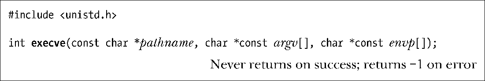
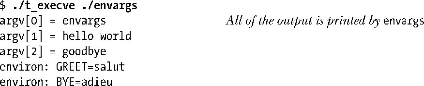
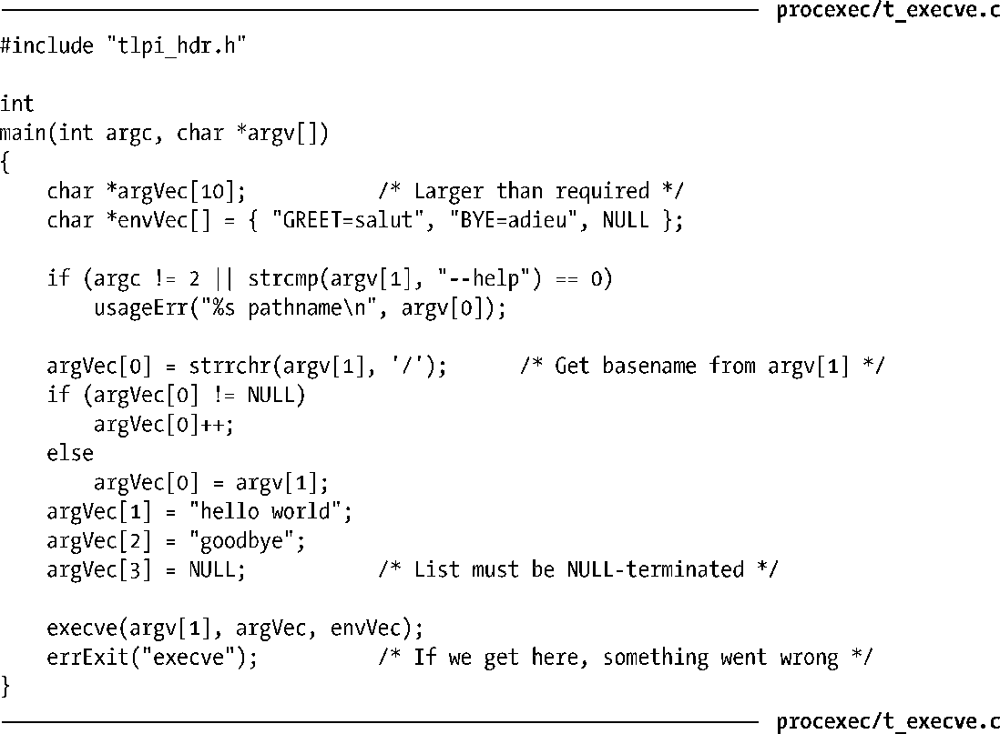
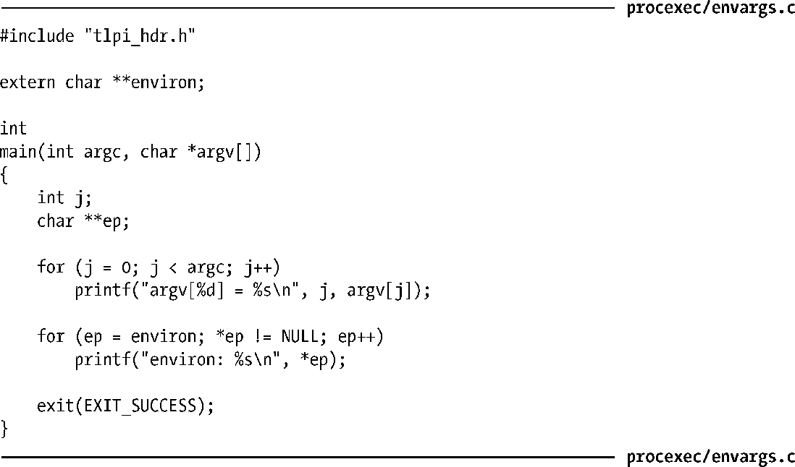

### 27.1　执行新程序：execve()

系统调用execve()可以将新程序加载到某一进程的内存空间。在这一操作过程中，将丢弃旧有程序，而进程的栈、数据以及堆段会被新程序的相应部件所替换。在执行了各种C语言函数库的运行时启动代码以及程序的初始化代码后，例如，C++静态构造函数，或者以gcc constructor属性（见42.4节）声明的C语言函数，新程序会从main()函数处开始执行。

由fork()生成的子进程对 execve()的调用最为频繁，不以fork()调用为先导而单独调用execve()的做法在应用中实属罕见。

基于系统调用execve()，还提供了一系列冠以exec来命名的上层库函数，虽然接口方式各异，但功能相同。通常将调用这些函数加载一个新程序的过程称作exec操作，或是简单地以exec()来表示。下面将先描述execve()，然后再对相关库函数进行说明。

参数pathname包含准备载入当前进程空间的新程序的路径名，既可以是绝对路径（冠之以/），也可以是相对于调用进程当前工作目录（current working directory）的相对路径。

参数argv则指定了传递给新进程的命令行参数。该数组对应于C语言main()函数的第2个参数（argv），且格式也与之相同：是由字符串指针所组成的列表，以NULL结束。argv[0]的值则对应于命令名。通常情况下，该值与pathname中的basename（路径名的最后部分）相同。

最后一个参数envp指定了新程序的环境列表。参数envp对应于新程序的environ数组：也是由字符串指针组成的列表，以NULL结束，所指向的字符串格式为name=value（6.7节）。

> Linux所特有的/proc/PID/exe文件是一个符号链接，包含PID对应进程中正在运行可执行文件的绝对路径名。

调用execve()之后，因为同一进程依然存在，所以进程ID仍保持不变。如28.4节所述，还有少量其他的进程属性也未发生变化。

如果对pathname所指定的程序文件设置了set-user-ID（set-group-ID）权限位，那么系统调用会在执行此文件时将进程的有效（effective）用户（组）ID置为程序文件的属主（组）ID。利用这一机制，可令用户在运行特定程序时临时获取特权。（参考9.3节）。

无论是否更改了有效ID，也不管这一变化是否生效，execve()都会以进程的有效用户ID去覆盖已保存的（saved）set-user-ID，以进程的有效组ID去覆盖已保存的（saved）set-group-ID。

由于是将调用程序取而代之，对execve()的成功调用将永不返回，而且也无需检查execve()的返回值，因为该值总是雷打不动地等于-1。实际上，一旦函数返回，就表明发生了错误。通常，可以通过errno来判断出错原因。可能自errno返回的错误如下：

##### EACCES

参数pathname没有指向一个常规（regular）文件，未对该文件赋予可执行权限，或者因为pathname中某一级目录不可搜索（not searchable）（即，关闭了该目录的可执行权限）。还有一种可能，是以MS_NOEXEC标志（14.8.1节）来挂载（mount）文件所在的文件系统，从而导致这一错误。

##### ENOENT

pathname所指代的文件并不存在。

##### ENOEXEC

尽管对pathname所指代文件赋予了可执行权限，但系统却无法识别其文件格式。一个脚本文件，如果没有包含用于指定脚本解释器（interpreter）（以字符#!开头）的起始行，就可能导致这一错误。

##### ETXTBSY

存在一个或多个进程已经以写入方式打开pathname所指代的文件（4.3.2节）。

##### E2BIG

参数列表和环境列表所需空间总和超出了允许的最大值。

当上述任一条件作用于执行脚本的脚本解释器，或是执行程序的ELF解释器时，同样会产生相应错误。

> ELF（Executable and Linking Format）是一种广为实现的标准，描述了可执行文件的布局。在执行期间，进程映像（image）通常是由可执行文件的各段（segment）构造而成（6.3节）。不过，ELF规格也允许定义一个解释器（ELF程序头部的PT_INTERP元素）来运行程序。如果定义了解释器，内核则基于指定解释器可执行文件的各段来构建进程映像，转而由解释器负责加载和执行程序。第41章会对ELF解释器做进一步描述，并给出对深层信息的一些指引。

#### 示例程序

程序清单27-1展示了execve()的用法。该程序首先为新程序创建参数列表和环境列表，接着调用execve()来执行由命令行参数（argv[1]）所指定的程序路径名。

程序清单27-2中所展示的程序，是设计专供程序清单27-1中程序来执行的。该程序只是简单显示一下自身的命令行参数以及环境列表（对后者的访问使用了全局变量environ，如6.7节所述）。

如下shell会话（session）演示了对程序清单27-1和程序清单27-2的使用（本例在指定执行程序时使用的是相对路径名）：

程序清单27-1：调用函数execve()来执行新程序

程序清单27-2：显示参数列表和环境列表

