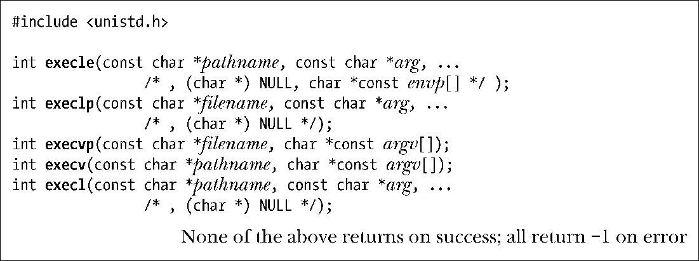

### 27.2　exec()库函数

本节所讨论的库函数为执行 exec()提供了多种 API 选择。所有这些函数均构建于 execve()调用之上，只是在为新程序指定程序名、参数列表以及环境变量的方式上有所不同。

各函数名称的最后一个字母为区分这些函数提供了线索。表27-1总结了这些差异，下面则是详细说明。

+ 大部分 exec()函数要求提供欲加载新程序的路径名。而 execlp()和 execvp()则允许只提供程序的文件名。系统会在由环境变量PATH所指定的目录列表中寻找相应的执行文件（稍后将详细解释）。这与shell对键入命令的搜索方式一致。这些函数名都包含字母p（表示PATH），以示在操作上有所不同。如果文件名中包含“/”，则将其视为相对或绝对路径名，不再使用变量PATH来搜索文件。
+ 函数 execle()、execlp()和execl()要求开发者在调用中以字符串列表形式来指定参数，而不使用数组来描述argv列表。首个参数对应于新程序main()函数的argv[0]，因而通常与参数filename或pathname的basename部分相同。必须以NULL指针来终止参数列表，以便于各调用定位列表的尾部。（上述各原型注释中的(char*)NULL部分透露了这一要求。至于为何需要对NULL进行强制类型转换，请参考附录C。）这些函数的名称都包含字母l（表示list），以示与那些将以NULL结尾的数组作为参数列表的函数有所区别。后者（execve()、execvp()和execv()）名称中则包含字母v（表示vector）。
+ 函数execve()和execle()则允许开发者通过envp为新程序显式指定环境变量，其中envp是一个以NULL结束的字符串指针数组。这些函数命名均以字母e（environment）结尾。其他exec()函数将使用调用者的当前环境（即environ中内容）作为新程序的环境。

> glibc 2.11曾加入一个非标准函数execve(file, argv, envp)。该函数与execvp()类似，不过并非通过environ来取得新程序的环境，而是通过参数envp（类似于函数execve()和execle()）来指定新环境。

后面几页会演示部分exec()函数变体的使用。

<b class="my_markdown">表27-1：exec()函数间的差异总结</b>

| 函　　数 | 对程序文件的描述（-, p） | 对参数的描述（v, l） | 环境变量来源（e, -） |
| :-----  | :-----  | :-----  | :-----  | :-----  | :-----  |
| execve() | 路径名 | 数组 | envp参数 |
| execle() | 路径名 | 列表 | envp参数 |
| execlp() | 文件名+PATH | 列表 | 调用者的environ |
| execvp() | 文件名+PATH | 数组 | 调用者的environ |
| execv() | 路径名 | 数组 | 调用者的environ |
| excel() | 路径名 | 列表 | 调用者的environ |

