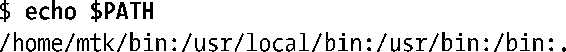
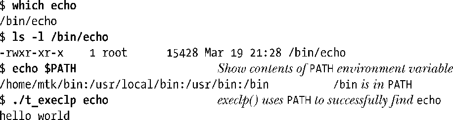
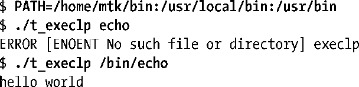
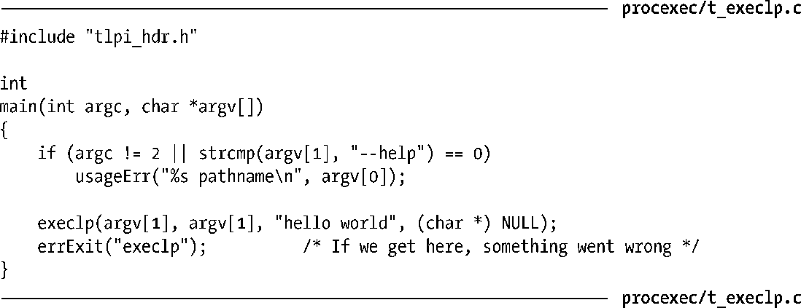

### 27.2.1　环境变量PATH

函数execvp()和execlp()允许调用者只提供欲执行程序的文件名。二者均使用环境变量PATH来搜索文件。PATH的值是一个以冒号（：）分隔，由多个目录名，也将其称为路径前缀（path prefixes）组成的字符串。下例中的PATH包含5个目录：

对于一个登录shell而言，其PATH值将由系统级和特定用户的shell启动脚本来设置。由于子进程继承其父进程的环境变量，shell执行每个命令时所创建的进程也就继承了shell的PATH。

PATH中指定的路径名既可以是绝对路径名（以/开始），也可以是相对路径名。对相对路径名的诠释是基于调用进程的当前工作目录（current working directory）。正如前面例子中所示，可以以.（点）来表示当前工作目录。

> 在PATH中包含一个长度为0的前缀，也可以用来指定当前工作目录。表示方式有：连续的冒号、起始冒号或尾部冒号（例如，/usr/bin:/bin: ）。SUSv3废止了这一技术；当前工作目录应该用.（点）来显式指定。

如果没有定义变量PATH，那么execvp()和execlp()会采用默认的路径列表：.:/usr/bin:/bin。

出于安全方面的考虑，通常会将当前工作目录排除在超级用户（root）的PATH之外。这是为了防止root用户发生如下意外情况：执行当前工作目录下与标准命令同名的程序（事先由恶意用户故意放置），或者将常用命令拼错而执行了当前工作目录下的其他程序（例如，输入 sl而非ls）。一些Linux发行版还将当前工作目录排除在非特权用户的PATH缺省值之外。这里假定，在本书展示的所有 shell 会话日志中，对 PATH 的定义均不包含当前工作目录，而书中示例在执行当前工作目录下的程序时都冠以前缀./，原因也正在于此。（同时还有一重妙用：在本书的shell会话日志中，从表现形式上将示例程序与标准命令区分开来。）

函数execvp()和execlp()会在PATH包含的每个目录中搜索文件，从列表开头的目录开始，直至成功执行了既定文件。如果不清楚可执行程序的具体位置，或是不想因硬编码（hard- code）而对具体位置产生依赖，对PATH环境变量的这种使用方式是非常有效的。

应该避免在设置了 set-user-ID或 set-group-ID 的程序中调用 execvp()和 execlp()，至少应当慎用。需要特别谨慎地控制PATH环境变量，以防运行恶意程序。在实际操作中，这意味着应用程序应该使用已知安全的目录列表来覆盖之前定义的任何PATH值。

程序清单27-3提供了一个使用execlp()的例子。下面的shell会话日志则演示了如何通过该程序来调用echo命令（/bin/echo）：

在上例中，程序清单27-3程序将字符串hello world作为第3个参数传递给execlp()调用。

接下来，重新对PATH进行定义，从中移去包含程序echo的目录/bin：

如你所见，当仅向execlp()提供文件名（即，字符串中不包含斜杠“/”）时，调用会失败。这是因为在PATH包含的目录列表中无法找到名为echo的文件。另一方面，当提供了包含一个或多个斜杠的路径名时，execlp()则会忽略PATH的内容。

程序清单27-3：使用execlp()在PATH中搜索文件

