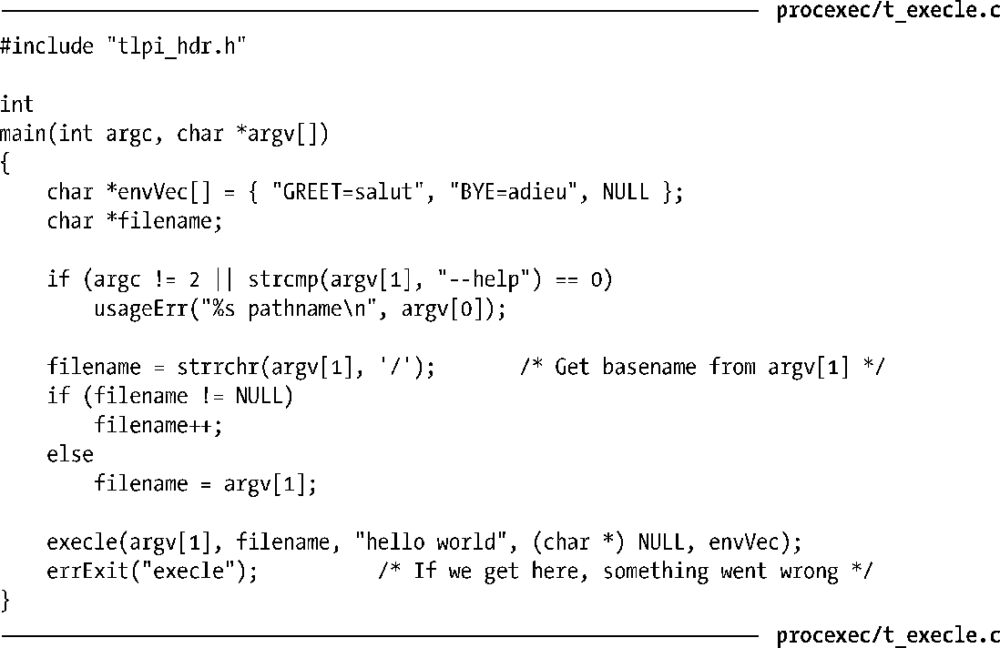

### 27.2.2　将程序参数指定为列表

如果在编程时已知某个exec()的参数个数，调用execle()、execlp()或者execl()时就可以将参数作为列表传入。较之于将参数装配于一个argv向量中，代码要少一些，便于使用。程序清单27-4中程序收效与程序清单27-1相同，只是调用了execle()而非execve()。

程序清单27-4：使用execle()，将程序参数指定为列表

