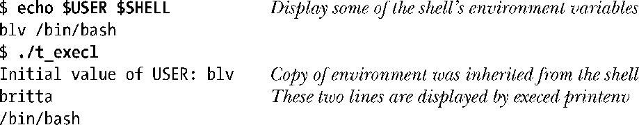
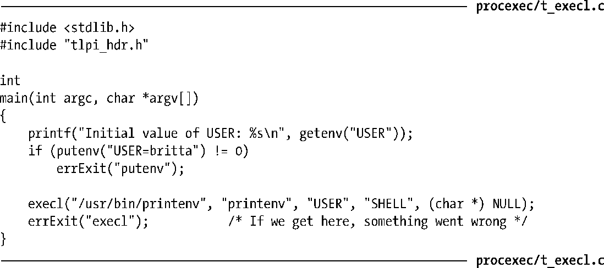

### 27.2.3　将调用者的环境传递给新程序

函数execlp()、execvp()、execl()和execv()不允许开发者显式指定环境列表，新程序的环境继承自调用进程（6.7节）。这一举措的后果可谓是喜忧参半。出于安全方面的考虑，有时希望确保程序在一个已知（安全）的环境列表下运行。38.8节将对此做深入讨论。

程序清单27-5演示了如何运用函数execl()使新程序继承调用者的环境。对于通过fork()从shell处所继承的环境，程序首先用函数putenv()进行了修改，接着执行printenv程序来显示环境变量USER和SHELL的值。运行程序的输出如下：

程序清单27-5：调用函数execl()，将调用者的环境传递给新程序

