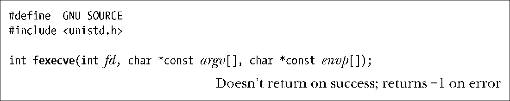

### 27.2.4　执行由文件描述符指代的程序：fexecve()

glibc自版本2.3.2开始提供函数fexecve()，其行为与execve()类似，只是指定将要执行的程序是以打开文件描述符fd的方式，而非通过路径名。有些应用程序需要打开某个程序文件，通过执行校验和（checksum）来验证文件内容，然后再运行该程序，这一场景就较为适宜使用函数fexecve()。

当然，即便没有fexecve()函数，也可以调用open()来打开文件，读取并验证其内容，并最终运行。然而，在打开与执行文件之间，存在将该文件替换的可能性（持有打开文件描述符并不能阻止创建同名新文件），最终造成验证者并非执行者的情况。

