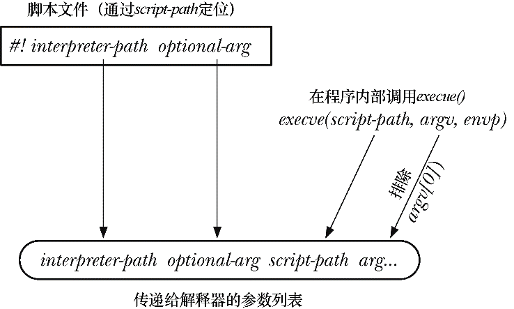
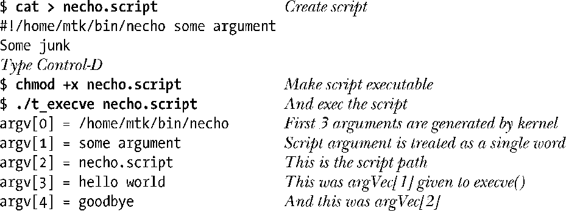
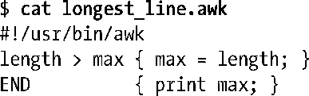
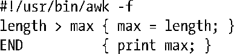

### 27.3　解释器脚本

所谓解释器（interpreter），就是能够读取并执行文本格式命令的程序。（相形之下，编译器则是将输入源代码译为可在真实或虚拟机器上执行的机器语言。）各种 UNIX shell，以及诸如awk、sed、perl、python和 ruby 之类的程序都属于解释器。除了能够交互式地读取和执行命令之外，解释器通常还具备这样一种能力：从被称为脚本（script）的文本文件中读取和执行命令。

UNIX 内核运行解释器脚本的方式与二进制（binary）程序无异，前提是脚本必须满足下面两点要求：首先，必须赋予脚本文件可执行权限；其次，文件的起始行（initial line）必须指定运行脚本解释器的路径名。格式如下：

字符#!必须置于该行起始处，这两个字符串与解释器路径名之间可以以空格分隔。在解释该路径名时不会使用环境变量 PATH，因而一般应采用绝对路径。使用相对路径固然可行，但很少见。对其解释则相对于启动解释器进程的当前工作目录。解释器路径名后还可跟随可选参数（稍后将解释其目的），二者之间以空格分隔。可选参数中不应包含空格。

作为例子，UNIX shell脚本通常以下面这行开始，指定运行该脚本的shell：

> 解释器脚本文件首行中的可选参数不应包含空格，因为空格此处所起的作用完全取决于实现。Linux系统不会对可选参数（optional-arg）中的空格做特殊解释，将从参数起始直至行尾的所有文本视为一个单词（正如后面所述，再将其作为一整个参数传递给解释器）。注意，对空格的这种处理方式与shell的做法形成鲜明对比，后者总是将其视为命令行中各单词的界定符。
> 其他UNIX实现在处理可选参数中的空格时，其做法与Linux有同有异。在6.0版本之前的FreeBSD上，可在解释器路径（interpreter-path）之后跟随多个以空格分隔的可选参数（并作为多个独立的单词传递给解释器）；而到了6.0版本，其行为又转而与Linux趋同。而Solaris 8则使用空格来表征可选参数的结束，同时忽略#!行中之后的任何剩余文本。

Linux内核要求脚本的#!起始行不得超过127个字节，其中不包括行尾的换行符（newline）。超出部分会被悄无声息地略去。

SUSv3 并未对脚本解释器的#!行技术加以规范，不过大多数UNIX实现都支持这一特性。

> 不同的UNIX实现对于#!行的长度限制有所不同。例如，OpenBSD 3.1的限制为64个字节，而Tru64 5.1则为1024字节。在一些早期的实现（例如SunOS 4）中，这一限制甚至低至32字节。

#### 解释器脚本的执行

因为脚本并不包含二进制机器码，所以当调用execve()来运行脚本时，显然发生了一些不同寻常的事件。execve()如果检测到传入的文件以两字节序列“#!”开始，就会析取该行的剩余部分（路径名以及参数），然后按如下参数列表来执行解释器程序：

这里，interpreter-path（解释器路径）和optional-arg（可选参数）都取自脚本的#!行，script-path（脚本路径）是传递给execve()的路径名，arg … 则是通过变量argv传递给execve()的参数列表（不过将argv[0]排除在外）。图27-1对每个脚本参数的起源做了总结。

<b class="my_markdown">图27-1：提供给可执行脚本的参数列表</b>

编写一个脚本，用程序清单6-2（necho.c）程序作为解释器，用于说明解释器参数的来源。该程序只是简单地输出所有的命令行参数。接着，再使用27-1中程序来执行该脚本：

在本例中，“解释器（necho）”并不关心脚本的内容（necho.script），脚本的第2行（Some junk）在执行时不起作用。

> 2.2内核在执行脚本时将只传递interpreter-path（解释器路径）的basename部分，以作为调用脚本的首个参数。所以，对于Linux 2.2来说，argv[0]的输出行会只显示值necho。

大多数UNIX shell和解释器会视字符#为注释的开始。因此，这些解释器在解释脚本时会忽略带有#!的初始行。

#### 使用脚本的optional-arg（可选参数）

在脚本的#!起始行中，optional-arg 的用途之一是为解释器指定命令行参数。对于 awk 之类的解释器而言，这是非常实用的特性。

> 自20世纪70年代末期开始，awk解释器业已成为UNIX系统的一部分。在介绍awk语言的诸多书籍之中，就有一本[Aho等，1988]是由该语言的3位发明者所著，而该语言的命名也源于3人名字的首字母。Awk的长处在于，能快速为文本处理程序创建原型。作为一门弱类型语言，其设计中富含多种文本处理原素，语法结构则以C语言为基础。对于时下风光无限的诸多脚本语言（诸如JavaScript和PHP）而言，awk的始祖地位毋庸置疑。

向awk提供脚本有两种不同方式。默认方式是将脚本作为awk的首个命令行参数：

也可以将awk脚本保存于文件之中，正如下面显示最长输入行长度的例子那样：

假设使用如下C代码来执行这一脚本：

execl()转而调用execve()，以如下参数列表来运行awk：

由于 awk 会把字符串longest_line.awk解释为一个包含无效awk命令的脚本，故而execve()调用将以失败告终。这就需要有一种方法来通知 awk：该参数实际上是包含脚本的文件名称。在脚本的#!起始行中加入-f可选参数，就可达到这一目的。这等于告诉 awk，后面的参数是一个脚本文件：

现在，新的execl()调用会使用如下参数列表：

这样，awk就可以成功地执行longest_line.awk脚本来处理输入文件input.txt。

#### 使用execlp()和execvp()执行脚本

通常，脚本缺少#!起始行将导致exec()函数执行失败。不过，execlp()和execvp()的行事方式多少有些不同。前面提到，这些函数会通过环境变量PATH来获取目录列表，并在其中搜索将要执行的文件。两个函数无论谁找到该文件，如果既具有可执行权限，又并非二进制格式，且起始行也不以#!开始，那么就会使用shell来解释这一文件。Linux中，会将这类文件视同于包含#!/bin/sh起始行的文件来进行处理。

