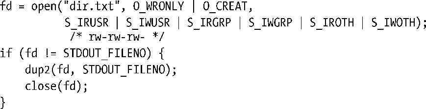
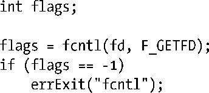
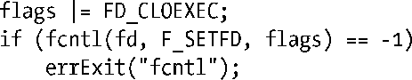
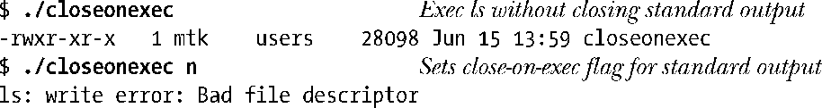
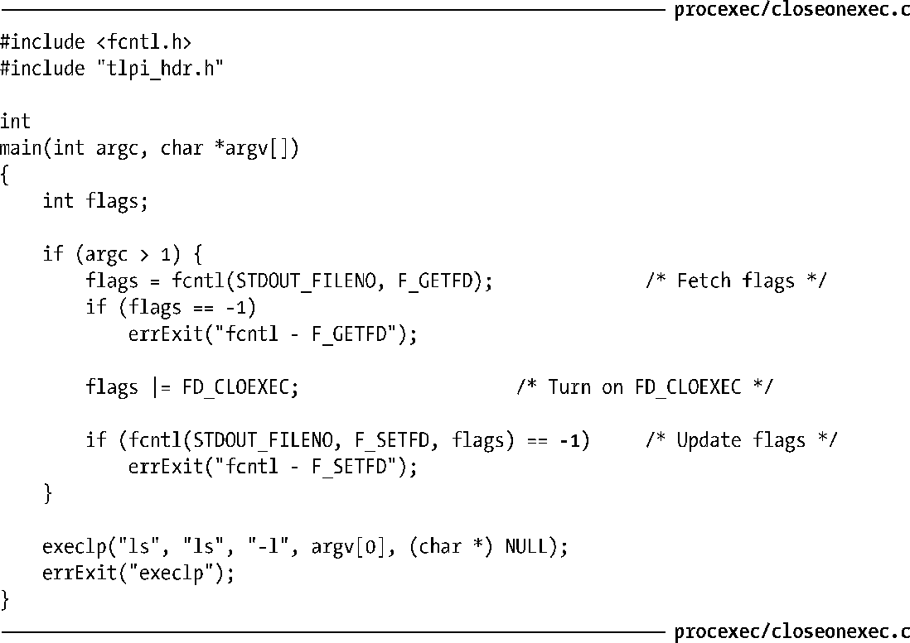

### 27.4　文件描述符与exec()

默认情况下，由exec()的调用程序所打开的所有文件描述符在exec()的执行过程中会保持打开状态，且在新程序中依然有效。这通常很实用，因为调用程序可能会以特定的描述符来打开文件，而在新程序中这些文件将自动有效，无需再去了解文件名或是把它们重新打开。

shell利用这一特性为其所执行的程序处理I/O重定向。例如，假设键入如下的shell命令：

shell运行该命令时，执行了以下步骤。

**1．** 调用fork()创建子进程，子进程会也运行shell的一份拷贝（因此命令行也有一份拷贝）。

**2．** 子shell以描述符1（标准输出）打开文件dir.txt用于输出。可能会采取以下任一方式。

a）子shell关闭描述符1（STDOUT_FILENO）后，随即打开文件dir.txt。因为open()在为描述符取值时总是取最小值，而标准输入（描述符0）又仍处于打开状态，所以会以描述符1来打开文件。

b）shell打开文件dir.txt，获取一个新的文件描述符。之后，如果该文件描述符不是标准输出，那么shell会使用dup2()强制将标准输出复制为新描述符的副本，并将此时已然无用的新描述符关闭。（这种方法较之前者更为安全，因为它并不依赖于打开文件描述符的低值取数原则。）源代码顺序大体如下：

**3．** 子shell执行程序ls。ls将其结果输出到标准输出，亦即文件dir.txt中。

> 此处对shell处理I/O重定向的解释有所简化。特别是，某些命令，即所谓shell内建命令，是由shell直接运行的，并未调用fork()或者exec()。在处理I/O重定向时，针对这样的命令必须进行特殊处理。
> 将某一 shell 命令实现为内建命令，不外乎如下两个目的：效率以及会对 shell 产生副作用（side effect）。一些频繁使用的命令（如pwd、echo和test）逻辑都很简单，放在shell内部实现效率会更高。将其他命令内置于 shell实现，则是希望命令对shell本身能产生副作用：更改shell所存储的信息，修改shell进程的属性，亦或是影响shell进程的运行。例如，cd命令必须改变shell自身的工作目录，故而不应在一个独立进程中执行。产生副作用的内建命令还包括exec、exit、read、set、source、ulimit、umask、wait以及shell的作业控制（job-control）命令（jobs、fg和bg）。想了解shell支持的全套内建命令，可参考shell手册页（manual page）文档。

#### 执行时关闭（close-on-exec）标志（FD_CLOEXEC）

在执行 exec()之前，程序有时需要确保关闭某些特定的文件描述符。尤其是在特权进程中调用exec()来启动一个未知程序时（并非自己编写），亦或是启动程序并不需要使用这些已打开的文件描述符时，从安全编程的角度出发，应当在加载新程序之前确保关闭那些不必要的文件描述符。对所有此类描述符施以close()调用就可达到这一目的，然而这一做法存在如下局限性。

+ 某些描述符可能是由库函数打开的。但库函数无法使主程序在执行exec()之前关闭相应的文件描述符。作为基本原则，库函数应总是为其打开的文件设置执行时关闭（close-on-exec）标志，稍后将介绍所使用的技术。
+ 如果exec()因某种原因而调用失败，可能还需要使描述符保持打开状态。如果这些描述符已然关闭，将它们重新打开并指向相同文件的难度很大，基本上不太可能。

为此，内核为每个文件描述符提供了执行时关闭标志。如果设置了这一标志，那么在成功执行exec()时，会自动关闭该文件描述符，如果调用exec()失败，文件描述符则会保持打开状态。可以通过系统调用fcntl()（5.2节）来访问执行时关闭标志。fcntl()的F_GETFD操作可以获取文件描述符标志的一份拷贝：

获取这些标志后，可以对FD_CLOEXEC位进行修改，再调用fcntl()的F_SETFD操作令其生效：

> 实际上FD_CLOEXEC是文件描述符标志中唯一可以操作的一位。该位对应值为1。在较老一些的程序中，有时可以看到以fcntl(fd, F_SETFD,1)的调用方式来设置执行时关闭标志，其事实依据是这种操作不可能影响到其他位。但理论上，情况不会总是一成不变（未来，一些UNIX系统可能会实现其他的标志位），所以还是使用正文所示的技术较为稳妥。
> 包括Linux在内的许多UNIX实现，还允许以另外两种非标准的ioctl()调用来修改执行时关闭标志：以ioctl(fd, FIOCLEX)为fd设置此标志，以ioctl(fd, FIONCLEX)来清除此标志。

当使用 dup()、dup2()或fcntl()为一文件描述符创建副本时，总是会清除副本描述符的执行时关闭标志。（这一现象既有其历史渊源，也顺应了 SUSv3 的要求。）

程序清单27-6展示了对执行时关闭标志的操作。如果运行时带有命令行参数（可为任意字符串），该程序首先为标准输出设置执行时关闭标志，随后执行 ls 命令。程序运行的结果如下：

上例中第2次运行该程序时，ls检测出其标准输出已然关闭，故而向标准错误（stderr）输出了一条错误信息。

程序清单27-6：为一文件描述符设置执行时关闭标志

