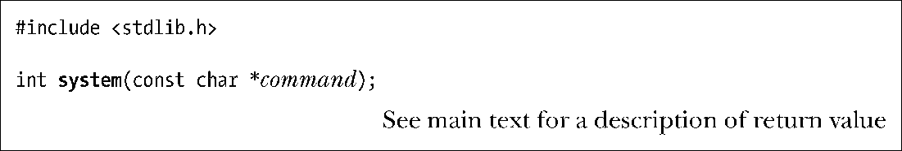
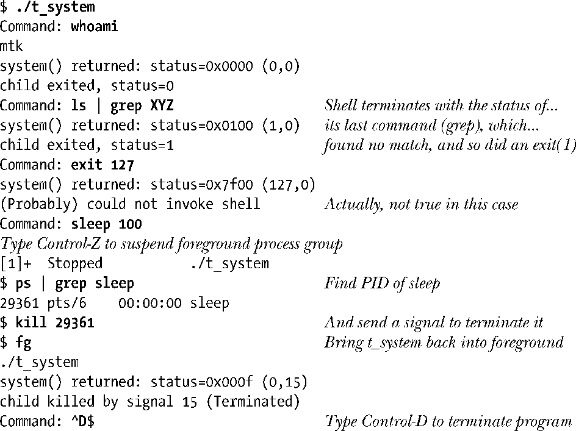
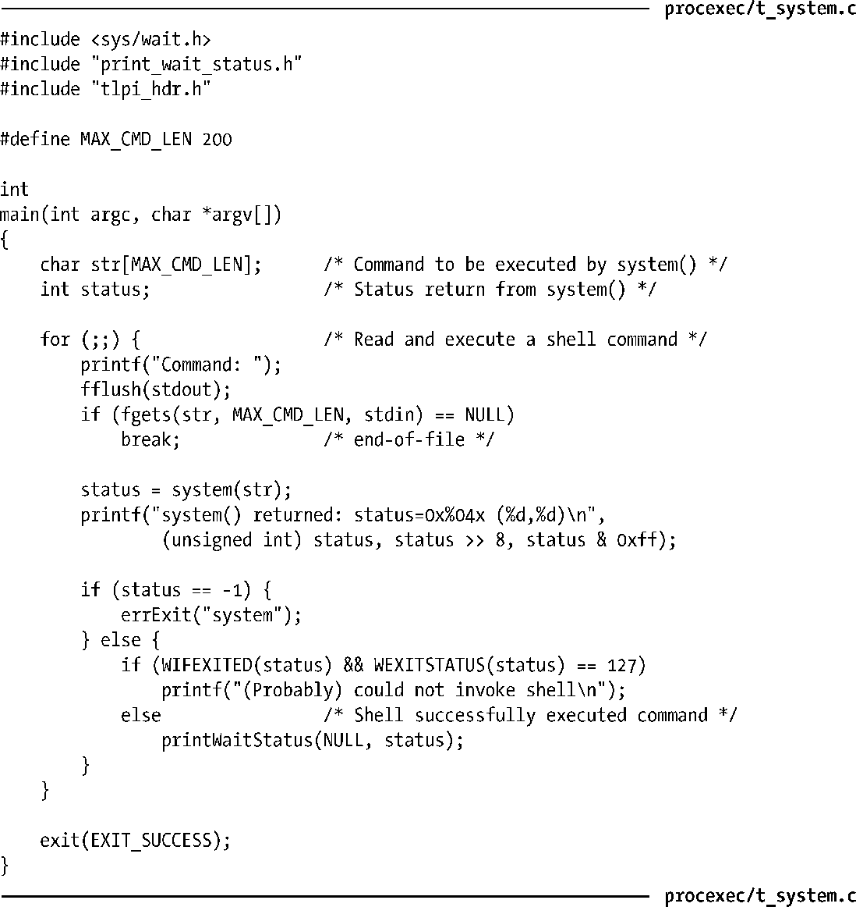

### 27.6　执行shell命令：system()

程序可通过调用system()函数来执行任意的shell命令。本节将讨论system()的操作，下一节将介绍如何运用fork()、exec()、wait()和exit()来实现system()。

> 44.5节所介绍的popen()和pclose()函数同样可以用来执行shell命令，而且还允许调用程序向命令发送输入信息，或是读取命令的输出。

函数system()创建一个子进程来运行shell，并以之执行命令command。其调用示例如下：

system()的主要优点在于简便。

+ 无需处理对fork()、exec()、wait()和exit()的调用细节。
+ system()会代为处理错误和信号。
+ 因为system()使用shell来执行命令（command），所以会在执行command之前对其进行所有的常规shell处理、替换以及重定向操作。为应用增加“执行一条shell命令”的功能不过是举手之劳。（许多交互式应用程序以“！command”的形式提供了这一功能。）

但这些优点是以低效率为代价的。使用system()运行命令需要创建至少两个进程。一个用于运行 shell，另外一个或多个则用于 shell 所执行的命令（执行每个命令都会调用一次exec()）。如果对效率或者速度有所要求，最好还是直接调用fork()和exec()来执行既定程序。

system()的返回值如下。

+ 当command为NULL指针时，如果shell可用则system()返回非0值，若不可用则返回0。这种返回值方式源于C语言标准，因为并未与任何操作系统绑定，所以如果system()运行在非 UNIX 系统上，那么该系统可能是没有shell的。此外，即便所有UNIX实现都有 shell，如果程序在调用system()之前又调用了chroot()，那么shell依然可能无效。若command不为NULL，则system()的返回值由本列表中的余下规则决定。
+ 如果无法创建子进程或是无法获取其终止状态，那么system()返回-1。
+ 若子进程不能执行shell，则system()的返回值会与子shell调用_exit(127)终止时一样。
+ 如果所有的系统调用都成功，system()会返回执行command的子shell的终止状态。shell 的终止状态是其执行最后一条命令时的退出状态；如果命令为信号所杀，大多数shell 会以值 128+n 退出，其中 n 为信号编号（如果是子 shell 为信号所杀，那么其终止状态如26.1.3节所述）。

> 至于调用失败是由于 system()无法执行 shell，还是 shell 以状态 127 退出（若 shell未能发现并执行既定名称的程序，就会导致后一种情况的发生），（通过system()的返回值）是无法区分的。

在最后两种情况中，system()的返回值与waitpid()所返回的等待状态（wait status）形式相同。因此，可以使用26.1.3节所述函数来分析返回值，并以printWaitStatus()函数（见程序清单26-2）加以显示。

#### 示例程序

程序清单27-7演示了 system()的用法。程序循环读取命令字符串，再使用system()来执行命令，并对system()的返回值进行分析和展示。下面是一个运行的例子：

程序清单27-7：通过system()执行shell命令

#### 在设置用户ID（set-user-ID）和组ID（set-group-ID）程序中避免使用system()

当设置了用户 ID 和组 ID 的程序在特权模式下运行时，绝不能调用 system()。即便此类程序并未允许用户指定需要执行的命令文本，鉴于shell对操作的控制有赖于各种环境变量，故而使用system()会不可避免地给系统带来安全隐患。

例如，在较老的Bourne shell中，环境变量IFS（定义了用于将命令行拆分为独立单词的内部字段分隔符）就引发了若干起对系统入侵的成功案例。如果将IFS定义为a，那么shell会将字符串shar视为带有参数r的单词sh，并启动另一shell进程来执行当前工作目录下名为r的脚本，这就一改命令的原意（执行名为shar的命令）。对这一安全漏洞的修复举措是，将IFS只应用于shell扩展所产生的单词。此外，现代shell会在启动时重置IFS（为由空格、Tab以及换行3个字符组成的字符串），以确保即使IFS的继承值很奇怪，脚本的行为也会保持一致。作为进一步的安全举措，当从设置用户（组）ID程序中调用时，bash会回转为实际用户（组）ID的“真身”。

应用需要加载其他程序时，为确保安全过关，应当直接调用fork()和exec()系函数（execlp()和execvp()除外）之一。

