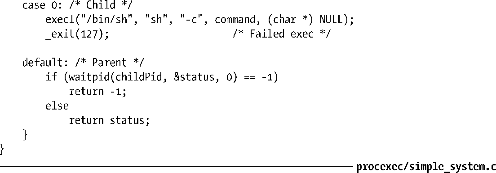
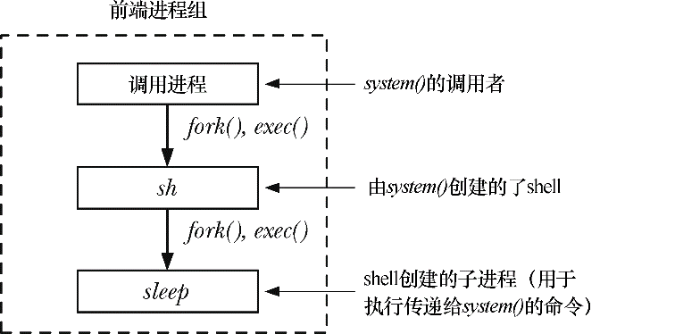
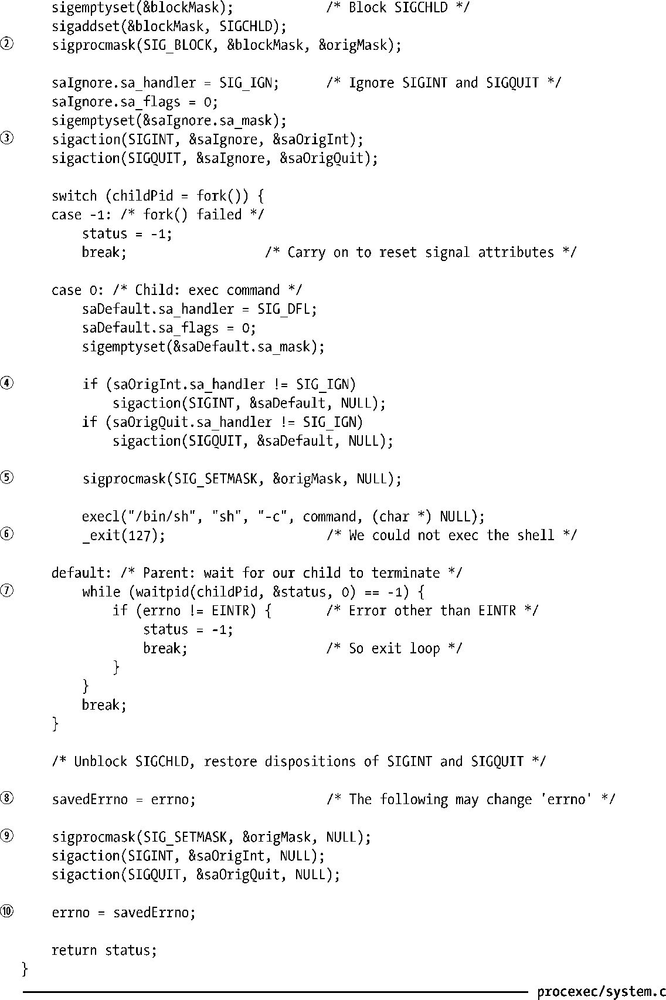
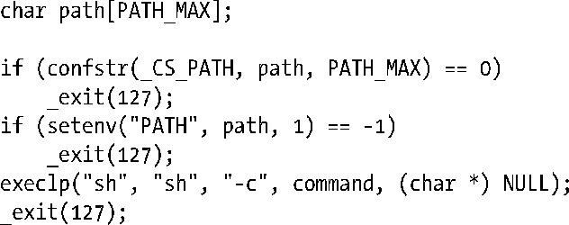

### 27.7　system()的实现

本节将说明如何实现system()的功能。首先给出一个简化版实现，接着指出这一实现的缺失所在，最后再展示了一个完整的实现。

#### 对system()的简化实现

命令sh的参数-c提供了一种简单的方法，可以执行包含任意命令的字符串：

因此，为了实现system()，需要使用fork()来创建一个子进程，并以对应于上例sh命令的参数来调用execl()：

为了收集system()所创建的子进程状态，还以指定的子进程ID调用了 waitpid()。（使用 wait()并不合适，因为wait()等待的是任一子进程，因而无意间所获取的子进程状态可能属于其他子进程。）程序清单27-8是对system()的简化实现。

程序清单27-8：一个缺乏信号处理的system()实现

#### 在system()内部正确处理信号

给system()的实现带来复杂性的是对信号的正确处理。

首先需要考虑的信号是SIGCHLD。假设调用system()的程序还直接创建了其他子进程，对SIGCHLD的信号处理器自身也执行了wait()。在这种情况下，当由system()所创建的子进程退出并产生SIGCHLD信号时，在system()有机会调用waitpid()之前，主程序的信号处理器程序可能会率先得以执行（收集子进程的状态）。这是竞争条件（race condition）的又一例证。这会产生两种不良后果。

+ 调用程序会误以为其所创建的某个子进程终止了。
+ system()函数却无法获取其所创建子进程的终止状态。

所以，system()在运行期间必须阻塞SIGCHLD信号。

其他需要关注的信号则是分别由终端的中断（interrupt）（通常为Ctrl-C）和退出（quit）（通常为Ctrl-\）符所产生的SIGINT和SIGQUIT信号。考虑执行如下调用的后果：

此时此刻，会有3个进程在运行：执行调用程序的进程、一个shell进程，以及sleep进程。如图27-2所示。

<b class="my_markdown">图27-2：执行system（"sleep 20"）期间的进程情况</b>

> 为提高效率，如果赋予-c选项的是一条简单命令，较之于管道（pipeline）或序列（sequence），一些shell（包括bash）会直接执行该命令，而不会再去创建一个子shell。对于采用此类优化的shell而言，因为只有两个进程（调用进程和sleep进程），所以图27-2有失准确。不过，本节关于system()如何处理信号的论述仍然适用。

图27-2中所示的所有进程构成终端前台进程组的一部分。（34.2节将详细讨论进程组。）所以，在输入中断或退出符时，会将相应信号发送给所有 3 个进程。shell 在等待子进程期间会忽略SIGINT和SIGQUIT信号。不过，默认情况下这些信号会杀死调用程序与sleep进程。

调用进程和所执行的命令应当如何应对这些信号呢？SUSv3的规定如下。

+ 调用进程在执行命令期间应忽略SIGINT和SIGQUIT信号。
+ 子进程对上述两信号的处理，如同调用进程调用了 fork()和 exec()一般，也就是说，将对已处理信号的处置重置为默认值，而对其他信号的处置则保持不变。

按照SUSv3所规范的方式来处理信号是最为合理的，其原因如下。

+ 让所有的进程都对这些信号做出响应是没有意义的，用户会对应用的行为困惑不已。
+ 与上述相类似，一面在执行命令的进程中忽略这些信号，而同时又在调用进程中按对它们的缺省处置来行事，这同样也说不通。用户借此可以将调用进程杀掉，同时放任其所执行的命令继续运行。这与实际情况也并不相符：当命令传递给 system()执行时，调用进程实际上已经放弃了控制权（即阻塞于waitpid()调用中）。
+ system()运行的可能是一个交互式应用，让此类应用响应终端产生的信号是合理的。

SUSv3要求按上述方式来处理SIGINT和SIGQUIT，但同时指出，对于暗中调用system()来执行任务的程序，这一做法可能会产生不良后果。执行命令时如按下Ctrl-C或Ctrl-\，将只会杀掉system()的子进程，而应用程序会继续运行（用户并不希望如此）。以此方式调用system()的程序应当检查system()所返回的终止状态，一旦发现命令因信号而终止，应采取相应措施。

#### system()实现的改进版

程序清单27-9所示为遵循上述规则的system()实现。关于该实现，需注意以下几点。

+ 如前所述，当command为NULL指针时，若shell可用，则system()应返回非0值；如不可用，则返回 0。要得出结论，唯一可靠的办法就是尝试运行 shell。程序这里的做法是：递归调用system()去运行shell命令“:”并检查该递归调用的返回状态是否为0 ①。“:”是一个shell内建命令，无所作为却总是返回成功。执行命令exit 0也可获得相同效果。（仅仅通过access()来判断文件/bin/sh存在与否，是否具有可执行权限的做法存在局限性。在chroot()环境中，即使具有可执行权限的shell文件存在，如果与其进行动态链接的共享库无效，依然无法执行shell。）
+ 只有父进程（system()的调用者）才需要阻塞SIGCHLD②，同时还需要忽略SIGINT和SIGQUIT③。不过，必须在调用fork()之前执行这些动作，因为如果在父进程的fork()之后执行，将出现竞争条件。（假设：如果在父进程有机会阻塞SIGCHLD之前，子进程就退出了。）结果是，如同稍后所述，子进程必须取消对信号属性的这些变更。
+ 父进程并未对 sigaction()以及 sigprocmask()调用进行错误检查②③⑨，这两者分别用于操作对信号的处置和信号掩码。这样做原因有二。其一，这些调用失手的可能性不大。实际上，只有指定参数有误时才会失败，而只要一开始调试就能搞定此类问题。其二，这里假定，较之于此类信号操控函数，调用者更关注fork()或waitpid()的成败与否。同理，在system()尾部的信号处理操作前后，分别有代码来保存和恢复 errno，以便一旦fork()或waitpid()失败，调用者能查明原因。如果因信号操作失败而返回-1，那么调用者会误认为是system()执行command失败所致。

> SUSv3仅仅指出在创建子进程失败或无法获取子进程状态时，system()返回-1。并未提及system()在处理信号失败时也会返回-1。

+ 子进程中对于信号相关的系统调用也未执行错误检查④⑤。一方面，无法报告此类错误（_exit(127）是预留给执行shell时报告错误之用）；另一方面，这一失败也不会殃及system()的调用者，二者分属于不同进程。
+ 子进程刚从fork()返回时，会将对SIGINT和SIGQUIT的处置置为SIG_IGN（继承自父进程）。不过，如前所述，子进程处理这些信号时就如同system()的调用者执行了fork()和exec()。fork()不会改变子进程对这些信号的处理方式。而exec()则会将对已处理信号的处置重置为默认值，但不改变对其他信号的处置（27.5节）。因此，如果调用者对SIGINT和SIGQUIT的处置设置并非SIG_IGN，那么子进程会将其置为SIG_DFL④。

> 一些system()实现反而会将子进程对SIGINT和SIGQUIT的处置重置为在调用者中生效的设置。这一做法的依据是，后续对execl()的调用会自动将对这些已处理信号的处置重置为默认值。不过，如果调用者正在处理两个信号之一时，这可能会导致不希望的行为发生。在这种情况下，如果在调用execl()之前的瞬间有信号送达子进程，那么在信号经由sigprocmask()解除阻塞后，子进程还是会调用信号处理器程序。

+ 子进程如果调用execl()失败，就会以_exit()，而非exit()来终止进程⑤。这是为了防止对子进程stdio缓冲区中的任何未写入数据进行刷新。
+ 父进程必须使用waitpid()来专候其所创建的特定子进程⑦。如果使用wait()，不经意间可能会捕获到其他子进程的状态。
+ 虽然system()实现并未强制要求使用信号处理器程序，但调用程序还是可能会去创建它们，从而中断对waitpid()的阻塞调用。SUSv3明确要求在这种情况下必须重新等待。所以，如果发生EINTR错误⑦，则循环调用waitpid()以期成功重启。如果是其他错误，则退出waitpid()循环。

程序清单27-9：system()的实现

#### 关于system()的更多细节

为保障应用程序的可移植性，应确保在将对SIGCHLD的处置置为SIG_IGN的情况下不去调用system()，因为此时waitpid()将无法获取子进程的状态。（忽略SIGCHLD会导致立即丢弃子进程状态，如26.3.3节所述。）

在一些UNIX实现中，如果在将对SIGCHLD的处置置为SIG_IGN的情况下调用system()，system()的应对策略是：临时将其改为SIG_DFL。只要在把对SIGCHLD的处置重置为SIG_IGN时，UNIX实现能够处理僵尸子进程（Linux不在此列），这种方法就是可行的。（如果系统做不到这一点，按此方式实现system()将产生如下不良后果：在调用者执行system()期间，如果另一子进程终止了，那么该子进程将成为僵尸进程，且无法回收。）

对于一些UNIX实现（尤其是Solaris），/bin/sh并非标准的POSIX shell。若希望确保执行标准 shell，则必须使用库函数 confstr()来获取配置变量_CS_PATH的值。该值的风格与PATH相同，包含了标准系统工具的目录列表。可以将该列表赋给变量 PATH，随即调用 execlp()以执行标准shell，具体如下：

