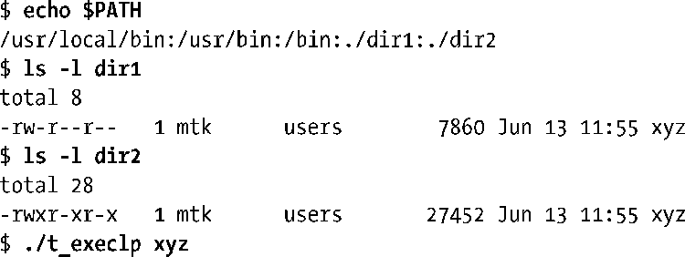
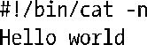
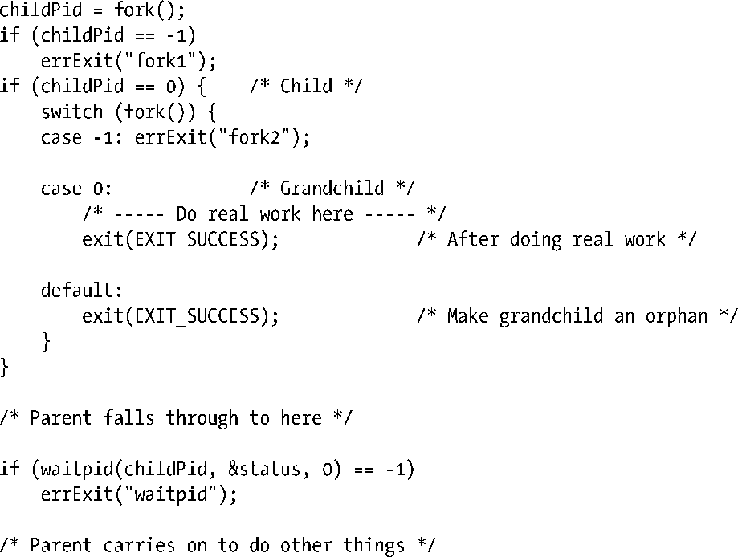
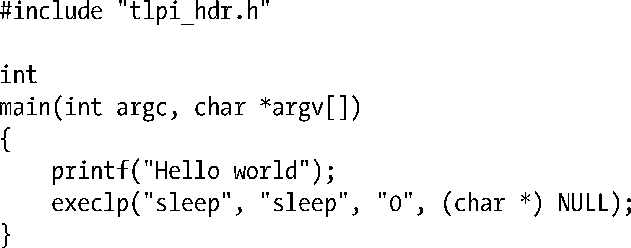

### 27.9　练习

**27-1.** 　如下shell会话的最后一条命令使用程序清单27-3程序来执行程序xyz。结果如何？

**27-2.** 　试用execve()实现execlp()。需使用stdarg(3) API来处理execlp()所提供的变长参数列表。还需要使用malloc函数库中函数为参数以及环境向量分配空间。最后，请注意，要检查特定目录下某个文件是否存在且可以执行，有一种简单方法：尝试执行该文件即可。

**27-3.** 　如果赋予如下脚本可执行权限并以exec()运行，输出结果如何？

**27-4.** 　下列代码会有什么效果？在何种情况下会起作用？

**27-5.** 　运行如下程序时无输出。试问原因何在？

**27-6.** 　假设父进程为信号SIGCHLD创建了一处理器程序，同时阻塞该信号。随后，其某一子进程退出，父进程接着执行wait()以获取该子进程的状态。当父进程解除对SIGCHLD的阻塞时，会发生什么？编写一个程序来验证答案。这一结果与调用system()函数的程序之间有什么关联？

