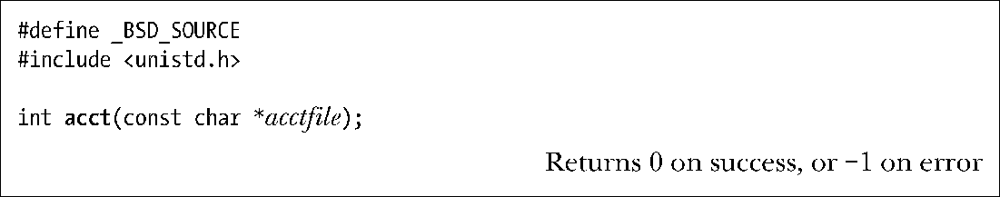
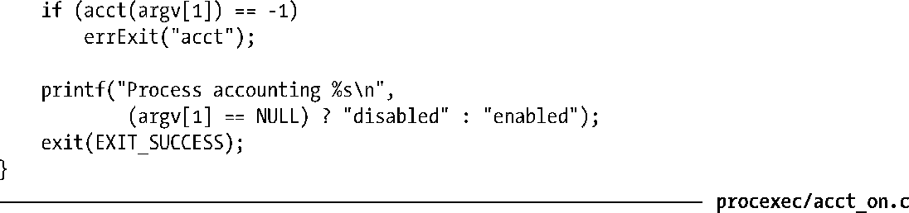
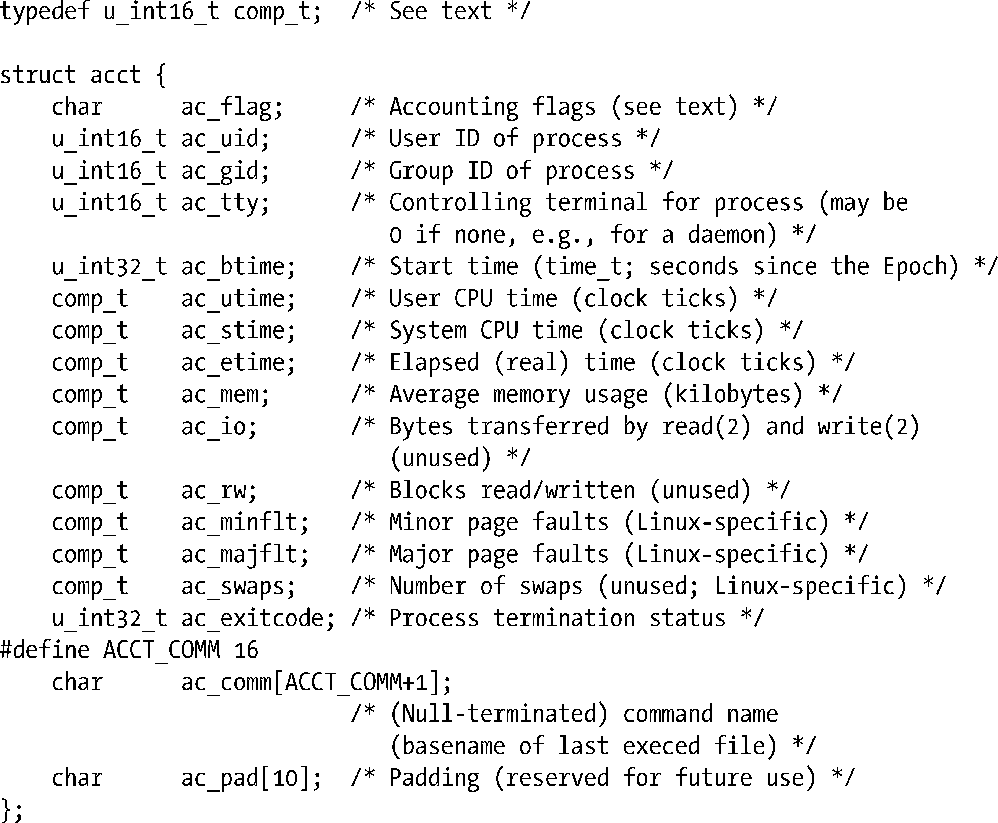
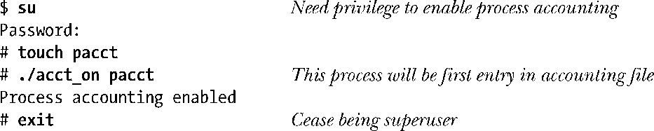
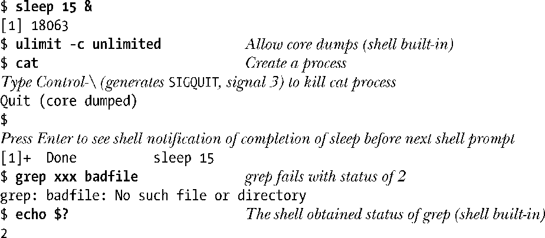
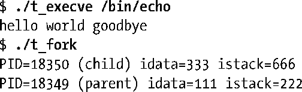
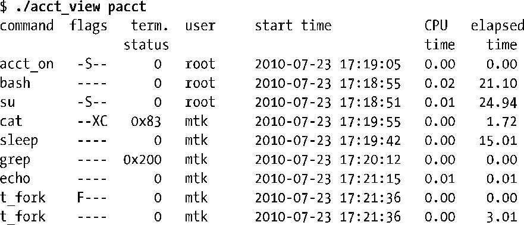
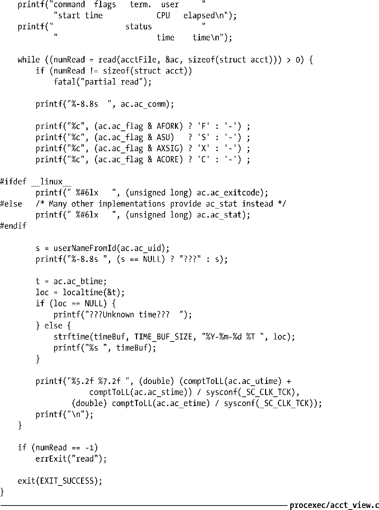
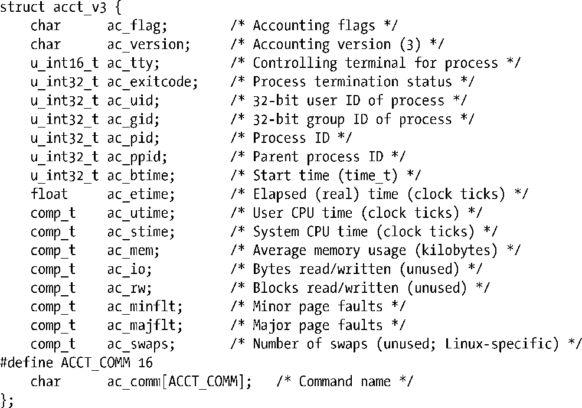

### 28.1　进程记账

打开进程记账功能后，内核会在每个进程终止时将一条记账信息写入系统级的进程记账文件。这条账单记录包含了内核为该进程所维护的多种信息，包括终止状态以及进程消耗的CPU时间。借助于标准工具（sa(8) 对账单文件进行汇总，lastcomm(1)则就先前执行的命令列出相关信息）或是定制应用，可对记账文件进行分析。

> 内核2.6.10之前，内核会为基于NPTL线程实现所创建的每个线程单独记录一条进程记账信息。自内核2.6.10开始，只有当最后一个线程退出时才会为整个进程保存一条账单记录。至于更老的LinuxThread线程实现，则会为每个线程单独记录一条进程记账信息。

从历史上看，进程记账主要用于在多用户UNIX系统上针对用户所消耗的系统资源进行计费。不过，如果进程的信息并未由其父进程进行监控和报告，那么就可以使用进程记账来获取。

虽然大部分UNIX实现都支持进程记账功能，但SUSv3并未对其进行规范。账单记录的格式、记账文件的位置也随系统实现的不同而多少存在差别。本节所述是针对Linux系统的细节，但会在论述过程中点出其与其他Unix系统的差异。

> Linux系统的进程记账功能属于可选内核组件，可以通过CONFIGBSD_PROCESS ACCT选项进行配置。

#### 打开和关闭进程记账功能

特权进程可利用系统调用acct()来打开和关闭进程记账功能。应用程序很少使用这一系统调用。一般会将相应命令置于系统启动脚本中，在系统每次重启时开启进程记账功能。

为了打开进程账单功能，需要在参数acctfile中指定一个现有常规文件的路径名。记账文件通常的路径名是/var/log/pacct或/usr/account/pacct。若想关闭进程记账功能，则指定acctfile为NULL即可。

程序清单28-1中程序使用acct()来开关进程的记账功能。该程序的作用类似于shell命令accton(8)。

程序清单28-1：打开和关闭进程记账功能

#### 进程账单记录

一旦打开进程记账功能，每当一进程终止时，就会有一条acct记录写入记账文件。acct结构定义于头文件<sys/acct.h>中，具体如下：

关于acct结构需要注意以下几点。

+ 数据类型u_int16_t和u_int32_t分别是16位和32位的无符号整数类型。
+ ac_flag 字段（field）是为进程记录多种事件（event）的位掩码（bit mask）。表 28-1展示了在该字段中可能出现的位。如表中所示，并非所有的UNIX实现都支持这些位。另有少数实现为该字段还提供了一些附加的位。
+ ac_comm字段记录了该进程最后执行的命令（程序文件）名称。内核会在每次调用execve()时记录该值。一些UNIX实现将该字段的大小限制在8个字节以内。
+ 类型comp_t是一种浮点型（floating-point）数字。有时也将该类型值称为压缩时钟周期（compressed clock tick）。该浮点值由3位（bit）以8为底的指数以及13位（bit）小数组成，指数用来表示值范围在80=1～87（2097152）之间的因子。例如，尾数为125，指数部分为1就表示值为1000。程序清单28-2中定义的函数（comptToLL()）可以将该类型转换为long long。因为在x86-32架构下的系统中，用于表示无符号长整型的32位数并不足以保存 comp_t型的最大值：(213 – 1) × 87。
+ 3个定义为comp_t型的时间字段其度量单位为系统时钟周期。要将它们转换成秒，必须除以sysconf(_SC_CLK_TCK)的返回值。
+ ac_exitcode字段保存着进程的退出状态（如26.1.3节所述）。其他大多数UNIX实现则提供了一个名为ac_stat的单字节字段来代替ac_exitcode，其中仅记录了杀死进程的信号值（如果进程为信号所杀）和一个标志位，用于标识是否因该信号而导致进程转储核心（dump core）。二者在源于BSD的实现中均未提供。

<b class="my_markdown">表28-1：进程账单记录中ac_flag字段各位的值</b>

| 位 | 说　　明 |
| :-----  | :-----  | :-----  | :-----  |
| AFORK | 由fork()创建的进程，终止前并未调用exec() |
| ASU | 拥有超级用户特权的进程 |
| AXSIG | 进程因信号而终止（有些实现未支持） |
| ACORE | 进程产生了核心转储（有些实现未支持） |

因为只在进程终止时才记录账单信息，所以对这些记录的排序也是按照进程的终止时间（并未写入记录），而非启动时间（ac_btime）。

> 如果系统崩溃，也不会为当前运行的进程记录任何记账信息。

由于向记账文件中写入信息可能会加速对磁盘空间的消耗，为了对进程记账行为加以控制，Linux系统提供了名为/proc/sys/kernel/acct的虚拟文件。此文件包含3个值，按顺序分别定义了如下参数：高水位（high-water）、低水位（low-water）和频率（frequency）。3个参数通常的默认值为 4、2和 30。如果开启进程记账特性且磁盘空闲空间低于低水位（low-water）百分比，将暂停记账。如果磁盘空闲空间升至高水位百分比之上，则恢复记账。频率值则规定了两次检查空闲磁盘空间占比之间的间隔时间（以秒为单位）。

#### 示例程序

程序清单28-2中程序显示了某进程记账文件记录中特定字段的信息。以下shell会话演示了对该程序的使用。首先新建一个空的进程记账文件，同时开启进程记账功能。

从开启进程记账功能到现在，已经有3个进程退出，分别执行了acct_on、su和bash程序。进程bash由su启动，负责运行特权级shell会话。

接着运行一系列命令，借此向记账文件加入更多记录：

下面两个命令执行的是前面章节中展示过的两个程序（程序清单27-1和程序清单24-1）。第一条命令运行的程序执行了/bin/echo，因此，写入账单记录中的命令名是echo。第二条命令创建了一个子进程，该子进程并未调用exec()。

最后，运行程序清单28-2中程序来查看记账文件的内容。

输出中的每行都对应于shell会话所创建的一个进程。ulimit和echo都是shell的内建命令，所以并不会创建新进程。注意，记账文件中sleep之所以出现在cat之后，是因为sleep在cat之后才终止。

大部分输出的含义均不言而喻。flags列中的各个字母表示每条记录对哪些ac_flag位进行了置位（参考表28-1）。至于应如何解释term.status列中的终止状态，26.1.3节有相关描述。

程序清单28-2：显示进程记账文件中的数据

#### 进程记账文件格式（版本3）

从内核2.6.8开始，Linux引入了另一版本的进程记账文件以备选用，意在突破传统记账文件的一些限制。若有意使用这种被称为版本3的备选格式，需要在编译内核前打开内核配置选项CONFIG_BSD_PROCESS_ACCT_V3。

使用版本3，操作进程记账时唯一的差别在于，写入记账文件的记录格式不同。新格式的定义如下：

以下是acct_v3结构与传统Linux acct结构的主要差别。

+ 增加ac_version字段。该字段包含本类型账单记录的版本号。对于acct_v3来说，总是等于3。
+ 增加ac_pid和ac_ppid字段，分别包含终止进程的进程ID及其父进程ID。
+ 字段ac_uid和ac_gid从16位扩展至32位，旨在容纳Linux 2.4所引入的32位用户ID和组ID。（传统acct文件无法正确记录大数值的用户和组ID。）
+ 将ac_etime字段类型从comp_t改为float，意在能够记录更长的逝去时间。

> 随本书发布的源代码文件procexec/acct_v3_view.c中提供了程序清单28-2中程序基于v3格式的新版本。

