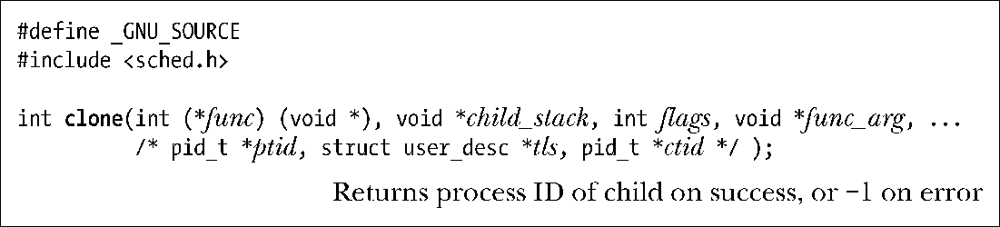
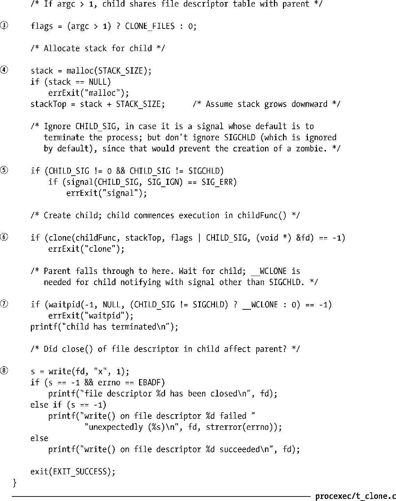
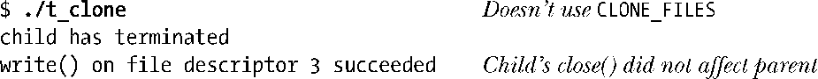
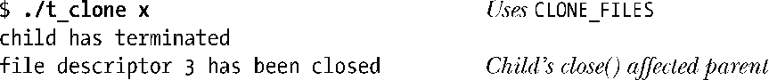

### 28.2　系统调用clone()

类似于fork()和vfork()，Linux特有的系统调用clone()也能创建一个新进程。与前两者不同的是，后者在进程创建期间对步骤的控制更为精准。clone()主要用于线程库的实现。由于clone()有损于程序的可移植性，故而应避免在应用程序中直接使用。之所以在这里讨论clone()，意在对第29章至第33章所论述的POSIX线程有所铺垫，同时也利于进一步阐明fork()和vfork()的操作。

如同fork()，由clone()创建的新进程几近于父进程的翻版。

但与fork()不同的是，克隆生成的子进程继续运行时不以调用处为起点，转而去调用以参数func所指定的函数，func又称为子函数（child function）。调用子函数时的参数由 func_arg指定。经过适当转换，子函数可对该参数的含义自由解读，例如，可以作为整型值（int），也可视为指向结构的指针。（之所以可以作为指针处理，是因为克隆产生的子进程对调用进程的内存既可获取，也可共享。）

> 对于内核而言，fork()、vfork()以及clone()最终均由同一函数实现（kernel/fork.c中的do_fork()）。在这一层次上，clone与fork更为接近：sys_clone()并没有func和func_arg参数，且调用后sys_clone()在子进程中返回的方式也与fork()相同。正文所述的clone()是由glibc为sys_clone()提供的封装函数。（对该函数的定义位于 glibc针对特定架构的汇编源码中，例如sysdeps/unix/sysv/linux/i386/clone.S。）sys_clone()在子进程中返回之后，由clone()发起对func函数的调用。

当函数func返回（此时其返回值即为进程的退出状态）或是调用exit()（或_exit()）之后，克隆产生的子进程就会终止。照例，父进程可以通过wait()一类函数来等待克隆子进程。

因为克隆产生的子进程可能（类似vfork()）共享父进程的内存，所以它不能使用父进程的栈。相反，调用者必须分配一块大小适中的内存空间供子进程的栈使用，同时将这块内存的指针置于参数child_stack中。在大多数硬件架构中，栈空间的增长方向是向下的，所以参数child_stack应当指向所分配内存块的高端。

> 栈增长方向对架构的依赖是clone()设计的一处缺陷。Interl IA-64架构就提供了一款经过改善的克隆API，称为clone2()。该系统调用对子进程栈范围的定义方式不依赖于栈的增长方向，只需要提供栈的起始地址以及大小即可。详情请参阅手册页。

函数clone()的参数flags服务于双重目的。首先，其低字节中存放着子进程的终止信号（terminateion signal），子进程退出时其父进程将收到这一信号。（如果克隆产生的子进程因信号而终止，父进程依然会收到SIGCHLD信号。）该字节也可能为0，这时将不会产生任何信号。（借助于Linux特有的/proc/PID/stat文件，可以判定任何进程的终止信号，详情请参阅proc(5)手册页。）

> 对于fork()和vfork()而言，就无从选择终止信号，只能是SIGCHLD。

参数flags的剩余字节则存放了位掩码，用于控制clone()的操作。表28-2对这些位掩码值进行了总结，28.2.1节会进一步加以说明。

<b class="my_markdown">表28-2：clone()参数flags的位掩码值</b>

| 标　　志 | 设置后的效果 |
| :-----  | :-----  | :-----  | :-----  |
| CLONE_CHILD_CLEARTID | 当子进程调用exec()或_exit()时，清除ctid（从版本2.6开始） |
| CLONE_CHILD_SETTID | 将子进程的线程ID写入ctid（从2.6版本开始） |
| CLONE_FILES | 父、子进程共享打开文件描述符表 |
| CLONE_FS | 父、子进程共享与文件系统相关的属性 |
| CLONE_IO | 子进程共享父进程的I/O上下文环境（从2.6.25版本开始） |
| CLONE_NEWIPC | 子进程获得新的System V IPC命名空间（从2.6.19开始） |
| CLONE_NEWNET | 子进程获得新的网络命名空间（从2.4.24版本开始） |
| CLONE_NEWNS | 子进程获得父进程挂载（mount）命名空间的副本（从2.4.19版本开始） |
| CLONE_NEWPID | 子进程获得新的进程ID命名空间（从2.6.23版本开始） |
| CLONE_NEWUSER | 子进程获得新的用户ID命名空间（从2.6.23版本开始） |
| CLONE_NEWUTS | 子进程获得新的UTS（utsname()）命名空间（从2.6.19版本开始） |
| CLONE_PARENT | 将子进程的父进程置为调用者的父进程（从2.4版本开始） |
| CLONE_PARENT_SETTID | 将子进程的线程ID写入ptid（从2.6版本开始） |
| CLONE_PID | 标志已废止，仅用于系统启动进程（直至2.4版本为止） |
| CLONE_PTRACE | 如果正在跟踪父进程，那么子进程也照此办理 |
| CLONE_SETTLS | tls描述子进程的线程本地存储（从2.6开始） |
| CLONE_SIGHAND | 父、子进程共享对信号的处置设置 |
| CLONE_SYSVSEM | 父、子进程共享信号量还原（undo）值（从2.6版本开始） |
| CLONE_THREAD | 将子进程置于父进程所属的线程组中（从2.4开始） |
| CLONE_UNTRACED | 不强制对子进程设置CLONE_PTRACE（从2.6版本开始） |
| CLONE_VFORK | 挂起父进程直至子进程调用exec()或_exit() |
| CLONE_VM | 父、子进程共享虚拟内存 |

clone()的余下参数分别是：ptid、tls和ctid。这些参数与线程的实现相关，尤其是在针对线程ID以及线程本地存储的使用方面。28.2.1节在说明flags位掩码值时，会论及这些参数的使用。（在Linux 2.4及其之前的版本中，clone()尚未提供上述3个参数。直到Linux 2.6，为了支持NPTL POSIX的线程实现，才特意加入了这些参数。）

#### 示例程序

程序清单28-3是使用clone()创建子进程的一个简单例子。主程序所做工作如下。

+ 打开一个文件描述符（打开设备/dev/null），在子进程中将其关闭②。
+ 若提供有命令行参数，则将clone()的flags参数置为CLONE_FILES③，以便父、子进程共享同一文件描述符表。若没有提供命令行参数，则将flags置0。
+ 分配一个栈供子进程使用④。
+ 若CHILD_SIG非0且不等于SIGCHLD⑤，则忽略之，以防该信号将子进程终止。之所以未忽略SIGCHLD，是因为那将导致无法收集子进程的退出状态。
+ 调用clone()创建子进程⑥。第三个参数（位掩码）包含了终止信号。第四个参数（func_arg）指定了之前打开的文件描述符（在②处）。
+ 等待子进程终止⑦。
+ 尝试调用write()，以检查文件描述符（在②处打开）是否仍处于打开状态⑧。程序报告write()操作是否成功。

克隆产生的子进程从childFunc()处开始执行，该函数（利用参数arg）接收由主程序打开的文件描述符（在②处）。子进程关闭文件描述符并调用return以终止①。

程序清单28-3：使用clone()创建子进程

运行程序清单28-3中程序，没有命令行参数时输出如下：

带有命令行参数运行程序时，两个进程将共享文件描述符表：

> 随本书发布的源代码文件procexec/demo_clone.c提供一个更为复杂的clone()用例。

