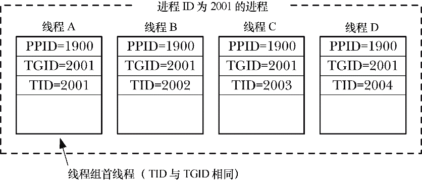
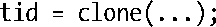

### 28.2.1　clone()的flags参数

clone()的flags参数是各种位掩码的组合（“或”操作），下面将对它们一一说明。讲述时并未按字母顺序展开，而是着眼于促进对概念理解，从实现POSIX线程所使用的标志开始。从线程实现的角度来看，下文多次出现的“进程”一词都可用“线程”替代。

这里需要指出，某种意义上，对术语“线程”和“进程”的区分不过是在玩弄文字游戏而已。引入术语“内核调度实体（KSE，kernel scheduling entity）”（某些教科书以之来指代内核调度器所处理的对象）的概念对解释这一点会有所助益。实际上，线程和进程都是KSE，只是与其他KSE之间对属性（虚拟内存、打开文件描述符、对信号的处置、进程ID等）的共享程度不同。针对线程间属性共享的方案不少，POSIX线程规范只是其中之一。

在下面的说明中，有时会提及Linux平台对POSIX线程的两种主要实现：年长的 LinuxThreads，以及较为年轻的 NPTL。关于这两种实现的更多细节可以在33.5节找到。

> 从内核2.6.16开始，Linux提供了新的系统调用unshare()，由clone()（或fork()、vfork()）创建的子进程利用该调用可以撤销对某些属性的共享（即反转一些clone() flags位的效果）。详细情况请参考unshare(2)手册页。

#### 共享文件描述符表：CLONE_FILES

如果指定了CLONE_FILES标志，父、子进程会共享同一个打开文件描述符表。也就是说，无论哪个进程对文件描述符的分配和释放（open()、close()、dup()、pipe()、socket()等），都会影响到另一进程。如果未设置CLONE_FILES，那么也就不会共享文件描述符表，子进程获取的是父进程调用clone()时文件描述符表的一份拷贝。这些描述符副本与其父进程中的相应描述符均指向相同的打开文件（和fork()和vfork()的情况一样）。

POSIX线程规范要求进程中的所有线程共享相同的打开文件描述符。

#### 共享与文件系统相关的信息：CLONE_FS

如果指定了CLONE_FS标志，那么父、子进程将共享与文件系统相关的信息（file system- related information）：权限掩码（umask）、根目录以及当前工作目录。也就是说，无论在哪个进程中调用umask ()、chdir()或者chroot()，都将影响到另一个进程。如果未设置CLONE_FS，那么父、子进程对此类信息则会各持一份（与fork()和vfork()的情况相同）。

POSIX线程规范要求实现CLONE_FS标志所提供的属性共享。

#### 共享对信号的处置设置：CLONE_SIGHAND

如果设置了CLONE_SIGHAND，那么父、子进程将共享同一个信号处置表。无论在哪个进程中调用sigaction()或signal()来改变对信号处置的设置，都会影响其他进程对信号的处置。若未设置CLONE_SIGHAND，则不共享对信号的处置设置，子进程只是获取父进程信号处置表的一份副本（如同fork()和vfork()）。CLONE_SIGHAND不会影响到进程的信号掩码以及对挂起（pending）信号的设置，父子进程的此类设置是绝不相同的。从Linux 2.6开始，如果设置了CLONE_SIGHAND，就必须同时设置CLONE_VM。

POSIX线程规范要求共享对信号的处置设置。

#### 共享父进程的虚拟内存：CLONE_VM

如果设置了CLONE_VM标志，父、子进程会共享同一份虚拟内存页（如同vfork()）。无论哪个进程更新了内存，或是调用了mmap()、munmap()，另一进程同样会观察到这些变化。如果未设置CLONE_VM，那么子进程得到的是对父进程虚拟内存的拷贝（如同fork()）。

共享同一虚拟内存是线程的关键属性之一，POSIX线程标准对此也有要求。

#### 线程组：CLONE_THREAD

若设置了CLONE_THREAD，则会将子进程置于父进程的线程组中。如果未设置该标志，那么会将子进程置于新的线程组中。

POSIX标准规定，进程的所有线程共享同一进程ID（即每个线程调用getpid()都应返回相同值），Linux从2.4版本开始引入了线程组（threads group），以满足这一需求。如图28-1 所示，线程组就是共享同一线程组标识（TGID）（thread group identifier）的一组KSE。在对CLONE_THREAD的后续讨论中，会将KSE视同线程看待。

<b class="my_markdown">图28-1：包含4个线程的线程组</b>

始于Linux2.4，getpid()所返回的就是调用者的TGID。换言之，TGID和进程ID是一回事。

> 在2.2以及更早的Linux系统中，对clone()的实现并不支持CLONE_THREAD。相反，LinuxThreads曾将POSIX线程实现为共享了多种属性（例如，虚拟内存）、进程ID又各不相同的进程。考虑到兼容性因素，即便是在当前的Linux内核中，LinuxThreads实现也未提供CLONE_THREAD，因为按此方式实现的线程就可以继续拥有不同的进程ID。

一个线程组内的每个线程都拥有一个唯一的线程标识符（thread identifier，TID），用以标识自身。Linux 2.4提供了一个新的系统调用gettid()，线程可通过该调用来获取自己的线程ID（与线程调用clone()时的返回值相同）。线程ID与进程ID都使用相同的数据类型pid_t来表示。线程ID在整个系统中是唯一的，且除了线程担当进程中线程组首线程的情况之外，内核能够保证系统中不会出现线程ID与进程ID相同的情况。

线程组中首个线程的线程ID与其线程组ID相同，也将该线程称之为线程组首线程（thread group leader）。

> 此处讨论的线程ID与POSIX线程所使用的线程ID（以数据类型pthread_t表示）不同。后者由POSIX线程实现（在用户空间）自行生成并维护。

线程组中的所有线程拥有同一父进程ID，即与线程组首线程ID相同。仅当线程组中的所有线程都终止后，其父进程才会收到SIGCHLD信号（或其他终止信号）。这些行为符合POSIX线程规范的要求。

当一个设置了CLONE_THREAD的线程终止时，并没有信号会发送给该线程的创建者（即调用clone()创建终止线程的线程）。相应的，也不可能调用 wait()（或类似函数）来等待一个以 CLONE_THREAD标志创建的线程。这与POSIX的要求一致。POSIX线程与进程不同，不能使用wait()等待，相反，必须调用pthread_join()来加入。为检测以CLONE_THREAD标志创建的线程是否终止，需要使用一种特殊的同步原语——futex（参考下文对CLONE_PARENT_SETTID标志的讨论）。

如果一个线程组中的任一线程调用了exec()，那么除了首线程之外的其他线程都会终止（这一行为也符合 POSIX 线程规范的要求），新进程将在首线程中执行。换言之，新程序中的 gettid()调用将会返回首线程的线程ID。调用exec()期间，会将该进程发送给其父进程的终止信号重置为SIGCHLD。

如果线程组中的某个线程调用fork()或vfork()创建了子进程，那么组中的任何线程都可使用wait()或类似函数来监控该子进程。

从Linux2.6开始，如果设置了CLONE_THREAD，同时也必须设置CLONE_SIGHAND。这也与POSIX线程标准的深入要求相契合，详细内容可参考33.2节关于POSIX线程与信号交互的相关讨论。（内核针对CLONE_THREAD线程组的信号处理对应于POSIX标准对进程中线程如何处理信号的规范。）

#### 线程库支持：CLONE_PARENT_SETTID、CLONE_CHILD_SETTID和CLONE_CHILD_CLEARTID

为实现POSIX线程，Linux 2.6提供了对CLONE_PARENT_SETTID、CLONE_CHILD_SETTID和CLONE_CHILD_CLEARTID的支持。这些标志会影响clone()对参数ptid和ctid的处理。NPTL的线程实现使用了CLONE_CHILD_SETTID和CLONE_CHILD_CLEARTID。

如果设置了CLONE_PARENT_SETTID，内核会将子线程的线程ID写入ptid所指向的位置。在对父进程的内存进行复制之前，会将线程ID复制到ptid所指位置。这也意味着，即使没有设置CLONE_VM，父、子进程均能在此位置获得子进程的线程ID。（如上所述，创建POSIX线程时总是指定了CLONE_VM标志。）

CLONE_PARENT_SETTID之所以存在，意在为线程实现获取新线程ID提供一种可靠的手段。注意，通过clone()的返回值并不足以获取新线程的线程ID。

问题在于，因为赋值操作只能在clone()返回后才会发生，所以以上代码会导致各种竞争条件。例如，假设新线程终止，而在完成对tid的赋值前就调用了终止信号的处理器程序。此时，处理器程序无法有效访问tid。（在线程库内部，可能会将tid置于一个用以跟踪所有线程状态的全局结构中。）程序通常可以通过直接调用clone()来规避这种竞争条件。不过，线程库无法控制其调用者程序的行为。使用CLONE_PARENT_SETTID可以保证在clone()返回之前就将新线程的ID赋值给ptid指针，从而使线程库避免了这种竞争条件。

如果设置了CLONE_CHILD_SETTID，那么clone()会将子线程的线程ID写入指针ctid所指向的位置。对ctid的设置只会发生在子进程的内存中，不过如果设置了CLONE_VM，还是会影响到父进程。虽然NPTL并不需要CLONE_CHILD_SETTID，但这一标识还是能给其他的线程库实现带来灵活性。

如果设置了CLONE_CHILD_CLEARTID标志，那么clone()会在子进程终止时将ctid所指向的内存内容清零。

借助于参数ctid所提供的机制（稍后描述），NPTL线程实现可以获得线程终止的通知。函数pthread_join()正需要这样的通知，POSIX线程利用该函数来等待另一线程的终止。

使用pthread_create()创建线程时，NPTL会调用clone()，其ptid和ctid均指向同一位置。（这正是NPTL不需要CLONE_CHILD_SETTID的原因所在。）设置了CLONE_PARENT_SETTID标志，就会以新的线程ID对该位置进行初始化。当子进程终止，ctid遭清除时，进程中的所有线程都会目睹这一变化（因为设置了CLONE_VM）。

内核将ctid指向的位置视同futex——一种有效的同步机制来处理。（关于futex的更多内容请参考futex(2)手册页。）执行系统调用futex()来监测ctid所指位置的内容变化，就可获得线程终止的通知。（这正是pthread_join()所做的幕后工作。）内核在清除ctid的同时，也会唤醒那些调用了futex()来监控该地址内容变化的任一内核调度实体（即线程）。（在POSIX线程的层面上，这会导致pthread_join()调用去解除阻塞。）

#### 线程本地存储：CLONE_SETTLS

如果设置了CLONE_SETTLS，那么参数tls所指向的user_desc结构会对该线程所使用的线程本地存储缓冲区加以描述。为了支持NPTL对线程本地存储的实现，Linux 2.6开始加入这一标志（31.4节）。关于user_desc结构的详情，可参考2.6内核代码中对该结构的定义和使用，以及set_thread_area(2)手册页。

#### 共享System V信号量的撤销值：CLONE_SYSVSEM

如果设置了CLONE_SYSVSEM，父、子进程将共享同一个System V信号量撤销值列表（47.8节）。如果未设置该标志，父、子进程各自持有取消列表，且子进程的列表初始为空。

> 内核从2.6版本开始支持CLONE_SYSVSEM，提供POSIX线程规范所要求的共享语义。

#### 每进程挂载命名空间：CLONE_NEWNS

Linux从内核2.4.19开始支持每进程挂载（mount）命名空间的概念。挂载命名空间是由对mount()和umount()的调用来维护的一组挂载点。挂载命名空间会影响将路径名解析为真实文件的过程，也会波及诸如chdir()和chroot()之类的系统调用。

默认情况下，父、子进程共享同一挂载命名空间，一个进程调用mount()或umount()对命名空间所做的改变，也会为其他进程所见（如同fork()和vfork()）。特权级（CAP_SYS_ADMIN）进程可以指定CONE_NEWNS标志，以便子进程去获取对父进程挂载命名空间的一份拷贝。这样一来，进程对命名空间的修改就不会为其他进程所见。（早期的2.4.x内核以及更老的版本认为，系统的所有进程共享同一个系统级挂载命名空间。）

可以利用每进程挂载命名空间来创建类似于chroot()监禁区（jail）的环境，而且更加安全、灵活，例如，可以向遭到监禁的进程提供一个挂载点，而该点对于其他进程是不可见的。设置虚拟服务器环境时也会用到挂载命名空间。

在同一clone()调用中同时指定CLONE_NEWNS和CLONE_FS纯属无聊，也不允许这样做。

#### 将子进程的父进程置为调用者的父进程：CLONE_PARENT

默认情况下，当调用clone()创建新进程时，新进程的父进程（由getppid()返回）就是调用clone()的进程（同fork()和vfork()）。如果设置了CLONE_PARENT，那么调用者的父进程就成为子进程的父进程。换言之，CLONE_PARENT等同于这样的设置：子进程.PPID = 调用者.PPID。（未设置CLONE_PARENT的默认情况是：子进程.PPID = 调用者.PID。）子进程终止时会向父进程（子进程.PPID）发出信号。

Linux从版本2.4之后开始支持CLONE_PARENT。其设计初衷意图是对POSIX线程的实现提供支持，不过内核 2.6 找出一种无需此标志而支持线程（之前所述的 CLONE_THREAD）的新方法。

#### 将子进程的进程ID置为与父进程相同：CLONE_PID（已废止）

如果设置了CLONE_PID，那么子进程就拥有与父进程相同的进程ID。若未设置此标志，那么父、子进程的进程ID则不同（如同fork()和vfork()）。只有系统引导进程（进程ID为0）可能会使用该标志，用于初始化多处理器系统。

CLONE_PID的设计初衷并非供用户级应用使用。Linux 2.6已将其移除，并以CLONE_IDLETASK取而代之，将新进程的ID置为0。CLONE_IDLETASK仅供内核内部使用（即使在clone()的参数中指定，系统也会对其视而不见）。使用此标志可为每颗CPU创建隐身的空闲进程（idle process），在多处理器系统中可能存在有多个实例。

#### 进程跟踪：CLONE_PTRACE和CLONE_UNTRACED

如果设置了CLONE_PTRACE且正在跟踪调用进程，那么也会对子进程进行跟踪。关于进程跟踪（由调试器和strace命令使用）的细节，请参考ptrace(2)手册页。

从内核2.6开始，即可设置CLONE_UNTRACED标志，这也意味着跟踪进程不能强制将其子进程设置为CLONE_PTRACE。CLONE_UNTRACED标志供内核创建内核线程时内部使用。

#### 挂起（suspending）父进程直至子进程退出或调用exec()：CLONE_VFORK

如果设置了CLONE_VFORK，父进程将一直挂起，直至子进程调用exec()或_exit()来释放虚拟内存资源（如同vfork()）为止。

#### 支持容器（container）的clone()新标志

Linux从2.6.19版本开始给clone()加入了一些新标志：CLONE_IO、CLONE_NEWIPC、CLONET_NEWNET、CLONE_NEWPID、CLONE_NEWUSER和CLONE_NEWUTS。（参考clone(2)手册页可获得有关这些标志的详细说明。）

这些标志中的大部分都是为容器（container）的实现提供支持（[Bhattiprolu et al., 2008]）。容器是轻量级虚拟化的一种形式，将运行于同一内核的进程组从环境上彼此隔离，如同运行在不同机器上一样。容器可以嵌套，一个容器可以包含另一个容器。与完全虚拟化将每个虚拟环境运行于不同内核的手法相比，容器的运作方式可谓是大相径庭。

为实现容器，内核开发者不得不为内核中的各种全局系统资源提供一个间接层，以便每个容器能为这些资源提供各自的实例。这些资源包括：进程ID、网络协议栈、uname()返回的ID、System V IPC对象、用户和组ID命名空间……

容器的用途很多，如下所示。

+ 控制系统的资源分配，诸如网络带宽或CPU时间（例如，授予容器某甲75%的CPU时间，某乙则获取25%）。
+ 在单台主机上提供多个轻量级虚拟服务器。
+ 冻结某个容器，以此来挂起该容器中所有进程的执行，并于稍后重启，可能是在迁移到另一台机器之后。
+ 允许转储应用程序的状态信息，记录于检查点（checkpointed），并于之后再行恢复（或许在应用程序崩溃之后，亦或是计划内、外的系统停机后），从检查点开始继续运行。

#### clone()标志的使用

大体上说来，fork()相当于仅设置flags为SIGCHLD的clone()调用，而vfork()则对应于设置如下flags的clone()：

> 自2.3.3版本以来，作为NPTL线程实现的一部分，glibc所提供的封装函数fork()绕开了内核的fork()系统调用，转而调用了clone()。该封装函数会去调用任何由调用者通过pthread_atfork()（参考33.3节）所设置的fork处理器程序。

LinuxThreads线程实现使用clone()（仅用到前4个参数）来创建线程，对flags的设置如下：

NPTL线程实现则使用clone()（使用了所有7个参数）来创建线程，对flags的设置如下：

