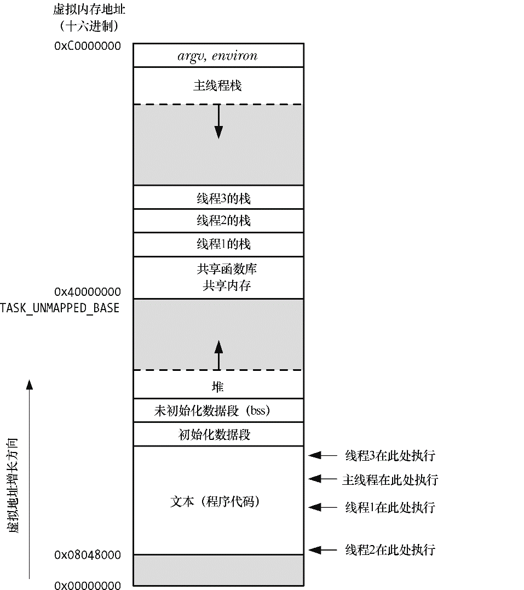

### 29.1　概述

与进程（process）类似①，线程（thread）是允许应用程序并发执行多个任务的一种机制。如图29-1所示，一个进程可以包含多个线程。同一程序中的所有线程均会独立执行相同程序，且共享同一份全局内存区域，其中包括初始化数据段（initialized data）、未初始化数据段（uninitialized data），以及堆内存段（heap segment）。（传统意义上的UNIX进程只是多线程程序的一个特例，该进程只包含一个线程。）

<b class="my_markdown">图29-1：同时执行4个线程的进程（Linux/x86-32）</b>

> 图29-1其实做了一些简化。特别是，线程栈（thread stack）的位置可能会与共享库和共享内存区域混杂在一起，这取决于创建线程、加载共享库，以及映射共享内存的具体顺序。而且，对于不同的Linux发行版，线程栈地址也会有所不同。

同一进程中的多个线程可以并发执行。在多处理器环境下，多个线程可以同时并行。如果一线程因等待I/O操作而遭阻塞，那么其他线程依然可以继续运行。（虽然有时单独创建一个专门执行I/O操作的线程颇为有用，但采用另一种I/O模型则更为可取，第63章会对此加以描述。）

对于某些应用而言，线程要优于进程。传统UNIX通过创建多个进程来实现并行任务。以网络服务器的设计为例，服务器进程（父进程）在接受客户端的连接后，会调用 fork()来创建一个单独的子进程，以处理与客户端的通信（可参考 60.3 节）。采用这种设计，服务器就能同时为多个客户端提供服务。虽然这种方法在很多情境下都屡试不爽，但对于某些应用来说也确实存在如下一些限制。

+ 进程间的信息难以共享。由于除去只读代码段外，父子进程并未共享内存，因此必须采用一些进程间通信（inter-process communication，简称IPC）方式，在进程间进行信息交换。
+ 调用 fork()来创建进程的代价相对较高。即便利用 24.2.2 节所描述的写时复制（copy-on-write）技术，仍然需要复制诸如内存页表（page table）和文件描述符表（file descriptor table）之类的多种进程属性，这意味着fork()调用在时间上的开销依然不菲。

线程解决了上述两个问题。

+ 线程之间能够方便、快速地共享信息。只需将数据复制到共享（全局或堆）变量中即可。不过，要避免出现多个线程试图同时修改同一份信息的情况，这需要使用第30章描述的同步技术。
+ 创建线程比创建进程通常要快10倍甚至更多。（在 Linux 中，是通过系统调用 clone()来实现线程的，表 28-3 展示了 fork()和 clone()在速度上的差异。）线程的创建之所以较快，是因为调用 fork()创建子进程时所需复制的诸多属性，在线程间本来就是共享的。特别是，既无需采用写时复制来复制内存页，也无需复制页表。

除了全局内存之外，线程还共享了一干其他属性（这些属性对于进程而言是全局性的，而并非针对某个特定线程），包括以下内容。

+ 进程ID（process ID）和父进程ID。
+ 进程组ID与会话ID（session ID）。
+ 控制终端。
+ 进程凭证（process credential）（用户ID和组ID ）。
+ 打开的文件描述符。
+ 由fcntl()创建的记录锁（record lock）。
+ 信号（signal）处置。
+ 文件系统的相关信息：文件权限掩码（umask）、当前工作目录和根目录。
+ 间隔定时器（setitimer()）和POSIX定时器（timer_create()）。
+ 系统V（system V）信号量撤销（undo，semadj）值（47.8节）。
+ 资源限制（resource limit）。
+ CPU时间消耗（由times()返回）。
+ 资源消耗（由getrusage()返回）。
+ nice值（由setpriority()和nice()设置）。

各线程所独有的属性，如下列出了其中一部分。

+ 线程ID（thread ID，29.5节）。
+ 信号掩码（signal mask）。
+ 线程特有数据（31.3节）。
+ 备选信号栈（sigaltstack()）。
+ errno变量。
+ 浮点型（floating-point）环境（见fenv(3)）。
+ 实时调度策略（real-time scheduling policy）和优先级（35.2节和35.3节）。
+ CPU亲和力（affinity，Linux所特有，35.4节将加以描述）。
+ 能力（capability，Linux所特有，第39章将加以描述）。
+ 栈，本地变量和函数的调用链接（linkage）信息。

> 如图29-1 所示，所有的线程栈均驻留于同一虚拟地址空间。这也意味着，利用一个合适的指针，各线程可以在对方栈中相互共享数据。这种方法偶尔也能派上用场，但由于局部变量的状态有效与否依赖于其所驻留栈帧的生命周期，故而需要在编程中谨慎处理这一问题。（当函数返回时，该函数栈帧所占用的内存区域有可能为后续的函数调用所重新使用。如果线程终止，那么新线程有可能会对已终止线程的栈所占用的内存空间重新加以利用）。若无法正确处理这一依赖关系，由此而产生的程序bug将难以捕获。

