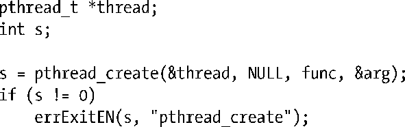

### 29.2　Pthreads API的详细背景

20世纪80年代末、90年代初，存在着数种不同的线程接口。1995年POSIX.1c对POSIX线程API进行了标准化，该标准后来为SUSv3所接纳。

有几个概念贯穿整个Pthreads API，在深入探讨API之前，将简单予以介绍。

#### 线程数据类型（Pthreads data type）

Pthreads API定义了一干数据类型，表29-1列出了其中的一部分。后续章节会对这些数据类型中的绝大部分加以描述。

<b class="my_markdown">表29-1：Pthreads数据类型</b>

| 数 据 类 型 | 描　　述 |
| :-----  | :-----  | :-----  | :-----  |
| pthread_t | 线程ID |
| pthread_mutex_t | 互斥对象（Mutex） |
| pthread_mutexattr_t | 互斥属性对象 |
| pthread_cond_t | 条件变量（condition variable） |
| pthread_condattr_t | 条件变量的属性对象 |
| pthread_key_t | 线程特有数据的键（Key） |
| pthread_once_t | 一次性初始化控制上下文（control context） |
| pthread_attr_t | 线程的属性对象 |

SUSv3并未规定如何实现这些数据类型，可移植的程序应将其视为“不透明”数据。亦即，程序应避免对此类数据类型变量的结构或内容产生任何依赖。尤其是，不能使用C语言的比较操作符（==）去比较这些类型的变量。

#### 线程和errno

在传统UNIX　API中，errno是一全局整型变量。然而，这无法满足多线程程序的需要。如果线程调用的函数通过全局errno返回错误时，会与其他发起函数调用并检查errno的线程混淆在一起。换言之，这将引发竞争条件（race condition）。因此，在多线程程序中，每个线程都有属于自己的errno。在Linux中，线程特有errno的实现方式与大多数UNIX实现相类似：将 errno 定义为一个宏，可展开为函数调用，该函数返回一个可修改的左值（lvalue），且为每个线程所独有。（因为左值可以修改，多线程程序依然能以errno=value的方式对errno赋值。）

一言以蔽之，errno机制在保留传统UNIX API报错方式的同时，也适应了多线程环境。

> 最初的POSIX.1标准沿袭K&R的C语言用法，允许程序将errno声明为extern int errno。SUSv3却不允许这一做法（这一变化实际发生于1995年的POSIX.1c标准之中）。如今，需要声明errno的程序必须包含<errno.h>，以启用对errno的线程级实现。

#### Pthreads函数返回值

从系统调用和库函数中返回状态，传统的做法是：返回0表示成功，返回-1表示失败，并设置errno以标识错误原因。Pthreads API则反其道而行之。所有Pthreads函数均以返回0表示成功，返回一正值表示失败。这一失败时的返回值，与传统UNIX系统调用置于errno中的值含义相同。

由于多线程程序对errno的每次引用都会带来函数调用的开销，因此，本书示例并不会直接将Pthreads函数的返回值赋给errno，而是使用一个中间变量，并利用自己实现的诊断函数errExitEN()（3.5.2节），如下所示：

#### 编译Pthreads程序

在Linux平台上，在编译调用了Pthreads API的程序时，需要设置cc -pthread的编译选项。使用该选项的效果如下。

+ 定义_REENTRANT预处理宏。这会公开对少数可重入（reentrant）函数的声明。
+ 程序会与库libpthread进行链接（等价于-lpthread）。

> 编译多线程程序时的具体编译选项会因实现及编译器的不同而不同。其他一些实现（例如Tru64）使用cc –pthread，而Solaris和HP-UX则使用cc –mt。

