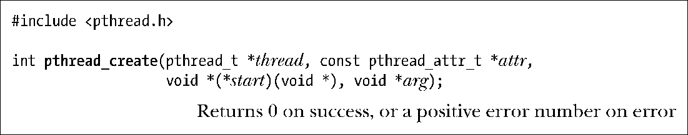

### 29.3　创建线程

启动程序时，产生的进程只有单条线程，称之为初始（initial）或主（main）线程。本节将讨论其他线程的创建过程。

函数pthread_create()负责创建一条新线程。

新线程通过调用带有参数arg的函数start（即start(arg)）而开始执行。调用pthread_create()的线程会继续执行该调用之后的语句。（如28.2节所述，这一行为与glibc库对系统调用clone()的包装函数行为相同。）

将参数arg声明为void*类型，意味着可以将指向任意对象的指针传递给start()函数。一般情况下，arg指向一个全局或堆变量，也可将其置为NULL。如果需要向start()传递多个参数，可以将arg指向一个结构，该结构的各个字段则对应于待传递的参数。通过审慎的类型强制转换，arg甚至可以传递int类型的值。

严格说来，对于int与void*之间相互强制转换的后果，C语言标准并未加以定义。不过，大部分C语言编译器允许这样的操作，并且也能达成预期的目的，即int j == (int) ((void*) j)。

start()的返回值类型为void*，对其使用方式与参数arg相同。对后续pthread_join()函数的描述中，将论及对该返回值的使用方式。

将经强制转换的整型数作为线程start函数的返回值时，必须小心谨慎。原因在于，取消线程（见第32章）时的返回值PTHREAD_CANCELED，通常是由实现所定义的整型值，再经强制转换为void*。若线程某甲的start函数将此整型值返回给正在执行pthread_join()操作的线程某乙，某乙会误认为某甲遭到了取消。应用如果采用了线程取消技术并选择将start函数的返回值强制转换为整型，那么就必须确保线程正常结束时的返回值与当前 Pthreads 实现中的PTHREAD_CANCELED不同。如欲保证程序的可移植性，则在任何将要运行该应用的实现中，正常退出线程的返回值应不同于相应的PTHREAD_CANCELED值。

参数thread指向pthread_t类型的缓冲区，在pthread_create()返回前，会在此保存一个该线程的唯一标识。后续的Pthreads函数将使用该标识来引用此线程。

SUSv3明确指出，在新线程开始执行之前，实现无需对thread参数所指向的缓冲区进行初始化，即新线程可能会在pthread_create()返回给调用者之前已经开始运行。如新线程需要获取自己的线程ID，则只能使用pthread_self()（29.5节描述）方法。

参数attr是指向pthread_attr_t对象的指针，该对象指定了新线程的各种属性。29.8节将述及其中的部分属性。如果将attr设置为NULL，那么创建新线程时将使用各种默认属性，本书的大部分示例程序都采用这一做法。

调用pthread_create()后，应用程序无从确定系统接着会调度哪一个线程来使用CPU资源（在多处理器系统中，多个线程可能会在不同CPU上同时执行）。程序如隐含了对特定调度顺序的依赖，则无疑会对24.4节所述的竞争条件打开方便之门。如果对执行顺序确有强制要求，那么就必须采用第30章所描述的同步技术。

