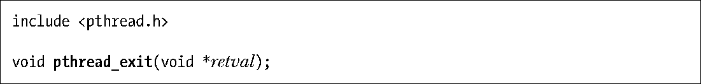

### 29.4　终止线程

可以如下方式终止线程的运行。

+ 线程start函数执行return语句并返回指定值。
+ 线程调用pthread_exit()（详见后述）。
+ 调用pthread_cancel()取消线程（在32.1节讨论）。
+ 任意线程调用了exit()，或者主线程执行了return语句（在main()函数中），都会导致进程中的所有线程立即终止。

pthread_exit()函数将终止调用线程，且其返回值可由另一线程通过调用pthread_join()来获取。

调用pthread_exit()相当于在线程的start函数中执行return，不同之处在于，可在线程start函数所调用的任意函数中调用pthread_exit() 。

参数retval指定了线程的返回值。Retval所指向的内容不应分配于线程栈中，因为线程终止后，将无法确定线程栈的内容是否有效。（例如，系统可能会立刻将该进程虚拟内存的这片区域重新分配，供一个新的线程栈使用。）出于同样的理由，也不应在线程栈中分配线程start函数的返回值。

如果主线程调用了pthread_exit()，而非调用exit()或是执行return语句，那么其他线程将继续运行。

