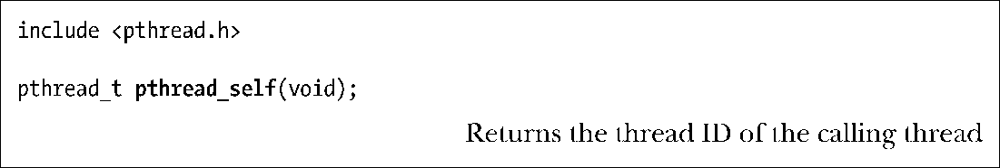
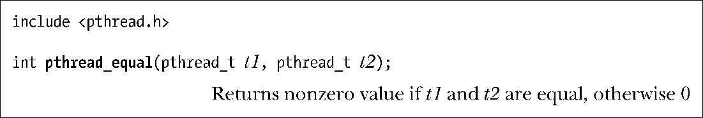
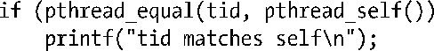
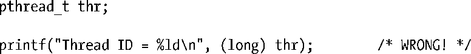

### 29.5　线程ID（Thread ID）

进程内部的每个线程都有一个唯一标识，称为线程ID。线程ID会返回给pthread_create()的调用者，一个线程可以通过pthread_self()来获取自己的线程ID。

线程ID在应用程序中非常有用，原因如下。

+ 不同的Pthreads函数利用线程ID来标识要操作的目标线程。这些函数包括pthread_ join()、pthread_detach()、pthread_cancel()和pthread_kill()等，后续章节将会加以讨论。
+ 在一些应用程序中，以特定线程的线程ID作为动态数据结构的标签，这颇有用处，既可用来识别某个数据结构的创建者或属主线程，又可以确定随后对该数据结构执行操作的具体线程。

函数pthread_equal()可检查两个线程的ID是否相同。

例如，为了检查调用线程的线程ID与保存于变量t1中的线程ID是否一致，可以编写如下代码：

因为必须将pthread_t作为一种不透明的数据类型加以对待，所以函数pthread_equal()是必须的。Linux将pthread_t定义为无符号长整型（unsigned long），但在其他实现中，则有可能是一个指针或结构。

> 在NPTL中，pthread_t实际上是一个经强制转化而为无符号长整型的指针。

SUSv3并未要求将pthread_t实现为一个标量（scalar）类型，该类型也可以是一个结构。因此，下列显示线程ID的代码实例并不具有可移植性（尽管该实例在包括Linux在内的许多实现上均可正常运行，而且有时在调试程序时还很实用）。

在Linux的线程实现中，线程ID在所有进程中都是唯一的。不过在其他实现中则未必如此，SUSv3特别指出，应用程序若使用线程ID来标识其他进程的线程，其可移植性将无法得到保证。此外，在对已终止线程施以pthread_join()，或者在已分离（detached）线程退出后，实现可以复用该线程的线程ID。（下一节和29.7节将分别解释pthread_join()和线程的分离。）

> POSIX线程ID与Linux专有的系统调用gettid()所返回的线程ID并不相同。POSIX线程ID由线程库实现来负责分配和维护。gettid()返回的线程ID是一个由内核（Kernel）分配的数字，类似于进程ID（process ID）。虽然在Linux NPTL线程实现中，每个POSIX线程都对应一个唯一的内核线程ID，但应用程序一般无需了解内核线程ID（况且，如果程序依赖于这一信息，也将无法移植）。

