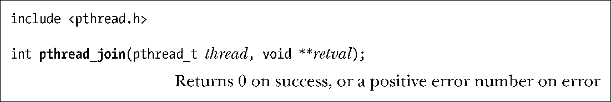
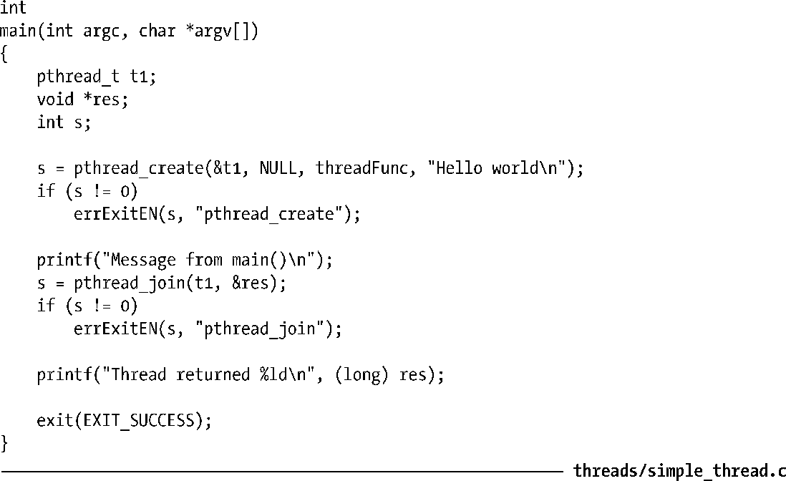
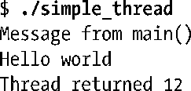

### 29.6　连接（joining）已终止的线程

函数pthread_join()等待由thread标识的线程终止。（如果线程已经终止，pthread_join()会立即返回）。这种操作被称为连接(joining)。

若 retval 为一非空指针，将会保存线程终止时返回值的拷贝，该返回值亦即线程调用return或pthred_exit()时所指定的值。

如向pthread_join()传入一个之前已然连接过的线程ID，将会导致无法预知的行为。例如，相同的线程ID在参与一次连接后恰好为另一新建线程所重用，再度连接的可能就是这个新线程。

若线程并未分离（detached，见29.7节），则必须使用ptherad_join()来进行连接。如果未能连接，那么线程终止时将产生僵尸线程，与僵尸进程（zombie process）的概念相类似（参考 26.2节）。除了浪费系统资源以外，僵尸线程若累积过多，应用将再也无法创建新的线程。

pthread_join()执行的功能类似于针对进程的waitpid()调用，不过二者之间存在一些显著差别。

+ 线程之间的关系是对等的（peers）。进程中的任意线程均可以调用pthread_join()与该进程的任何其他线程连接起来。例如，如果线程A创建线程B，线程B再创建线程C，那么线程A可以连接线程C，线程C也可以连接线程A。这与进程间的层次关系不同，父进程如果使用fork()创建了子进程，那么它也是唯一能够对子进程调用wait()的进程。调用pthread_create()创建的新线程与发起调用的线程之间，就没有这样的关系。
+ 无法“连接任意线程”（对于进程，则可以通过调用waitpid(-1, &status, options)做到这一点），也不能以非阻塞（nonblocking）方式进行连接（类似于设置WHOHANG标志的waitpid()）。使用条件（condition）变量可以实现类似的功能，30.2.4节会给出示例。

> 限制pthread_join()只能连接特定线程ID，这样做是“别有用心”的。其用意在于，程序应只能连接它所“知道的”线程。线程之间并无层次关系，如果听任“与任意线程连接”的操作发生，那么所谓“任意”线程就可以包括由库函数私自创建的线程，从而带来问题。（30.2.4所展示的条件变量技术也只允许线程连接它“知道的”其他线程。）结果是，函数库在获取线程返回状态时将不再能与该线程连接②，只会一错再错，试图连接一个已然连接过的线程ID。换言之，“连接任意线程”的操作与模块化的程序设计理念背道而驰。

#### 示例程序

程序清单29-1中的程序创建了一个线程，并与之连接。

程序清单29-1：一个使用Pthreads的简单程序

当运行程序清单29-1的程序时，可以看到如下输出：

依赖于系统对两个线程的具体调度，第1行与第2行的输出顺序可能会颠倒过来。

