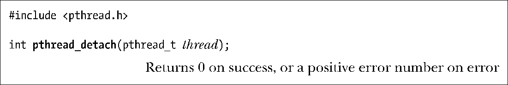

### 29.7　线程的分离

默认情况下，线程是可连接的(joinable)，也就是说，当线程退出时，其他线程可以通过调用pthread_join()获取其返回状态。有时，程序员并不关心线程的返回状态，只是希望系统在线程终止时能够自动清理并移除之。在这种情况下，可以调用pthread_detach()并向thread参数传入指定线程的标识符，将该线程标记为处于分离（detached）状态。

如下例所示，使用pthread_detach()，线程可以自行分离：

一旦线程处于分离状态，就不能再使用pthread_join()来获取其状态，也无法使其重返“可连接”状态。

其他线程调用了exit()，或是主线程执行return语句时，即便遭到分离的线程也还是会受到影响。此时，不管线程处于可连接状态还是已分离状态，进程的所有线程会立即终止。换言之，pthread_detach()只是控制线程终止之后所发生的事情，而非何时或如何终止线程。

