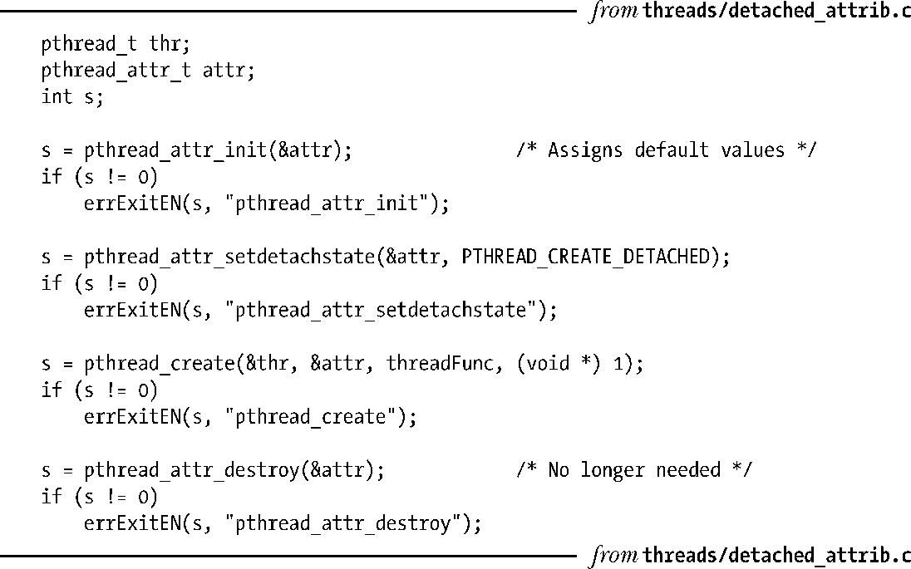

### 29.8　线程属性

前面已然提及pthread_create()中类型为pthread_attr_t的attr参数，可利用其在创建线程时指定新线程的属性。本书无意深入这些属性的细节（关于此类细节，可参考本章结尾处的参考资料列表），也不会将操作pthread_attr_t对象的各种Pthreads函数原型一一列出，只会点出如下之类的一些属性：线程栈的位置和大小、线程调度策略和优先级（类似于35.2节和35.3节所描述的进程实时调度策略和优先级），以及线程是否处于可连接或分离状态。

作为线程属性的使用示例，程序清单29-2中的代码创建了一个新线程，该线程刚一创建即遭分离（而非之后再调用pthread_detach()）。这段代码首先以缺省值对线程属性结构进行初始化，接着为创建分离线程而设置属性，最后再以此线程属性结构来创建新线程。线程一旦创建，就无需再保留该属性对象，故而程序将其销毁。

程序清单29-2：使用分离属性创建线程

