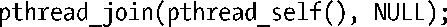
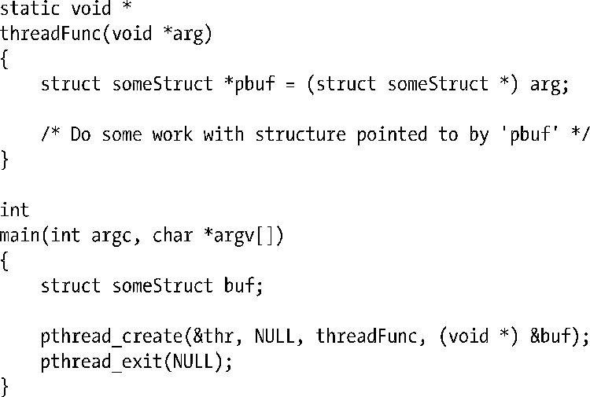

### 29.11　练习

**29-1.** 　若一线程执行了如下代码，可能会产生什么结果？

在Linux上编写一个程序，观察一下实际会发生什么情况。假设代码中有一变量tid，其中包含了某个线程ID，在自身发起pthread_join(tid, NULL)调用时，要避免造成与上述语句相同的后果，该线程应采取何种措施？

**29-2.** 　除了缺少错误检查，以及对各种变量和结构的声明外，下列程序还有什么问题？

①译者注：此处指多进程并发。

②译者注：本句的两处线程均指前文由库函数私自创建的线程。

