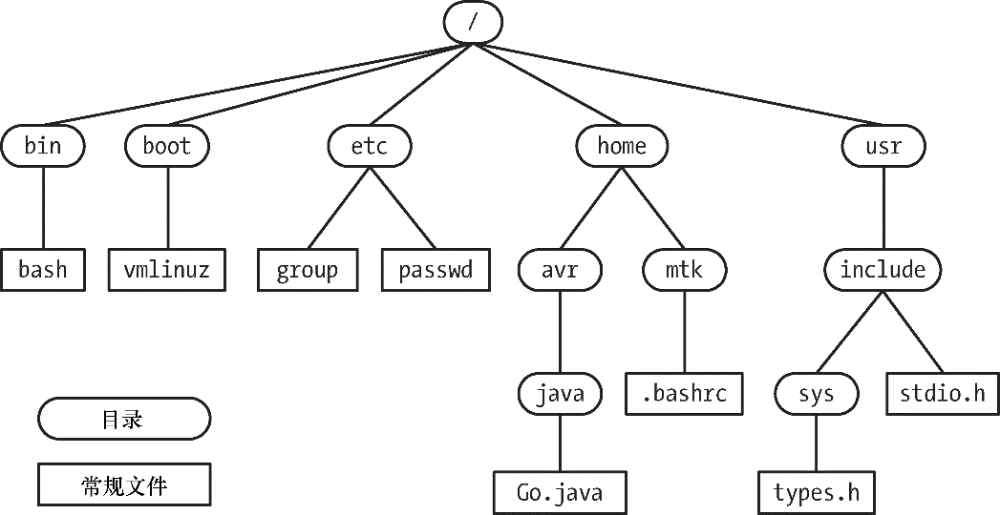

### 2.4　单根目录层级、目录、链接及文件

内核维护着一套单根目录结构，以放置系统的所有文件。（这与微软Windows之类的操作系统形成了鲜明对照，Windows系统的每个磁盘设备都有各自的目录层级。）这一目录层级的根基就是名为“/”的根目录。所有的文件和目录都是根目录的“子孙”。图 1-2 所示为这种文件层级结构的示例。

#### 文件类型

在文件系统内，会对文件类型进行标记，以表明其种类。其中一种用来表示普通数据文件，人们常称之为“普通文件”或“纯文本文件”，以示与其他种类的文件有所区别。其他文件类型包括设备、管道、套接字、目录以及符号链接。

术语“文件”常用来指代任意类型的文件，不仅仅指普通文件。

#### 路径和链接

目录是一种特殊类型的文件，内容采用表格形式，数据项包括文件名以及对相应文件的引用。这一“文件名+引用”的组合被称为链接。每个文件都可以有多条链接，因而也可以有多个名称，在相同或不同的目录中出现。

目录可包含指向文件或其他目录的链接。路径间的链接建立起如图2-1所示的目录层级。

<b class="my_markdown">图2-1：Linux单根目录层级的一部分</b>

每个目录至少包含两条记录：.和..，前者是指向目录自身的链接，后者是指向其上级目录—— 父目录的链接。除根目录外，每个目录都有父目录。对于根目录而言，..是指向根目录自身的链接（因此，/..等于/）。

#### 符号链接

类似于普通链接，符号链接给文件起了一个“别号（alternative name）”。在目录列表中，普通链接是内容为“文件名+指针”的一条记录，而符号链接则是经过特殊标记的文件，内容包含了另一文件的名称。（换言之，一个符号链接对应着目录中内容为“文件名+指针”的一条记录，指针指向的文件内容①为另一个文件名的字符串。）所谓“另一文件”通常被称为符号链接的目标，人们一般会说符号链接“指向”或“引用”目标文件。在多数情况下，只要系统调用用到了路径名，内核会自动解除（换言之，按照）该路径名中符号链接的引用，以符号链接所指向的文件名来替换符号链接。若符号链接的目标文件自身也是一个符号链接，那么上述过程会以递归方式重复下去。（为了应对可能出现的循环引用，内核对解除引用的次数作了限制。）如果符号链接指向的文件并不存在，那么可将该链接视为空链接（dangling link）。

通常，人们会分别使用硬链接（hard link）或软链接（soft link）这样的术语来指代正常链接和符号链接。之所以存在这两种不同类型的链接，将在第18章做出解释。

#### 文件名

在大多数Linux文件系统上，文件名最长可达255个字符。文件名可以包含除“/”和空字符（\0）外的所有字符。但是，只建议使用字母、数字、点(“.”)、下划线（“_”）以及连字符（“−”）。SUSv3将这65个字符的集合[-._a-zA-Z0-9]称为可移植文件名字符集（portable filename character set）。

对于可移植文件名字符集以外的字符，由于其可能会在shell、正则表达式或其他场景中具有特殊含义，故而应避免在文件名中使用。如在上述环境中出现了包含特殊含义字符的文件名，则需要进行转义，即对此类字符进行特殊标记（一般会在特殊字符前插入一个“\”），以指明不应以特殊含义对其进行解释。若场境不支持转义机制，则不能使用此类文件名。

此外，还应避免以连字符（“-”）作为文件名的起始字符，因为一旦在shell命令中使用这种文件名，会被误认为命令行选项开关。

#### 路径名

路径名是由一系列文件名组成的字符串，彼此以“/”分隔，首字符可以为“/”（非强制）②。除却最后一个文件名外，该系列文件名均为目录名称（或为指向目录的符号链接）。路径名的尾部③可标识任意类型的文件，包括目录在内。有时将该字符串中最后一个“/”字符之前的部分称为路径名的目录部分，将其之后的部分称为路径名的文件部分或基础部分。

路径名应按从左至右的顺序阅读，路径名中每个文件名之前的部分，即为该文件所处目录。可在路径名中任意位置后引入字符串“..”④，用以指代路径名中当前位置的父目录。

路径名描述了单根目录层级下的文件位置，又可分为绝对路径名和相对路径名：

+ **绝对路径名以** “/”开始，指明文件相对于根目录的位置。图2-1中的/home/mtk/. bashrc、/usr/include以及/（根路径的路径名）都是绝对路径名的例子。
+ **相对路径名** 定义了相对于进程当前工作目录（见下文）的文件位置，与绝对路径名相比，相对路径名缺少了起始的“/”。如图2-1所示，在目录usr下，可使用相对路径名include/sys/types.h来引用文件types.h，在目录avr下，可使用相对路径名../mtk/.bashrc来访问文件.bashrc。

#### 当前工作目录

每个进程都有一个当前工作目录（有时简称为进程工作目录或当前目录）。这就是单根目录层级下进程的“当前位置”，也是进程解释相对路径名的参照点。

进程的当前工作目录继承自其父进程。对登录shell来说，其初始当前工作目录，是依据密码文件中该用户记录的主目录字段来设置。可使用cd命令来改变shell的当前工作目录。

#### 文件的所有权和权限

每个文件都有一个与之相关的用户ID和组ID，分别定义文件的属主和属组。系统根据文件的所有权来判定用户对文件的访问权限。

为了访问文件，系统把用户分为3类：文件的属主（有时，也称为文件的用户）、与文件组（group）ID相匹配的属组成员用户以及其他用户。可为以上3类用户分别设置3种权限（共计9种权限位）：只允许查看文件内容的读权限；允许修改文件内容的写权限；允许执行文件的执行权限。这里的文件要么指程序，要么是交由某种解释程序（通常指shell的一种，但也有例外）处理的脚本。

也可针对目录进行上述权限设置，但意义稍有不同。读权限允许列出目录内容（即该目录下的文件名），写权限允许对目录内容进行更改（比如，添加、修改或删除文件名），执行（有时也称为搜索）权限允许对目录中的文件进行访问（但需受文件自身访问权限的约束）。

