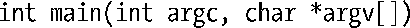

### 2.6　程序

程序通常以两种面目示人。其一为源码形式，由使用编程语言（比如，C语言）写成的一系列语句组成，是人类可以阅读的文本文件。要想执行程序，则需将源码转换为第二种形式——计算机可以理解的二进制机器语言指令。（这与脚本形成了鲜明对照，脚本是包含命令的文本文件，可以由shell或其他命令解释器之类的程序直接处理。）一般认为，术语“程序”的上述两种含义几近相同，因为经过编译和链接处理，会将源码转换为语义相同的二进制机器码。

#### 过滤器

从stdin读取输入，加以转换，再将转换后的数据输出到stdout，常常将拥有上述行为的程序称为过滤器，cat、grep、tr、sort、wc、sed、awk均在其列。

#### 命令行参数

C语言程序可以访问命令行参数，即程序运行时在命令行中输入的内容。要访问命令行参数，程序的main()函数需做如下声明：

argc变量包含命令行参数的总个数，argv指针数组的成员指针则逐一指向每个命令行参数字符串。首个字符串argv[0]，标识程序名本身。

