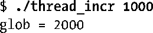
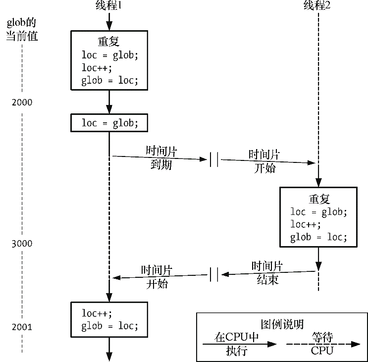
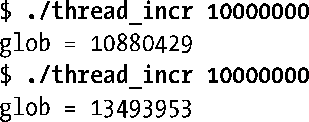
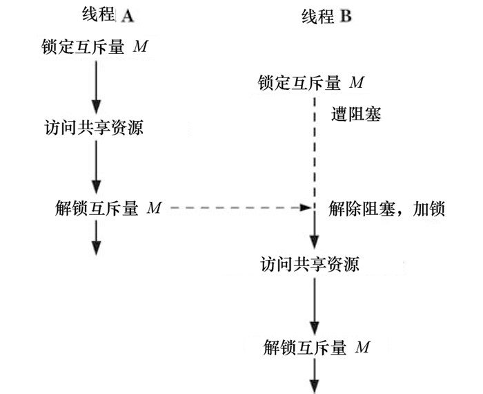

### 30.1　保护对共享变量的访问：互斥量

线程的主要优势在于，能够通过全局变量来共享信息。不过，这种便捷的共享是有代价的：必须确保多个线程不会同时修改同一变量，或者某一线程不会读取正由其他线程修改的变量。术语临界区（critical section）是指访问某一共享资源的代码片段，并且这段代码的执行应为原子（atomic）操作，亦即，同时访问同一共享资源的其他线程不应中断该片段的执行。

程序清单30-1中的简单示例，展示了以非原子方式访问共享资源时所发生的问题。该程序创建了两个线程，且均执行同一函数。该函数执行一个循环，重复以下步骤：将 glob 复制到本地变量loc中，然后递增loc，再把loc复制回glob，以此不断增加全局变量glob的值。因为loc是分配于线程栈中的自动变量（automatic variable），所以每个线程都有一份。循环重复的次数要么由命令行参数指定，要么取默认值。

程序清单30-1：两线程以错误方式递增全局变量的值

运行程序清单30-1中的示例，并指定每个线程均对该变量递增1000次，看起来一切正常。

不过，很有可能会发生如下情况：在线程某乙尚未得以运行时，线程某甲已经执行完毕并且退出了。如果加大每个线程的工作量，结果将完全不同。

执行到最后，glob的值本应为2000万。问题的原因是由于如下的执行序列（参见图30-1）。

<b class="my_markdown">图30-1：两个线程不使用同步技术递增全局变量的值</b>

**1．** 线程1将glob值赋给局部变量loc。假设blog的当前值为2000。

**2．** 线程1的时间片期满，线程2开始执行。

**3．** 线程2执行多次循环：将全局变量glob的值置于局部变量loc，递增loc，再将结果写回变量glob。第1次循环时，glob的值为2000。假设线程2的时间片到期时，glob的值已经增至3000。

**4．** 线程1获得另一时间片，并从上次停止处恢复执行。线程1在上次运行时，已将glob的值（2000）赋给loc，现在递增loc，再将loc的值2001写回glob。此时，线程2此前递增操作的结果遭到覆盖。

如果使用同样的命令行参数将该程序运行多次，glob的值会波动很大：

这一行为的不确定性，实应归咎于内核CPU调度决定的难以预见。若在复杂程序中发生这一不确定行为，则意味着此类错误将偶尔发作，难以重现，因此也很难发现。

使用如下语句，将程序清单30-1中函数threadFunc()内for循环中的3条语句加以替换，似乎可以解决这一问题：

不过，在很多硬件架构上（例如，RISC系统），编译器依然会将这条语句转换成机器码，其执行步骤仍旧等同于threadFunc循环内的3条语句。换言之，尽管C语言的递增符看似简单，其操作也未必就属于原子操作，依然可能发生上述行为。

为避免线程更新共享变量时所出现问题，必须使用互斥量（mutex是mutual exclusion的缩写）来确保同时仅有一个线程可以访问某项共享资源。更为全面的说法是，可以使用互斥量来保证对任意共享资源的原子访问，而保护共享变量是其最常见的用法。

互斥量有两种状态：已锁定（locked）和未锁定（unlocked）。任何时候，至多只有一个线程可以锁定该互斥量。试图对已经锁定的某一互斥量再次加锁，将可能阻塞线程或者报错失败，具体取决于加锁时使用的方法。

一旦线程锁定互斥量，随即成为该互斥量的所有者。只有所有者才能给互斥量解锁。这一属性改善了使用互斥量的代码结构，也顾及到对互斥量实现的优化。因为所有权的关系，有时会使用术语获取（acquire）和释放（release）来替代加锁和解锁。

一般情况下，对每一共享资源（可能由多个相关变量组成）会使用不同的互斥量，每一线程在访问同一资源时将采用如下协议。

+ 针对共享资源锁定互斥量。
+ 访问共享资源。
+ 对互斥量解锁。

如果多个线程试图执行这一代码块（一个临界区），事实上只有一个线程能够持有该互斥量（其他线程将遭到阻塞），即同时只有一个线程能够进入这段代码区域，如图30-2所示。

<b class="my_markdown">图30-2：使用互斥量来保护临界区</b>

最后请注意，使用互斥锁仅是一种建议，而非强制。亦即，线程可以考虑不使用互斥量而仅访问相应的共享变量。为了安全地处理共享变量，所有线程在使用互斥量时必须互相协调，遵守既定的锁定规则。

