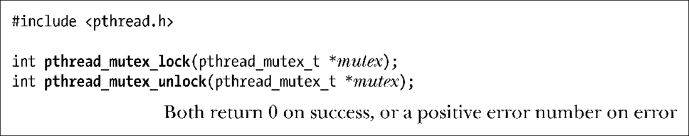
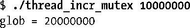
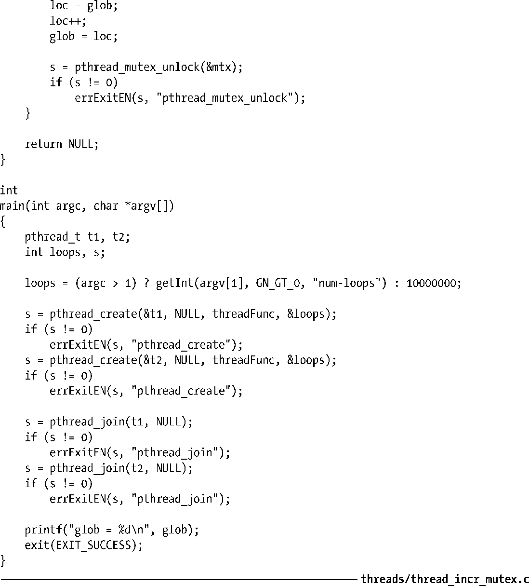

### 30.1.2　加锁和解锁互斥量

初始化之后，互斥量处于未锁定状态。函数pthread_mutex_lock()可以锁定某一互斥量，而函数pthread_mutex_unlock()则可以将一个互斥量解锁。

要锁定互斥量，在调用pthread_mutex_lock()时需要指定互斥量。如果互斥量当前处于未锁定状态，该调用将锁定互斥量并立即返回。如果其他线程已经锁定了这一互斥量，那么pthread_mutex_lock()调用会一直堵塞，直至该互斥量被解锁，到那时，调用将锁定互斥量并返回。

如果发起pthread_mutex_lock()调用的线程自身之前已然将目标互斥量锁定，对于互斥量的默认类型而言，可能会产生两种后果——视具体实现而定：线程陷入死锁（deadlock），因试图锁定已为自己所持有的互斥量而遭到阻塞；或者调用失败，返回EDEADLK错误。在Linux上，默认情况下线程会发生死锁。（30.1.7节在讨论互斥量类型时会述及一些其他的可能行为。）

函数pthread_mutex_unlock()将解锁之前已遭调用线程锁定的互斥量。以下行为均属错误：对处于未锁定状态的互斥量进行解锁，或者解锁由其他线程锁定的互斥量。

如果有不止一个线程在等待获取由函数pthread_mutex_unlock()解锁的互斥量，则无法判断究竟哪个线程将如愿以偿。

#### 示例程序

程序清单30-2是对程序清单30-1的修改，使用了一个互斥量来保护对全局变量glob的访问。使用与之前类似的命令行来运行这个改版程序，可以看到对glob的累加总是能够保持正确。

程序清单30-2：使用互斥量保护对全局变量的访问

#### pthread_mutex_trylock()和pthread_mutex_timedlock()

Pthreads API提供了pthread_mutex_lock()函数的两个变体：pthread_mutex_trylock()和pthread_mutex_timedlock()。可参考手册页（manual page）获取这些函数的原型。

如果信号量已然锁定，对其执行函数pthread_mutex_trylock()会失败并返回EBUSY错误，除此之外，该函数与pthread_mutex_lock()行为相同。

除了调用者可以指定一个附加参数 abstime（设置线程等待获取互斥量时休眠的时间限制）外，函数pthread_mutex_timedlock()与pthread_mutex_lock()没有差别。如果参数abstime指定的时间间隔期满，而调用线程又没有获得对互斥量的所有权，那么函数pthread_mutex_timedlock()返回ETIMEDOUT错误。

函数pthread_mutex_trylock() 和 pthread_mutex_timedlock()比pthread_mutex_lock()的使用频率要低很多。在大多数经过良好设计的应用程序中，线程对互斥量的持有时间应尽可能短，以避免妨碍其他线程的并发执行。这也保证了遭堵塞的其他线程可以很快获取对互斥量的锁定。若某一线程使用pthread_mutex_trylock()周期性地轮询是否可以对互斥量加锁，则有可能要承担这样的风险：当队列中的其他线程通过调用pthread_mutex_lock()相继获得对互斥量的访问时，该线程将始终与此互斥量无缘。

