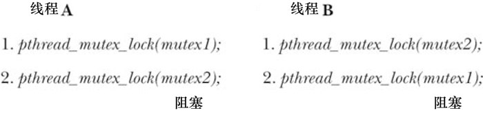

### 30.1.4　互斥量的死锁

有时，一个线程需要同时访问两个或更多不同的共享资源，而每个资源又都由不同的互斥量管理。当超过一个线程加锁同一组互斥量时，就有可能发生死锁。图30-3展示了一个死锁的例子，其中每个线程都成功地锁住一个互斥量，接着试图对已为另一线程锁定的互斥量加锁。两个线程将无限期地等待下去。

<b class="my_markdown">图30-3：两个线程分别锁定两个互斥量所导致的死锁</b>

要避免此类死锁问题，最简单的方法是定义互斥量的层级关系。当多个线程对一组互斥量操作时，总是应该以相同顺序对该组互斥量进行锁定。例如，在图30-3所示场景中，如果两个线程总是先锁定mutex1再锁定mutex2，死锁就不会出现。有时，互斥量间的层级关系逻辑清晰。不过，即便没有，依然可以设计出所有线程都必须遵循的强制层级顺序。

另一种方案的使用频率较低，就是“尝试一下，然后恢复”。在这种方案中，线程先使用函数pthread_mutex_lock()锁定第1个互斥量，然后使用函数pthread_mutex_trylock()来锁定其余互斥量。如果任一pthread_mutex_trylock()调用失败（返回EBUSY），那么该线程将释放所有互斥量，也许经过一段时间间隔，从头再试。较之于按锁的层级关系来规避死锁，这种方法效率要低一些，因为可能需要历经多次循环。另一方面，由于无需受制于严格的互斥量层级关系，该方法也更为灵活。[Butenhof, 1996]中载有这一方案的范例。

