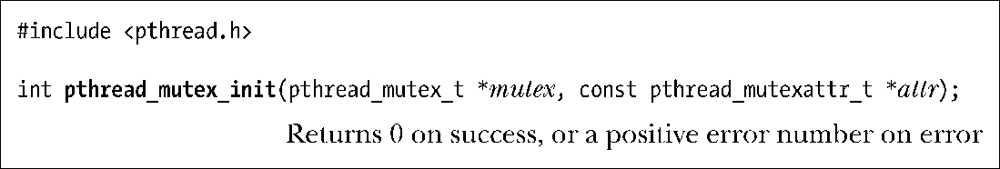
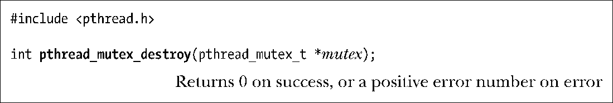

### 30.1.5　动态初始化互斥量

静态初始值PTHREAD_MUTEX_INITIALIZER，只能用于对如下互斥量进行初始化：经由静态分配且携带默认属性。其他情况下，必须调用pthread_mutex_init()对互斥量进行动态初始化。

参数mutex指定函数执行初始化操作的目标互斥量。参数 attr 是指向pthread_mutexattr_t类型对象的指针，该对象在函数调用之前已经过了初始化处理，用于定义互斥量的属性。（下节会介绍更多互斥量属性。）若将attr参数置为NULL，则该互斥量的各种属性会取默认值。

SUSv3规定，初始化一个业已初始化的互斥量将导致未定义的行为，应当避免这一行为。

在如下情况下，必须使用函数pthread_mutex_init()，而非静态初始化互斥量。

+ 动态分配于堆中的互斥量。例如，动态创建针对某一结构的链表，表中每个结构都包含一个pthread_mutex_t类型的字段来存放互斥量，借以保护对该结构的访问。
+ 互斥量是在栈中分配的自动变量。
+ 初始化经由静态分配，且不使用默认属性的互斥量。

当不再需要经由自动或动态分配的互斥量时，应使用 pthread_mutex_destroy()将其销毁。（对于使用PTHREAD_MUTEX_INITIALIZER静态初始化的互斥量，无需调用pthread_mutex_destroy()。）

只有当互斥量处于未锁定状态，且后续也无任何线程企图锁定它时，将其销毁才是安全的。若互斥量驻留于动态分配的一片内存区域中，应在释放（free）此内存区域前将其销毁。对于自动分配的互斥量，也应在宿主函数返回前将其销毁。

经由pthread_mutex_destroy()销毁的互斥量，可调用pthread_mutex_init()对其重新初始化。

