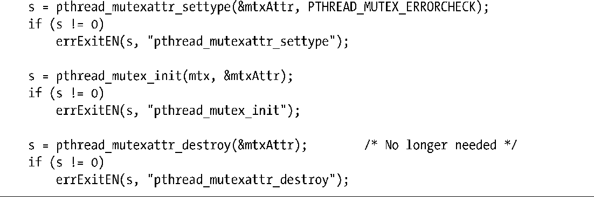

### 30.1.7　互斥量类型

前面几页对互斥量的行为做了若干论述。

+ 同一线程不应对同一互斥量加锁两次。
+ 线程不应对不为自己所拥有的互斥量解锁（亦即，尚未锁定互斥量）。
+ 线程不应对一尚未锁定的互斥量做解锁动作。

准确地说，上述情况的结果将取决于互斥量类型（type）。SUSv3定义了以下互斥量类型。

##### PTHREAD_MUTEX_NORMAL

该类型的互斥量不具有死锁检测（自检）功能。如线程试图对已由自己锁定的互斥量加锁，则发生死锁。互斥量处于未锁定状态，或者已由其他线程锁定，对其解锁会导致不确定的结果。（在Linux上，对这类互斥量的上述两种操作都会成功。）

##### PTHREAD_MUTEX_ERRORCHECK

对此类互斥量的所有操作都会执行错误检查。所有上述3种情况都会导致相关Pthreads函数返回错误。这类互斥量运行起来比一般类型要慢，不过可将其作为调试工具，以发现程序在哪里违反了互斥量使用的基本原则。

##### PTHREAD_MUTEX_RECURSIVE

递归互斥量维护有一个锁计数器。当线程第1次取得互斥量时，会将锁计数器置1。后续由同一线程执行的每次加锁操作会递增锁计数器的数值，而解锁操作则递减计数器计数。只有当锁计数器值降至0时，才会释放（release，亦即可为其他线程所用）该互斥量。解锁时如目标互斥量处于未锁定状态，或是已由其他线程锁定，操作都会失败。

Linux的线程实现针对以上各种类型的互斥量提供了非标准的静态初始值（例如，PTHREAD_RECURSIVE_MUTEX_INITIALIZER_NP），以便对那些通过静态分配的互斥量进行初始化，而无需使用pthread_mutex_init()函数。不过，为保证程序的可移植性，应该避免使用这些初始值。

除了上述类型，SUSv3还定义了PTHREAD_MUTEX_DEFAULT类型。使用PTHREAD_MUTEX_INITIALIZER初始化的互斥量，或是经调用参数attr为NULL的pthread_mutex_init()函数所创建的互斥量，都属于此类型。至于该类型互斥量在本节开始处3个场景中的行为，规范有意未作定义，意在为互斥量的高效实现保留最大的灵活性。Linux上，PTHREAD_MUTEX_DEFAULT类型互斥量的行为与PTHREAD_MUTEX_NORMAL类型相仿。

程序清单30-3演示了如何设置互斥量类型，本例创建了一个带有错误检查属性（error-checking）的互斥量。

程序清单30-3：设置互斥量类型

