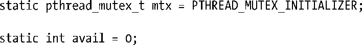
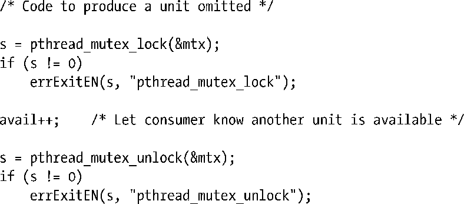
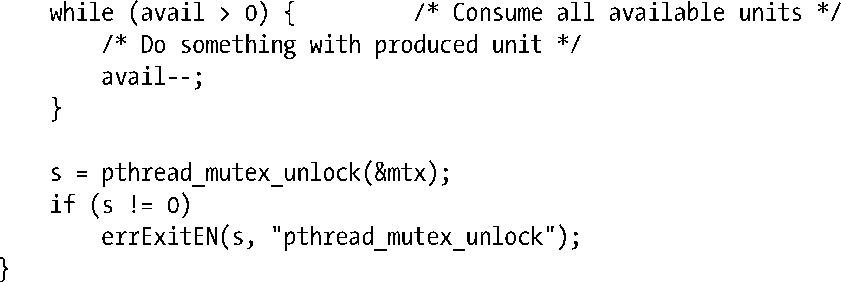

### 30.2　通知状态的改变：条件变量（Condition Variable）

互斥量防止多个线程同时访问同一共享变量。条件变量允许一个线程就某个共享变量（或其他共享资源）的状态变化通知其他线程，并让其他线程等待（堵塞于）这一通知。

一个未使用条件变量的简单例子有助于展示条件变量的重要性。假设由若干线程生成一些“产品单元（result unit）”供主线程消费。还使用了一个由互斥量保护的变量avail来代表待消费产品的数量：

本节引用的代码片段摘自于随本书发布的源代码文件threads/prod_no_condvar.c。

生产者线程的源代码如下：

主线程（消费者）的代码如下：

上述代码虽然可行，但由于主线程不停地循环检查变量avail的状态，故而造成CPU资源的浪费。采用了条件变量（condition variable），这一问题就迎刃而解：允许一个线程休眠（等待）直至接获另一线程的通知（收到信号）去执行某些操作（例如，出现一些“情况”后，等待者必须立即做出响应）。

条件变量总是结合互斥量使用。条件变量就共享变量的状态改变发出通知，而互斥量则提供对该共享变量访问的互斥（mutual exclusion）。这里使用的术语“信号”（signal），与第20章至第22章所述信号（signal）无关，而是发出信号的意思。

