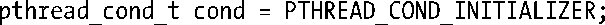

### 30.2.1　由静态分配的条件变量

如同互斥量一样，条件变量的分配，有静态和动态之分。条件变量的动态创建延后到 30.2.5节再行描述，这里先讨论一下静态分配。

条件变量的数据类型是pthread_count_t。类似于互斥量，使用条件变量前必须对其初始化。对于经由静态分配的条件变量，将其赋值为PTHREAD_COND_INITALIZER即完成初始化操作。可参考下面的例子：

> 依据SUSv3规定，将本节后续所描述的操作施之于一个条件变量的副本（copy）时，其结果未定义。所有操作仅能针对条件变量的原本执行，要么经由PTHREAD_COND_INITIALIZE进行了静态初始化，要么使用pthread_cond_init()做了动态初始化（30.2.5节描述）处理。

