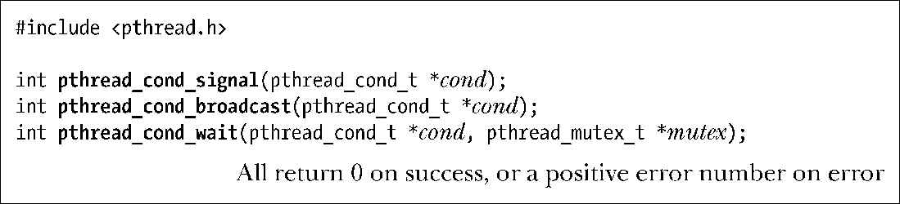
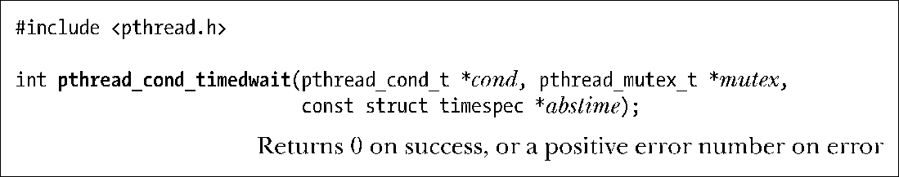
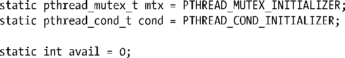
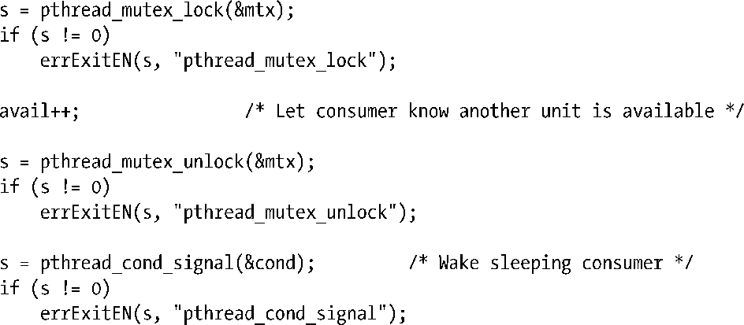
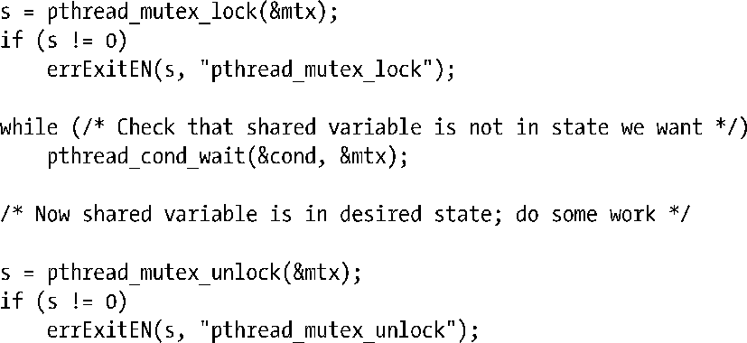
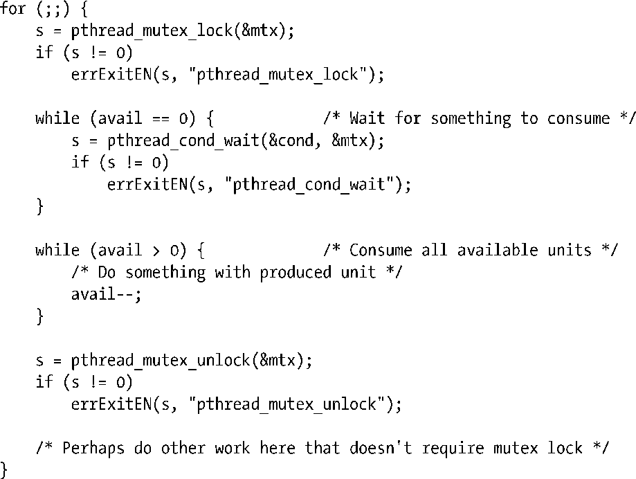

### 30.2.2　通知和等待条件变量

条件变量的主要操作是发送信号（signal）和等待（wait）。发送信号操作即通知一个或多个处于等待状态的线程，某个共享变量的状态已经改变。等待操作是指在收到一个通知前一直处于阻塞状态。

函数pthread_cond_signal()和pthread_cond_broadcast()均可针对由参数cond所指定的条件变量而发送信号。pthread_cond_wait()函数将阻塞一线程，直至收到条件变量 cond的通知。

函数pthread_cond_signal()和pthread_cond_broadcast()之间的差别在于，二者对阻塞于pthread_cond_wait()的多个线程处理方式不同。pthread_cond_signal()函数只保证唤醒至少一条遭到阻塞的线程，而pthread_cond_broadcast()则会唤醒所有遭阻塞的线程。

使用函数pthread_cond_broadcast()总能产生正确结果（因为所有线程应都能处理多余和虚假的唤醒动作），但函数pthread_cond_signal()会更为高效。不过，只有当仅需唤醒一条（且无论是其中哪条）等待线程来处理共享变量的状态变化时，才应使用 pthread_cond_signal()。应用这种方式的典型情况是，所有等待线程都在执行完全相同的任务。基于这些假设，函数pthread_cond_signal()会比pthread_cond_broadcast()更具效率，因为这可以避免发生如下情况。

**1．** 同时唤醒所有等待线程。

**2．** 某一线程首先获得调度。此线程检查了共享变量的状态（在相关互斥量的保护之下），发现还有任务需要完成。该线程执行了所需工作，并改变共享变量状态，以表明任务完成，最后释放对相关互斥量的锁定。

**3．** 剩余的每个线程轮流锁定互斥量并检测共享变量的状态。不过，由于第一个线程所做的工作，余下的线程发现无事可做，随即解锁互斥量转而休眠（即再次调用 pthread_cond_wait()）。

相形之下，函数pthread_cond_broadcast()所处理的情况是：处于等待状态的所有线程执行的任务不同（即各线程关联于条件变量的判定条件不同）。

条件变量并不保存状态信息，只是传递应用程序状态信息的一种通讯机制。发送信号时若无任何线程在等待该条件变量，这个信号也就会不了了之。线程如在此后等待该条件变量，只有当再次收到此变量的下一信号时，方可解除阻塞状态。

函数pthread_cond_timedwait()与函数pthread_cond_wait()几近相同，唯一的区别在于，由参数abstime来指定一个线程等待条件变量通知时休眠时间的上限。

参数abstime是一个timespec类型的结构（见23.4.2节），用以指定自Epoch（参考10.1节）以来以秒和纳秒（nanosecond）为单位表示的绝对（absolute）时间。如果abstime指定的时间间隔到期且无相关条件变量的通知，则返回ETIMEOUT错误。

#### 在生产者-消费者（producer-consumer）示例中使用条件变量

下面对前面的示例作出修改，引入条件变量。对全局变量、相关互斥量以及条件变量的声明代码如下：

> 本节中的代码片段摘自随本书发布的源代码文件threads/prod_condvar.c。

除了增加对函数pthread_cond_signal()的调用外，生产者线程的代码与之前并无变化:

在分析消费者代码之前，需要对pthread_cond_wait()函数做更为详细的解释。前文已经指出，条件变量总是要与一个互斥量相关。将这些对象通过函数参数传递给pthread_cond_wait()，后者执行如下操作步骤。

+ 解锁互斥量mutex。
+ 堵塞调用线程，直至另一线程就条件变量cond发出信号。
+ 重新锁定mutex。

设计 pthread_cond_wait()执行上述步骤，是因为通常情况下代码会以如下方式访问共享变量：

下一节将会介绍为何将pthread_cond_wait()调用置于while循环中，而非if语句中。

在以上代码中，两处对共享变量的访问都必须置于互斥量的保护之下，其原因之前已做了解释。换言之，条件变量与互斥量之间存在着天然的关联关系。

**1．** 线程在准备检查共享变量状态时锁定互斥量。

**2．** 检查共享变量的状态。

**3．** 如果共享变量未处于预期状态，线程应在等待条件变量并进入休眠前解锁互斥量（以便其他线程能访问该共享变量）。

**4.** 当线程因为条件变量的通知而被再度唤醒时，必须对互斥量再次加锁，因为在典型情况下，线程会立即访问共享变量。

函数pthread_cond_wait()会自动执行最后两步中对互斥量的解锁和加锁动作。第3步中互斥量的释放与陷入对条件变量的等待同属于一个原子操作。换句话说，在函数pthread_cond_wait()的调用线程陷入对条件变量的等待之前，其他线程不可能获取到该互斥量，也不可能就该条件变量发出信号。

> 通过观察得出推论：条件变量与互斥量之间存在天然关系，同时等待相同条件变量的所有线程在调用pthread_cond_wait()或pthread_cond_timedwait()时必须指定同一互斥量。实际上，pthread_cond_wait()在调用期间能将条件变量与一个唯一的互斥量做动态绑定。SUSv3规定，在针对同一条件变量并发调用pthread_cond_wait()时，若使用多个互斥量会导致未定义的结果。

结合以上所有细节，使用pthread_cond_wait()修改主（消费者）线程的代码如下：

最后，再看一下pthread_cond_signal()和pthread_cond_broadcast()的使用。前面展示的生产者代码先调用了pthread_mutex_unlock()，接着调用了pthread_cond_signal()；换言之，先解锁与共享变量相关的互斥量，再就对应的条件变量发出信号。也可以将这两步颠倒执行，SUSv3允许以任意顺序执行这两个调用。

> [Butenhof, 1996]指出，在某些实现中，先解锁互斥量再通知条件变量可能比反序执行效率要高。如果仅在发出条件变量信号后才解锁互斥量，执行pthread_cond_wait()调用的线程可能会在互斥量仍处于加锁状态时就醒来，当其发现互斥量仍未解锁，会立即再次休眠。这会导致两个多余的上下文切换（context switch）。有些实现运用等待变形（wait morphing）技术解决了这一问题：将等待接收信号的线程从条件变量的等待队列转移至互斥量等待队列。这样，即便互斥量处于加锁状态，也无需切换上下文。

