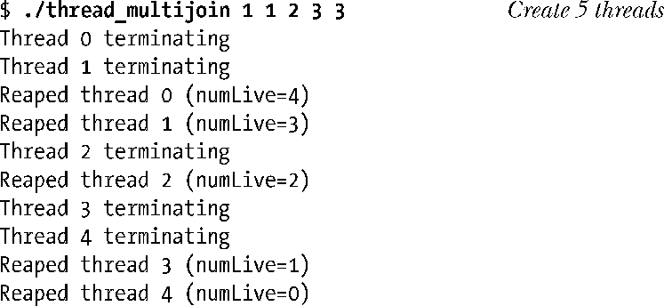
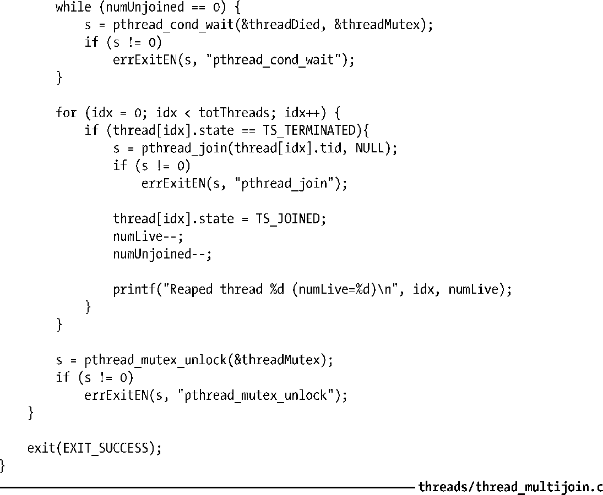

### 30.2.4　示例程序：连接任意已终止线程

前面已然提及，使用pthread_join()只能连接一个指定线程。且该函数也未提供任何机制去连接任意的已终止线程。本节展示如何使用条件变量绕过这一限制。

程序清单30-4为其每个命令行参数创建一个线程。每个线程休眠一段时间后随即退出，休眠时间由相应命令行参数所指定的秒数决定。这里用休眠间隔来模拟线程工作了一段时间。

该程序维护有一组全局变量，记录了所有已创建线程的信息。对于每个线程，全局数组thread中都含有一元素记录其线程ID（字段tid）以及当前状态（字段state）。状态字段state可设置为以下值：TS_ALIVE，表示线程是活动的；TS_TERMINATED，代表线程已经终结但尚未被连接；TS_JOINED，表示线程终止且已被连接。

当线程终止时，将TS_TERMINATED赋给数组thread中对应元素的state字段，对表征已终止但尚未连接线程的全局计数器（numUnjoined）加一，并就条件变量threadDied发出信号。

主线程使用循环不断等待条件变量threadDied。当收到threadDied信号，且存在已终止线程尚未被连接时，主线程将扫描thread数组，寻找state为TS_TERMINATED的数组元素。对处于该状态的每个线程，以数组thread中的对应tid字段调用pthread_join()函数，并将state置为TS_JOINED。当由主线程创建的所有线程终止时，即全局变量numLive值为0时，主循环结束。

以下shell会话日志展示了对程序清单30-4中程序的调用：

最后要指出，虽然示例中的线程都被创建为处于可连接状态，且终止后立即由pthread_ join()予以捕获，其实无需采用这一方法来发现线程的终止。可以将线程置为分离态（detached），无需使用pthread_join()，简单地利用thread数组（及其他相关全局变量）作为记录每个线程终结的手段。

程序清单30-4：可以连接任意已终止线程的主线程

