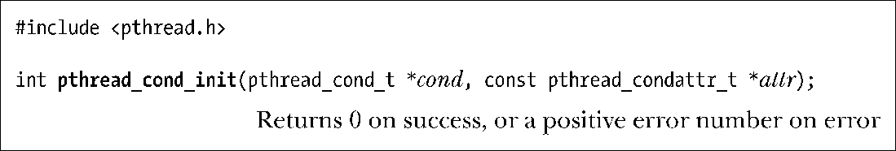
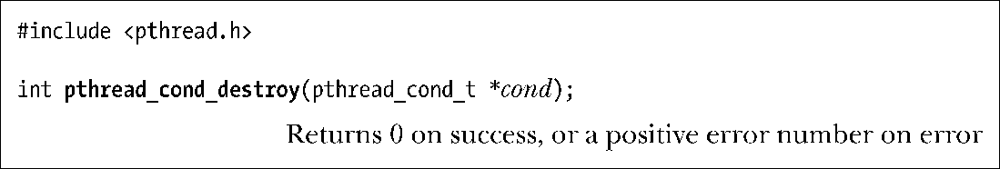

### 30.2.5　经由动态分配的条件变量

使用函数 pthread_cond_init()对条件变量进行动态初始化。需要使用 pthread_cond_init()的情形类似于使用 pthread_mutex_init()来动态初始化互斥量的情况。亦即，对自动或动态分配的条件变量进行初始化时，或是对未采用默认属性经由静态分配的条件变量进行初始化时，必须使用pthread_cond_init()。

参数cond表示将要初始化的目标条件变量。类似于互斥量，可以指定之前经由初始化处理的 attr 参数来判定条件变量的属性。对于 attr 所指向的 pthread_condattr_t 类型对象，可使用多个Pthreads函数对其中属性进行初始化。若将attr置为NULL，则使用一组缺省属性来设置条件变量。

SUSv3规定，对业已初始化的条件变量进行再次初始化，将导致未定义的行为。应当避免这一做法。

当不再需要一个经由自动或动态分配的条件变量时，应调用pthread_cond_destroy()函数予以销毁。对于使用PTHREAD_COND_INITIALIZER进行静态初始化的条件变量，无需调用pthread_cond_destroy()。

对某个条件变量而言，仅当没有任何线程在等待它时，将其销毁才是安全的。如果条件变量驻留于某片动态创建的内存区域，那么应在释放该内存区域前就将其销毁。经由自动分配的条件变量应在宿主函数返回前予以销毁。

经pthread_cond_destroy()销毁的条件变量，之后可以调用pthread_cond_init()对其进行重新初始化。

