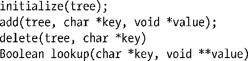

### 30.4　练习

**30-1.** 　修改程序清单30-1（thread_incr.c）中的程序，以便线程起始函数在每次循环中都能输出glob的当前值以及能对线程做唯一标识的标识符。可将线程的这一唯一标识指定为创建线程的函数pthread_create()的调用参数。对于这一程序，需要将线程起始函数的参数改为指针，指向包含线程唯一标识和循环次数限制的数据结构。运行该程序，将输出重定向至一文件，查看内核在调度两线程交替执行时glob的变化情况。

**30-2.** 　实现一组线程安全的函数，以更新和搜索一个不平衡二叉树。此函数库应该包含如下形式的函数（目的明显）：

上述函数原型中，tree是一个指向根节点的结构（为此需要定义一个合适的结构）。树的每个节点保存有一个键-值对。还需为树中每个节点定义一数据结构，其中应包含互斥量，以确保同时仅有一个线程可以访问该节点。initialize()、add()和 lookup()函数的实现相对简单。delete()的实现需要较为深入的考虑。

> 无需维护平衡二叉树，这极大简化了实现对锁的需求，但同时也带来了风险，特定模式的输入会导致树的执行效率低下。要维护平衡二叉树，则在执行 add()和 delete()操作时必然要在子树间移动节点，这就需要更为复杂的锁定策略。

