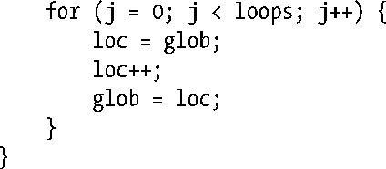

### 31.1　线程安全（再论可重入性）

若函数可同时供多个线程安全调用，则称之为线程安全函数；反之，如果函数不是线程安全的，则不能并发调用。例如，如下函数（30.1节也有类似代码）就不是线程安全的：

如果多个线程并发调用该函数，glob的最终值将不得而知。本例展示了导致线程不安全的典型原因：使用了在所有线程之间共享的全局或静态变量。

实现线程安全有多种方式。其一是将函数与互斥量关联使用（如果函数库中的所有函数都共享同样的全局变量，那么或许应将所有函数都与该互斥量相关联），在调用函数时将其锁定，在函数返回时解锁。这一方法的优点在于简单。另一方面，这也意味着同时只能有一个线程执行该函数，亦即，对该函数的访问是串行的（serialized）。如果各线程在执行此函数时都耗费了相当多的时间，那么串行化会导致并发能力的丧失，所有线程将不再并发执行。

另一种更为复杂的解决方案是：将共享变量与互斥量关联起来。这需要程序员们确认函数的哪些部分是使用了共享变量的临界区，且仅在执行到临界区时去获取和释放互斥量。这将允许多线程同时执行一个函数并实现并行，除非出现多个线程需要同时执行同一临界区的情况。

#### 非线程安全的函数

为便于开发多线程应用程序，除了表 31-1 所列函数以外（其中大部分并未在本书中提及），SUSv3中的所有函数都需实现线程安全。

除了表31-1中所列函数，SUSv3还做了如下规定。

+ 如传参为NULL时，函数ctermid()和tmpnam()无需是线程安全的。
+ 如果函数wcrtomb()和wcsrtombs()的最后一个参数（ps）为NULL，那么这两个函数也无需是线程安全的。

SUSv4对表31-1中的函数做了以下修改。

+ 移除函数ecvt()、fcvt()、gcvt()、gethostbyname()以及gethostbyaddr()，因为已从标准中删除了这些函数。
+ 增加函数strsignal()和system()。由于system()函数就信号处置所做的操作将影响整个进程，故而是不可重入的。

标准并未禁止将表31-1中的函数实现为线程安全。不过，即使在某些实现中有些函数是线程安全的，为确保应用程序的可移植性，也不应该假设这些函数在所有实现中都是如此。

<b class="my_markdown">表31-1：SUSv3不要求这些函数是线程安全的</b>

| asctime() | fcvt() | getpwnam() | nl_langinfo() |
| :-----  | :-----  | :-----  | :-----  | :-----  | :-----  |
| basename() | ftw() | getpwuid() | ptsname() |
| catgets() | gcvt() | getservbyname() | putc_unlocked() |
| crypt() | getc_unlocked() | getservbyport() | putchar_unlocked() |
| ctime() | getchar_unlocked() | getservent() | putenv() |
| dbm_clearerr() | getdate() | getutxent() | pututxline() |
| dbm_close() | getenv() | getutxid() | rand() |
| dbm_delete() | getgrent() | getutxline() | readdir() |
| dbm_error() | getgrgid() | gmtime() | setenv() |
| dbm_fetch() | getgrnam() | hcreate() | setgrent() |
| dbm_firstkey() | gethostbyaddr() | hdestroy() | setkey() |
| dbm_nextkey() | gethostbyname() | hsearch() | setpwent() |
| dbm_open() | gethostent() | inet_ntoa() | setutxent() |
| dbm_store() | getlogin() | l64a() | strerror() |
| dirname() | getnetbyaddr() | lgamma() | strtok() |
| dlerror() | getnetbyname() | lgammaf() | ttyname() |
| drand48() | getnetent() | lgammal() | unsetenv() |
| ecvt() | getopt() | localeconv() | wcstombs() |
| encrypt() | getprotobyname() | localtime() | wctomb() |
| endgrent() | getprotobynumber() | lrand48() |
| endpwent() | getprotoent() | mrand48() |
| endutxent() | getpwent() | nftw() |

#### 可重入和不可重入函数

较之于对整个函数使用互斥量，使用临界区实现线程安全虽然有明显改进，但由于存在对互斥量的加锁和解锁开销，所以多少还是有些低效。可重入函数则无需使用互斥量即可实现线程安全。其要诀在于避免对全局和静态变量的使用。需要返回给调用者的任何信息，亦或是需要在对函数的历次调用间加以维护的信息，都存储于由调用者分配的缓冲区内。（初次碰到可重入问题，是在21.1.2节讨论信号处理器中的全局变量时。）不过，并非所有函数都可以实现为可重入，通常的原因如下。

+ 根据其性质，有些函数必须访问全局数据结构。malloc 函数库中的函数就是这方面的典范。这些函数为堆中的空闲块维护有一个全局链表。malloc 库函数的线程安全是通过使用互斥量来实现的。
+ 一些函数（在发明线程之前就已问世）的接口本身就定义为不可重入，要么返回指针，指向由函数自身静态分配的存储空间，要么利用静态存储对该函数（或相关函数）历次调用间的信息加以维护。表 31-1 所列函数大多属于此类。例如，函数asctime()（10.2.3节）就返回一个指针，指向经由静态分配的缓冲区，其内容为日期和时间字符串。

对于一些接口不可重入的函数，SUSv3为其定义了以后缀_r结尾的可重入“替身”。这些“替身”函数要求由调用者来分配缓冲区，并将缓存区地址传给函数用以返回结果。这使得调用线程可以使用局部（栈）变量来存放函数结果。出于这一目的，SUSv3定义了如下函数：asctime_r()、ctime_r()、getgrgid_r()、getgrnam_r()、getlogin_r()、getpwnam_r()、getpwuid_r()、gmtime_r()、localtime_r()、rand_r()、readdir_r()、strerror_r()、strtok_r()和ttyname_r()。

> 有些系统实现为一些传统的不可重入函数也提供了附加的可重入“替身”。例如，glibc就提供了函数crypt_r()、gethostbyname_r()、getservbyname_r()、getutent_r()、getutid_r()、getutline_r()和ptsname_r()。不过，为确保应用程序的可移植性，不应假设这些函数在其他实现中也存在。某些情况下，SUSv3并未规定这些等价的可重入函数，因为功能更强、又可重入的替代函数已然存在。例如，函数getaddrinfo()就更新且可重入，可用来替代函数gethostbyname()和getservbyname()。

