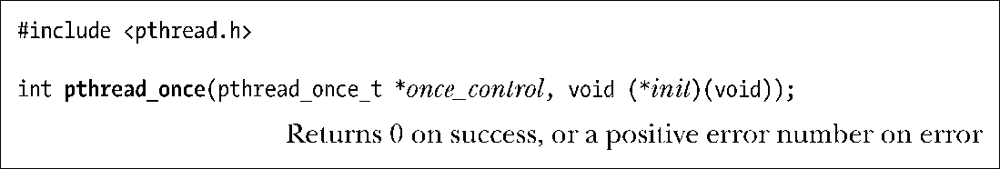
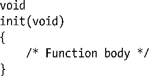

### 31.2　一次性初始化

多线程程序有时有这样的需求：不管创建了多少线程，有些初始化动作只能发生一次。例如，可能需要执行 pthread_mutex_init()对带有特殊属性的互斥量进行初始化，而且必须只能初始化一次。如果由主线程来创建新线程，那么这一点易如反掌：可以在创建依赖于该初始化的线程之前进行初始化。不过，对于库函数而言，这样处理就不可行，因为调用者在初次调用库函数之前可能已经创建了这些线程。故而需要这样的库函数：无论首次为任何线程所调用，都会执行初始化动作。

库函数可以通过函数pthread_once()实现一次性初始化。

利用参数 once_control 的状态，函数 pthread_once()可以确保无论有多少线程对pthread_once()调用了多少次，也只会执行一次由init指向的调用者定义函数。

init函数没有任何参数，形式如下：

另外，参数 once_control 必须是一指针，指向初始化为 PTHREAD_ONCE_INIT 的静态变量。

调用函数pthread_once()时要指定一个指针，指向类型为pthread_once_t的特定变量，对该函数的首次调用将修改once_control所指向的内容，以便对其后续调用不会再次执行init。

常常将Pthread_once()和线程特有数据结合使用，相关内容会在下一节描述。

> Pthreads 的早期版本不能对互斥量进行静态初始化，只能使用 pthread_mutex_init()（[Butenbof，1996]），这也是函数 pthread_once()存在的主要原因。随着静态分配互斥量功能的问世，库函数可以使用一个经静态分配的互斥量和一个静态布尔型（Boolean）变量来实现一次性初始化。虽然如此，出于方便的考虑，函数pthread_once()得以保留。

