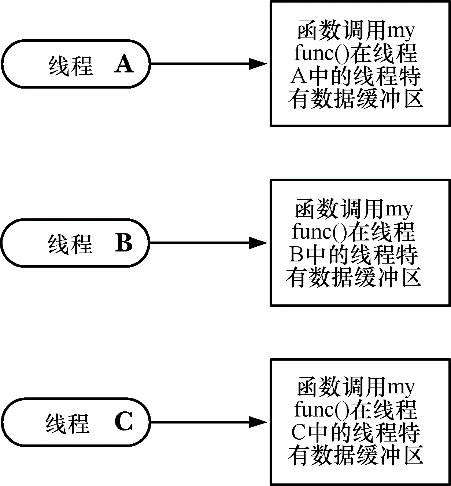

### 31.3　线程特有数据

实现函数线程安全最为有效的方式就是使其可重入，应以这种方式来实现所有新的函数库。不过，对于已有的不可重入函数库（可能问世于线程流行之前）来说，采用这种方法通常需要修改函数接口，这也意味着，需要修改所有使用此类函数的应用程序。

使用线程特有数据技术，可以无需修改函数接口而实现已有函数的线程安全。较之于可重入函数，采用线程特有数据的函数效率可能要略低一些，不过对于使用了这些调用的程序而言，则省去了修改程序之劳。

如图31-1所示，线程特有数据使函数得以为每个调用线程分别维护一份变量的副本（copy）。线程特有数据是长期存在的。在同一线程对相同函数的历次调用间，每个线程的变量会持续存在，函数可以向每个调用线程返回各自的结果缓冲区（如果需要的话）。

<b class="my_markdown">图31-1：线程特有数据（TSD）为函数提供线程内存储</b>

