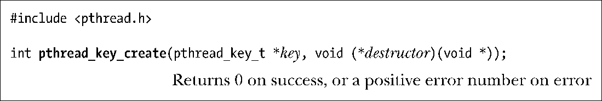
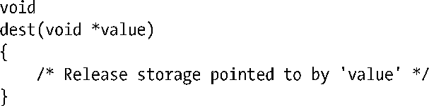
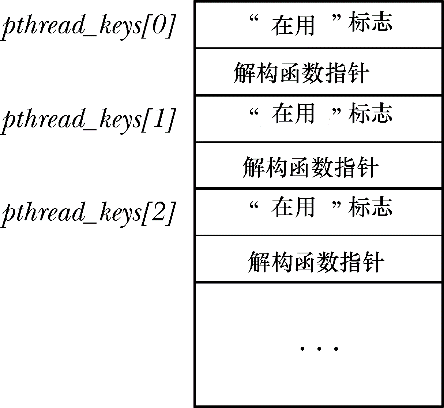
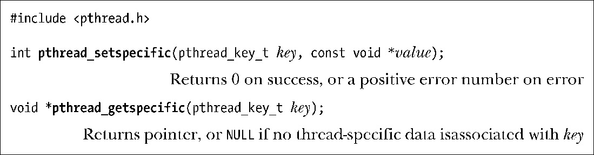
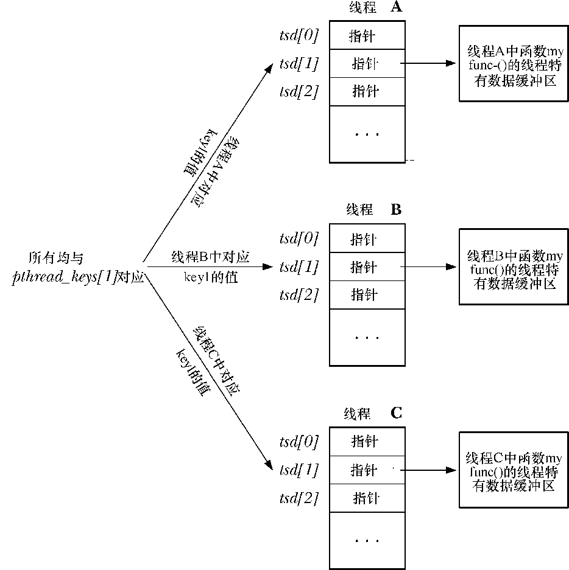

### 31.3.3　线程特有数据API详述

本节将详述上节所提及的各个函数，并通过对线程特有数据的典型实现来说明其操作方法。下一节会演示如何使用线程特有数据来实现线程安全的标准C语言库函数stderror()。

调用pthread_key_create()函数为线程特有数据创建一个新键，并通过key所指向的缓冲区返回给调用者。

因为进程中的所有线程都可使用返回的键，所以参数key应指向一个全局变量。

参数destructor指向一个自定义函数，其格式如下：

只要线程终止时与key的关联值不为NULL，Pthreads API会自动执行解构函数，并将与key的关联值作为参数传入解构函数。传入的值通常是与该键关联，且指向线程特有数据块的指针。如果无需解构，那么可将destructor设置为NULL。

> 如果一个线程有多个线程特有数据块，那么对各个解构函数的调用顺序是不确定的。对每个解构函数的设计应相互独立。

观察线程特有数据的实现有助于理解它们的使用方法。典型的实现（NPTL即在此列）会包含以下数组。

+ 一个全局（进程范围）数组，存放线程特有数据的键信息。
+ 每个线程包含一个数组，存有为每个线程分配的线程特有数据块的指针（通过调用pthread_ setspecific()来存储指针）。

在这一实现中，pthread_key_create()返回的pthread_key_t类型值只是对全局数组的索引（index），标记为pthread_keys，其格式如图31-2所示。数组的每个元素都是一个包含两个字段（field）的结构。第一个字段标记该数组元素是否在用（即已由之前对pthread_key_create()的调用分配）。第二个字段用于存放针对此键、线程特有数据块的解构函数指针（是函数pthread_key_crate()中参数destructor的一份拷贝）。

<b class="my_markdown">图31-2：线程特有数据键的实现</b>

函数pthread_setspecific()要求Pthreads API将value的副本存储于一数据结构中，并将value与调用线程以及key相关联（key由之前对pthread_key_create()的调用返回）。Pthread_getspecific()函数执行的操作与之相反，返回之前与本线程及给定key相关的值（value）。

函数pthread_setspecific()的参数value通常是一指针，指向由调用者分配的一块内存。当线程终止时，会将该指针作为参数传递给与key对应的解构函数。

> 参数 value 也可以不是一个指向内存区域的指针，而是任何可以赋值（通过强制转换）给 void*的标量值。在这种情况下，先前对 pthread_key_create()函数的调用应将destructor指定为NULL。

图31-3展示了用于存储value的数据结构的常见实现。图中假设将pthread_keys[1]分配给函数myfunc()。Pthreads API为每个函数维护指向线程特有数据块的一个指针数组。其中每个数组元素都与图 31-2 中全局 pthread_keys 数组的元素一一对应。函数 pthread_setspecific()在指针数组中为每个调用线程设置与key对应的元素。

<b class="my_markdown">图31-3：用于实现线程特有数据（TSD）指针的数据结构</b>

当线程刚刚创建时，会将所有线程特有数据的指针都初始化为NULL。这意味着当线程初次调用库函数时，必须使用pthread_getspecific()函数来检查该线程是否已有与key对应的关联值。如果没有，那么此函数会分配一块内存并通过pthread_setspecific()保存指向该内存块的指针。在下一节实现线程安全版的 stderror()函数时，将给出示例。

