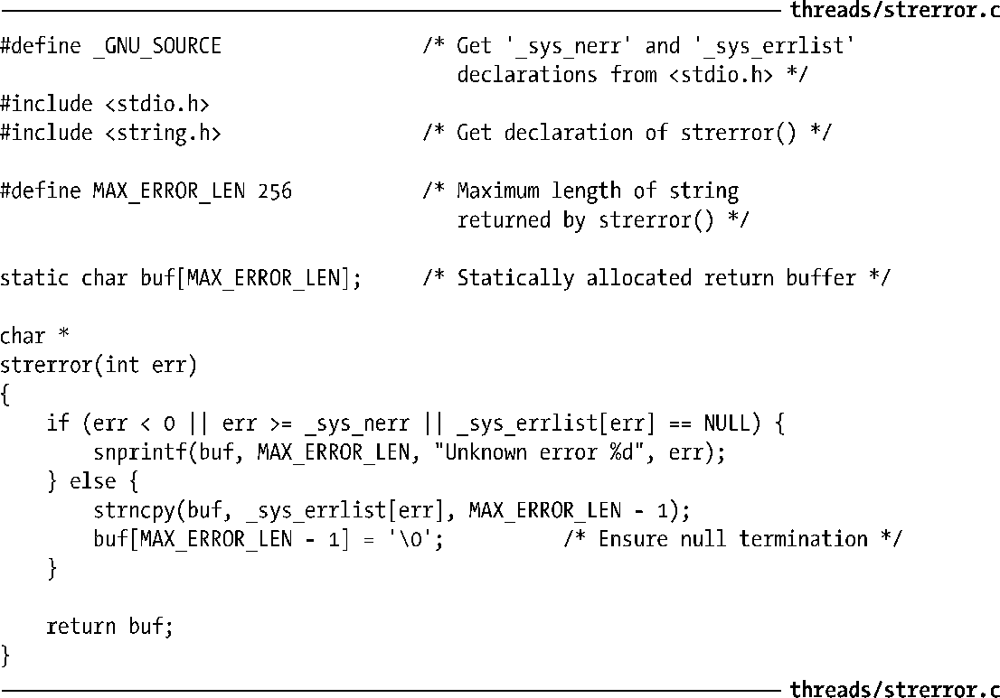
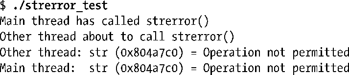
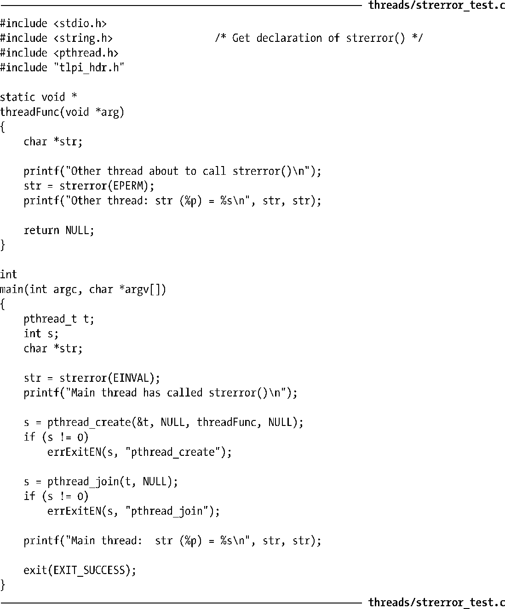
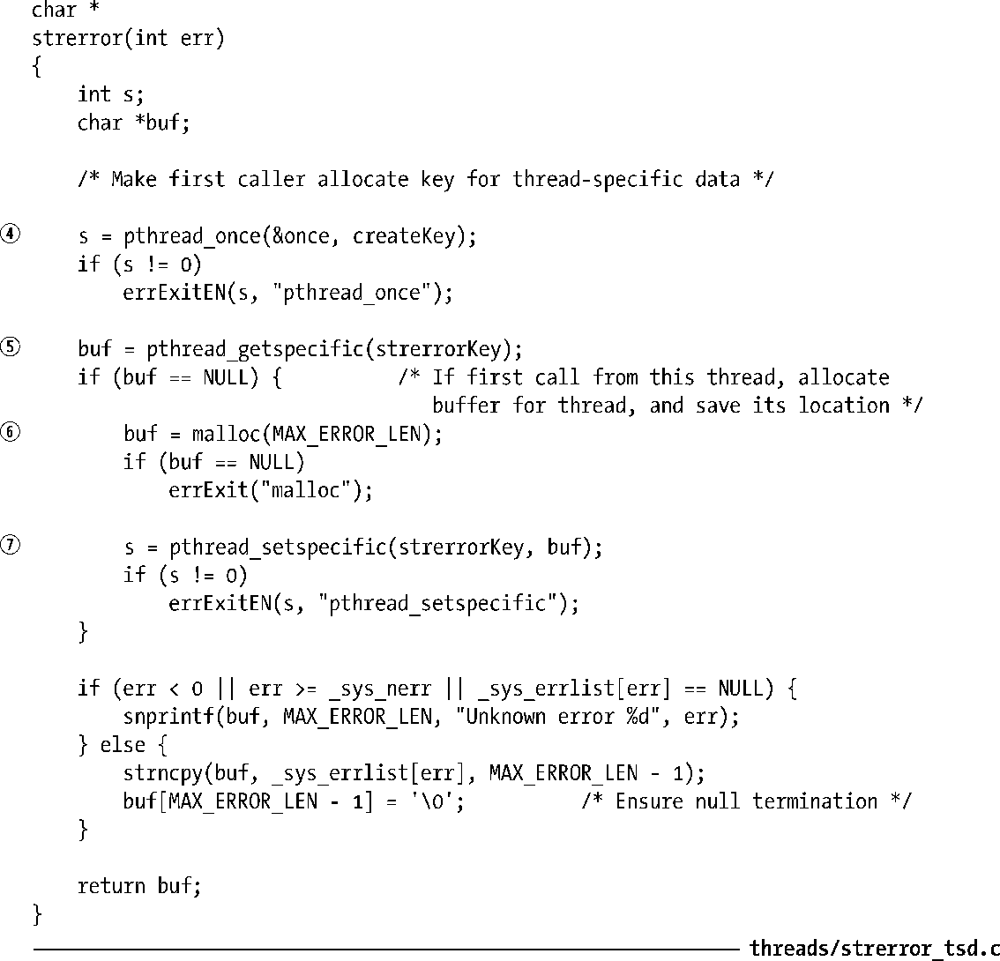
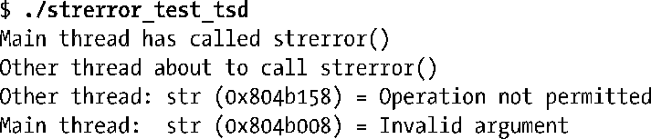

### 31.3.4　使用线程特有数据API

3.4 节在首度论及标准 stderror()函数时曾指出，可能会返回一个指向静态分配字符串的指针作为函数结果。这意味着 stderror()可能不是线程安全的。后面将以数页篇幅讨论一下非线程安全的 stderror()实现，接着说明如何使用线程特有数据来实现该函数的线程安全。

> 在包括Linux在内的许多UNIX实现中，由标准C语言函数库提供的stderror()函数都是线程安全的。不过，由于 SUSv3 并未规定该函数必须是线程安全的，而且这一stderror()的实现又为使用线程特有数据提供了一个简单范例，故而在此将其作为示例。

程序清单 31-1 演示了非线程安全版 strerror()函数的一个简单实现。该函数利用了由glibc定义的一对全局变量：_sys_errlist是一个指针数组，其每个元素指向一个与errno错误号相匹配的字符串（因此，例如，_sys_errlist[EINVAL]即指向字符串Invalid operation）；_sys_nerr表示_sys_errlist中的元素个数。

程序清单31-1：非线程安全版strerror()函数的一种实现

可以利用程序清单31-2中程序来展示程序清单31-1中非线程安全版的streerror()实现所造成的后果。该程序分别从两个不同线程中调用strerror()，并且均在两个线程调用stderror()之后才显示返回结果。虽然两个线程为strerror()指定的参数值不同（EINVAL和EPERM），在与程序清单31-1版的strerror()链接、编译后，运行该程序将产生如下结果：

两个线程都显示与EPERM对应的errno字符串，因为第二个线程对strerror()的调用（在函数threadFunc()中）覆盖了主线程调用strerror()时写入缓冲区的内容。检查输出结果可以发现，两个线程的局部变量str均指向同一内存地址。

程序清单31-2：从两个不同线程调用strerror()

程序清单31-3是对函数 strerror()的全新实现，使用了线程特有数据来确保线程安全。

程序清单31-3：使用线程特有数据以实现线程安全的strerror()函数

改进版strerror()所做的第一步是调用pthread_once()④，以确保（从任何线程）对该函数的首次调用将执行createKey()②。函数createKey()会调用pthread_key_create()来分配一个线程特有数据的键（key），并将其存储于全局变量strerrorKey③中。对pthread_key_create()的调用同时也会记录解构函数①的地址，将使用该解构函数来释放与键对应的线程特有数据缓冲区。

接着，函数strerror()调用pthread_getspecific()⑤以获取该线程中对应于strerrorKey的唯一缓冲区地址。如果pthread_getspecific()返回NULL，这表明该线程是首次调用strerror()函数，因此函数会调用malloc()⑥分配一个新缓冲区，并使用pthread_setspecific()⑦来保存该缓冲区的地址。如果pthread_getspecific()的返回值非NULL，那么该值指向业已存在的缓冲区，此缓冲区由之前对strerror()的调用所分配。

这一strerror()函数实现的剩余部分与非线程安全版的前述实现相类似，唯一的区别在于，buf是线程特有数据的缓冲区地址，而非静态变量。

如果使用新版strerror()（程序清单 31-3）编译链接测试程序（程序清单31-2）strerror_test_tsd，程序运行会有如下结果：

根据这一输出，可以看出新版strerro()是线程安全的：两个线程中局部变量str所指向的地址是不同的。

