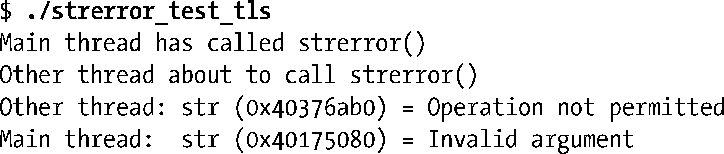
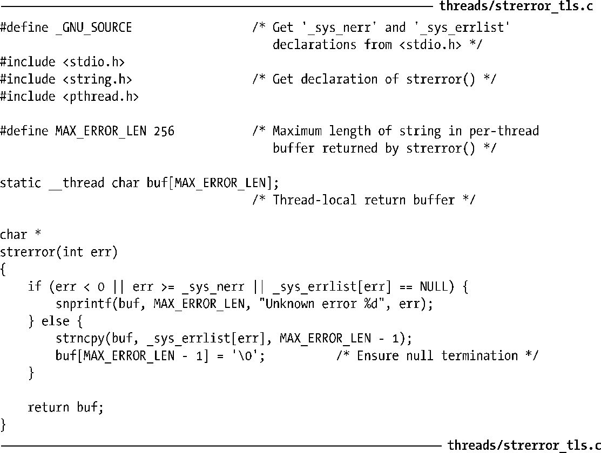

### 31.4　线程局部存储

类似于线程特有数据，线程局部存储提供了持久的每线程存储。作为非标准特性，诸多其他的 UNIX 实现（例如Solaris和FreeBSD）为其提供了相同，或类似的接口形式。

线程局部存储的主要优点在于，比线程特有数据的使用要简单。要创建线程局部变量，只需简单地在全局或静态变量的声明中包含__thread说明符即可。

但凡带有这种说明符的变量，每个线程都拥有一份对变量的拷贝。线程局部存储中的变量将一直存在，直至线程终止，届时会自动释放这一存储。

关于线程局部变量的声明和使用，需要注意如下几点。

+ 如果变量声明中使用了关键字static或extern，那么关键字__thread必须紧随其后。
+ 与一般的全局或静态变量声明一样，线程局部变量在声明时可设置一个初始值。
+ 可以使用C语言取址操作符（&）来获取线程局部变量的地址。

线程局部存储需要内核（由Linux 2.6提供）、Pthreads实现（由NPTL提供）以及C编译器（在x86-32平台上由gcc 3.3或后续版本提供）的支持。

程序清单31-4提供了使用线程局部存储实现线程安全版strerror()函数的例子。如果用该版strerror()与测试程序（程序清单31-2）编译、链接、生成strerror_test_tls，那么运行时将产生如下结果：

程序清单31-4：使用线程局部存储实现线程安全版的strerror()函数

