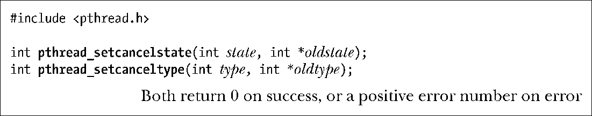

### 32.2　取消状态及类型

函数pthread_setcancelstate()和pthread_setcanceltype()会设定标志，允许线程对取消请求的响应过程加以控制。

函数pthread_setcancelstate()会将调用线程的取消性状态置为参数state所给定的值。该参数的值如下。

##### PTHREAD_CANCEL_DISABLE

线程不可取消。如果此类线程收到取消请求，则会将请求挂起，直至将线程的取消状态置为启用。

##### PTHREAD_CANCEL_ENABLE

线程可以取消。这是新建线程取消性状态的默认值。

线程的前一取消性状态将返回至参数oldstate所指向的位置。

如果对前一状态没有兴趣，Linux允许将oldstate置为NULL。在很多其他的系统实现中，情况也是如此。不过，SUSv3并没有规范这一特性，所以要保证应用的可移植性，就不能依赖这一特性。应该总是为oldstate设置一个非NULL的值。

如果线程执行的代码片段需要不间断地一气呵成，那么临时屏闭线程的取消性状态（PTHREAD_CANCEL_DISABLE）就变得很有必要。

如果线程的取消性状态为“启用”（PTHREAD_CANCEL_ENABLE），那么对取消请求的处理则取决于线程的取消性类型，该类型可以通过调用函数pthread_setcanceltype()时的参数type给定。参数type有如下值：

##### PTHREAD_CANCEL_ASYNCHRONOUS

可能会在任何时点（也许是立即取消，但不一定）取消线程。异步取消的应用场景很少，将延后至32.6节再做讨论。

##### PTHREAD_CANCEL_DEFERED

取消请求保持挂起状态，直至到达取消点（cancellation point，见下节）。这也是新建线程的缺省类型。后续各节将介绍延迟取消（deferred cancelability）的更多细节。

线程原有的取消类型将返回至参数oldtype所指向的位置。

> 与函数pthread_setcancelstate()的参数oldstate类似，如果不关心原有取消类型，许多系统实现（包括Linux）允许将oldtype置为NULL。同样，SUSv3也没有规范这一行为，所以需要保障可移植性的应用不应使用这一特性，应该总是为oldtype设置一个非NULL值。

当某线程调用fork()时，子进程会继承调用线程的取消性类型及状态。而当某线程调用exec()时，会将新程序主线程的取消性类型及状态分别重置为PTHREAD_CANCEL_NABLE和PTHREAD_CANCEL_DEFERRED。

