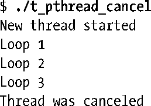
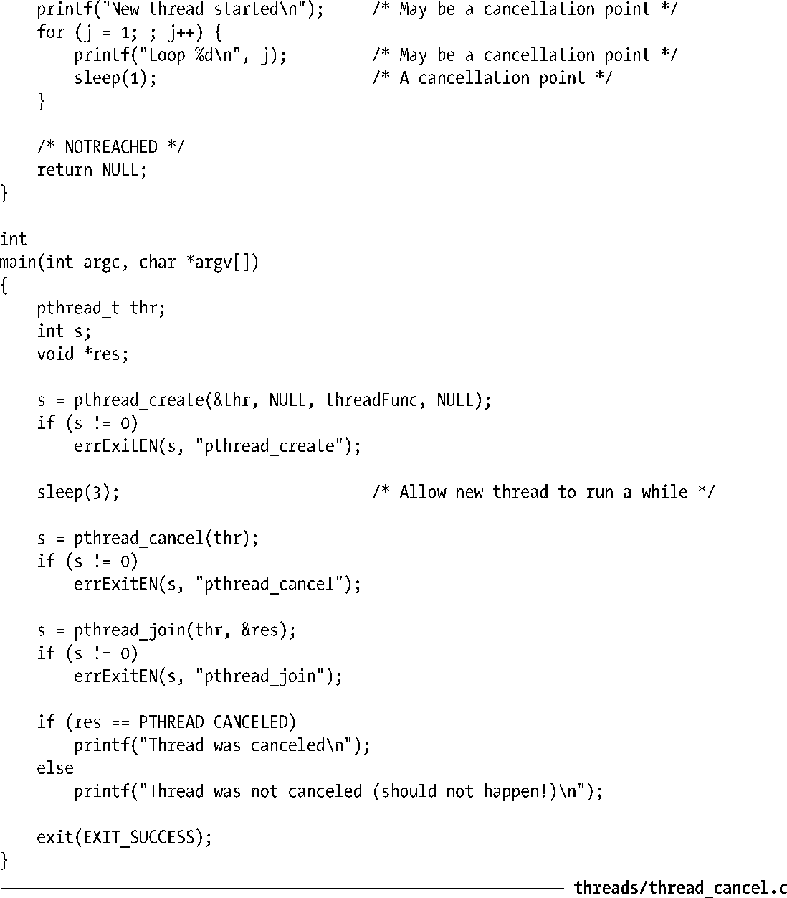

### 32.3　取消点

若将线程的取消性状态和类型分别置为启用和延迟，仅当线程抵达某个取消点（cancellation point）时，取消请求才会起作用。取消点即是对由实现定义的一组函数之一加以调用。

SUSv3规定，实现若提供了表32-1中所列的函数，则这些函数必须是取消点。其中的大部分函数都有能力将线程无限期地堵塞起来。

<b class="my_markdown">表32-1：SUSv3规定必须是取消点的函数</b>

| accept() | nanosleep() | sem_timedwait() |
| :-----  | :-----  | :-----  | :-----  | :-----  |
| aio_suspend() | open() | sem_wait() |
| clock_nanosleep() | pause() | send() |
| close() | poll() | sendmsg() |
| connect() | pread() | sendto() |
| creat() | pselect() | sigpause() |
| fcntl(F_SETLKW) | pthread_cond_timedwait() | sigsuspend() |
| fsync() | pthread_cond_wait() | sigtimedwait() |
| fdatasync() | pthread_join() | sigwait() |
| getmsg() | pthread_testcancel() | sigwaitinfo() |
| getpmsg() | putmsg() | sleep() |
| lockf(F_LOCK) | putpmsg() | system() |
| mq_receive() | pwrite() | tcdrain() |
| mq_send() | read() | usleep() |
| mq_timedreceive() | readv() | wait() |
| mq_timedsend() | recv() | waitid() |
| msgrcv() | recvfrom() | waitpid() |
| msgsnd() | recvmsg() | write() |
| msync() | select() | writev() |

除表32-1所列函数之外，SUSv3还指定了大量函数，系统实现可以将其定义为取消点。其中包括stdio函数、dlopen API、syslog API、nftw()、popen()、semop()、unlink()，以及从诸如 utmp 之类的系统文件中获取信息的各种函数。可移植应用程序必须正确处理这一情况：线程在调用这些函数时有可能遭到取消。

SUSv3规定，除了上述两组必须或可能是可取消点的函数之外，不得将标准中的任何其他函数视为取消点（亦即，调用这些函数不会招致线程取消，可移植程序无需加以处理）。

SUSv4在必须的可取消点函数列表中增加了openat()，并移除了函数sigpause()（将其移至“可能的”取消点函数列表中）和函数usleep()（已从标准中删除）。

> 系统实现可随意将标准并未规范的其他函数标记为取消点。任何可能造成堵塞的函数（有可能是因为需要访问文件）都是取消点的理想候选对象。出于这一理由，glibc将其中的许多非标准函数标记为取消点。

线程一旦收到取消请求，且启用了取消性状态并将类型置为延迟，则其会在下次抵达取消点时终止。如果该线程尚未分离（not detached），那么为防止其变为僵尸线程，必须由其他线程对其进行连接（join）。连接之后，返回至函数pthread_join()中第二个参数的将是一个特殊值：PTHREAD_CANCELED。

#### 示例程序

程序清单32-1是一个使用pthread_cancel()的简单例子。主程序创建一个线程来执行无限循环，每次都在休眠一秒后打印循环计数器的值。（仅当向其发送取消请求或者进程退出时，该线程才会终止。）同时，主程序将休眠3秒，随即向新创建的线程发送取消请求。程序运行结果如下：

程序清单32-1：调用pthread_cancel()取消线程

