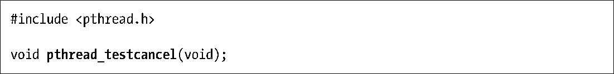

### 32.4　线程可取消性的检测

在程序清单32-1中，由main()创建的线程会执行到属于取消点的函数（sleep()属于取消点，printf()可能也是），因而会接受取消请求。不过，假设线程执行的是一个不含取消点的循环（计算密集型［compute-bound］循环），这时，线程永远也不会响应取消请求。

函数pthread_testcancel()的目的很简单，就是产生一个取消点。线程如果已有处于挂起状态的取消请求，那么只要调用该函数，线程就会随之终止。

当线程执行的代码未包含取消点时，可以周期性地调用pthread_testcancel()，以确保对其他线程向其发送的取消请求做出及时响应。

