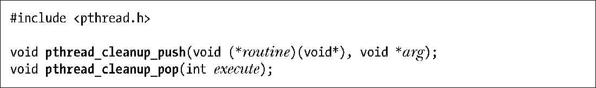
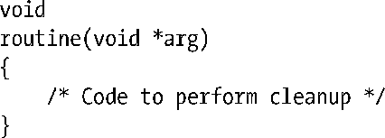
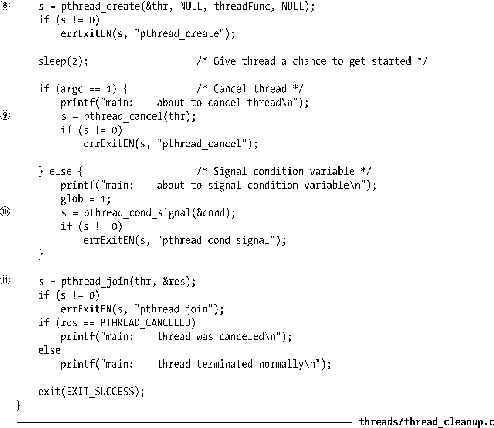
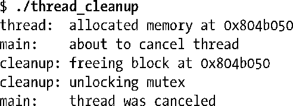
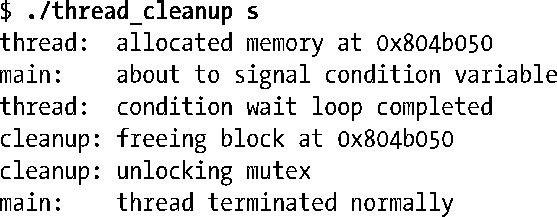

### 32.5　清理函数（cleanup handler）

一旦有处于挂起状态的取消请求，线程在执行到取消点时如果只是草草收场，这会将共享变量以及Pthreads对象（例如互斥量）置于一种不一致状态，可能导致进程中其他线程产生错误结果、死锁，甚至造成程序崩溃。为规避这一问题，线程可以设置一个或多个清理函数，当线程遭取消时会自动运行这些函数，在线程终止之前可执行诸如修改全局变量，解锁互斥量等动作。

每个线程都可以拥有一个清理函数栈。当线程遭取消时，会沿该栈自顶向下依次执行清理函数，首先会执行最近设置的函数，接着是次新的函数，以此类推。当执行完所有清理函数后，线程终止。

函数 pthread_cleanup_push()和 pthread_cleanup_pop()分别负责向调用线程的清理函数栈添加和移除清理函数。

pthread_cleanup_push()会将参数routine所含的函数地址添加到调用线程的清理函数栈顶。参数routine是一个函数指针，格式如下：

执行pthread_cleanup_push()时给定的 arg 值，会作为调用清理函数时的参数。其参数类型为void*，如果强制装换使用得当，那么通过该参数可以传入各种类型的数据。

通常，线程如在执行一段特殊代码时遭到取消，才需要执行清理动作。如果线程顺利执行完这段代码而未遭取消，那么就不再需要清理。所以，每个对pthread_cleanup_push()的调用都会伴随着对 pthread_cleanup_pop()的调用。此函数从清理函数栈中移除最顶层的函数。如果参数 execute 非零，那么无论如何都会执行清理函数。在函数未遭取消而又希望执行清理动作的情况下，这会非常方便。

尽管这里把pthread_cleanup_push()和pthread_cleanup_pop()描述为函数，SUSv3却允许将它们实现为宏（macro），可展开为分别由{和}所包裹的语句序列。并非所有的 UNIX都这样做，不过包括Linux在内的很多系统都是使用宏来实现的。这意味着，pthread_cleanup_push()和与其配对的pthread_cleanup_pop()属于同一个语法块，必须一一对应。（一旦以此方式来实现pthread_cleanup_push()和pthread_cleanup_pop()，在对两者的调用间所声明的变量，其作用域将受限于这一语法块。）例如，以下代码就不正确：

为便于编码，若线程因调用pthread_exit()而终止，则也会自动执行尚未从清理函数栈中弹出（pop）的清理函数。线程正常返回（return）时不会执行清理函数。

#### 示例程序

程序清单32-2提供了一个使用清理函数的简单例子。主程序创建线程⑧，线程首先分配一块内存③，并将其地址存储于buf中，接着锁定互斥量mtx④。因为线程可能会遭到取消，所以调用pthread_cleanup_push()⑤设置清理函数，并将存储于buf中的地址作为参数传入。如果执行到清理函数，那么清理函数会释放内存①并解锁互斥量②。

线程接着进入循环，等待对条件变量cond的通知⑥。取决于可执行程序是否带有命令行参数，此循环会以以下两种方式结束。

+ 若无命令行参数，则由 main()⑨函数取消线程。此时，取消操作发生在对pthread_cond_wait()⑥的调用中，此函数可见于程序清单32-1中，属于取消点。作为取消动作的一部分，会自动调用由pthread_cleanup_push()设置的清理函数。
+ 如果指定了命令行参数，那么在将全局变量glob设置为非零后，通知条件变量⑩。此时，线程会一直执行到pthread_cleanup_pop()⑦，因为向此函数传入了非零参数，所以依然会调用清理函数。

程序清单32-2：使用清理函数

主程序与遭终止线程建立连接⑪，并报告线程是遭到取消还是正常终止。

如果执行程序清单 32-2 中程序且不带任何命令行参数，那么 main()函数会调用pthread_cancel()，清理函数也会得以自动执行。输出如下：

如果运行该程序且带有命令行参数，那么main()将glob设置为1并通知条件变量，清理函数则通过pthread_cleanup_pop()的调用执行，可以看到如下结果：

