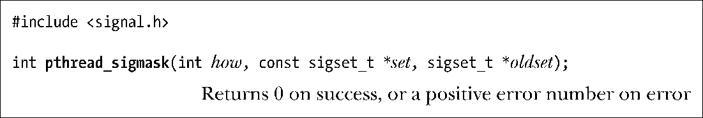

### 33.2.2　操作线程信号掩码

刚创建的新线程会从其创建者处继承信号掩码的一份拷贝。线程可以使用pthread_sigmask()来改变或/并获取当前的信号掩码。

除了所操作的是线程信号掩码之外，pthread_sigmask()与 sigprocmask()的用法完全相同（见20.10节）。

> SUSv3特别指出，注明在多线程程序中使用函数sigprocmask()，其结果是未定义的，也无法保证程序的可移植性。事实上，函数sigprocmask()和pthread_sigmask()在包括Linux在内的很多系统实现中是相同的。

