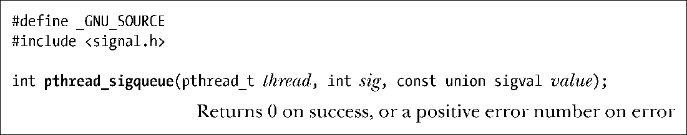

### 33.2.3　向线程发送信号

函数pthread_kill()向同一进程下的另一线程发送信号sig。目标线程由参数thread标识。

因为仅在同一进程中可保证线程ID的唯一性（参见29.5节），所以无法调用pthread_kill()向其他进程中的线程发送信号。

> 在实现函数pthread_kill()时，使用了Linux特有的tgkill（tgid，tid，sig）系统调用，将信号sig发送给由tid（由gettid()所返回的内核线程ID）标识的线程，该线程从属于由tgid标识的线程组中。更多细节，请参考tgkill(2)手册页。

Linux特有的函数pthread_sigqueue()将pthread_kill()和sigqueue()的功能合二为一（见22.8.1节）：向同一进程中的另一线程发送携带数据的信号。

与函数pthread_kill()一样，sig表示将要发送的信号，thread标识目标线程。参数value则指定了伴随信号的数据，其使用方式与函数sigqueue()中的对应参数相同。

> 函数pthread_sigqueue()从2.11版开始加入glibc函数库中，同时需要内核的支持。始于Linux 2.6.31，内核通过系统调用rt_tgsigqueueinfo()来提供这一支持。

